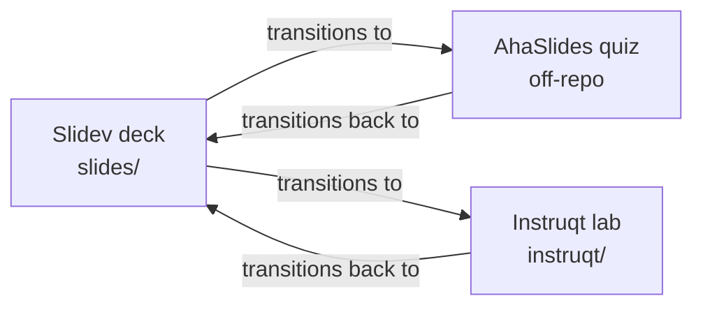

# Introduction to Temporal Nexus (Replay 2026 Workshop)

A 3.5-hour hands-on workshop that introduces [Temporal Nexus](https://docs.temporal.io/nexus) through a payment-processing scenario. Attendees decouple a monolith into two namespace-isolated services connected by a Nexus Endpoint, then layer in asynchronous Operations, human-in-the-loop Updates, lifecycle controls (cancellation, errors, circuit breaker), and a polyglot connector demo where the same Service contract is fulfilled by a Java handler.

This repo holds the **lab definition**, **slide deck**, and **sandbox image build**. It does not hold the Python or Java exercise code that attendees write against; that lives in the companion code repo (see [Companion repos](#companion-repos)).

## Audience

Software engineers comfortable with the core Temporal model (Workflows, Activities, Workers, Signals, Queries, Updates) but new to Nexus. Comfortable reading Python. The polyglot demo is read-only Java.

## How the workshop is delivered

Three coordinated runtime surfaces. Each one lives in its own top-level directory.



| Surface | Source | What it is |
| :--- | :--- | :--- |
| Slidev deck | `slides/` | The lecture deck. Slides for concept introductions, reviews, and chapter transitions. Vendored Temporal theme at `slides/theme-temporal/`. |
| Instruqt lab | `instruqt/` | The hands-on lab. Each numbered directory (`01-run-monolith/` through `09-what-next/`) is one challenge with `assignment.md`, `setup-workshop`, `cleanup-workshop`, and `solve-workshop`. |
| AhaSlides | off-repo, presentation id `9123470` | The audience-response polls and graded quizzes. Specced slide-by-slide in [`aha.md`](./aha.md). The Slidev deck has dedicated transition slides at every AhaSlides switch point. |

## Repo layout

| Path | Purpose |
| :--- | :--- |
| [`course-plan.md`](./course-plan.md) | Canonical course design: competencies, learning objectives, timing |
| [`aha.md`](./aha.md) | AhaSlides slide-by-slide spec |
| [`CLAUDE.md`](./CLAUDE.md) | Authoring guide for AI agents (slide register, vocabulary, brand rules, conventions) |
| `instruqt/track.yml` | Track manifest (slug, id, tags, sandbox config) |
| `instruqt/config.yml` | Sandbox container image pin |
| `instruqt/track_scripts/` | Global setup/cleanup that runs once per session |
| `instruqt/NN-*/assignment.md` | Per-chapter challenge body and frontmatter |
| `slides/slides.md` | Slidev master deck (imports chapters via `src:`) |
| `slides/chapters/*.md` | Per-chapter slide content and speaker notes |
| `slides/theme-temporal/` | Vendored Temporal theme (workshop-customized) |
| [`slides/DEPLOY.md`](./slides/DEPLOY.md) | VPS hosting guide for live presenter-follow during the workshop |
| `docker/Dockerfile` | Sandbox image build |
| `.github/workflows/build-image.yml` | CI for the sandbox image |
| `justfile` | All build, push, and dev recipes |

## Quick start

All recipes live in [`justfile`](./justfile). Run from anywhere in the repo.

### Instruqt track

Requires the [Instruqt CLI](https://docs.instruqt.com) and a one-time `instruqt auth login`.

```bash
just push          # push instruqt/ to Instruqt
just pull          # pull canonical state from Instruqt
just validate      # validate locally without pushing
just diff          # diff local vs deployed
```

After the first push, Instruqt writes an `id:` back into `instruqt/track.yml`. Commit it so subsequent pushes update the same track.

### Slidev deck

```bash
just slides-install    # pnpm install (run once, or after pulling theme changes)
just slides-dev        # start dev server on http://localhost:3030
just slides-build      # static build into slides/dist/
```

The deck has additional pnpm scripts inside `slides/`:

```bash
cd slides
pnpm export                                # build the PDF (uses playwright-chromium)
pnpm build -- --without-notes --download   # public artifact: notes stripped, PDF baked in
```

### Live hosting during the workshop

For live presenter-follow (you advance, attendees who clicked "follow" advance with you), see [`slides/DEPLOY.md`](./slides/DEPLOY.md). Caddy on `:443` reverse-proxies HTTPS and WebSockets to the Slidev dev server on `localhost:3030`; the PDF lives at `URL/export.pdf`.

## Sandbox image

`docker/Dockerfile` builds the Instruqt sandbox image. The image bakes the Python source from the companion code repo into `/opt/workshop`, pre-warms the uv venv, and builds the Java polyglot worker.

CI ([`.github/workflows/build-image.yml`](./.github/workflows/build-image.yml)) rebuilds the image on push to `main` when `docker/**` or the workflow file changes. It is also manually triggerable via `workflow_dispatch` from the GitHub Actions UI, with an optional `code_ref` input to pick the code-repo ref to bake in. There is no `repository_dispatch` from the code repo; republishing after a code-repo change is a deliberate manual click.

`instruqt/config.yml` pins the sandbox containers to `ghcr.io/temporalio/workshop-nexus-intro-sandbox:<tag>`. Update the tag here when you cut a new image.

## Companion repos

| Repo | Contents |
| :--- | :--- |
| [`temporalio/workshop-nexus-intro-code`](https://github.com/temporalio/workshop-nexus-intro-code) | The Python and Java exercise code attendees work through. Baked into the sandbox image at build time. |

## Authoring and contributing

- **Slide and lab conventions** (workshop register, vocabulary, brand rules, font sizes, the "handler vs implementer" disambiguation) are documented in [`CLAUDE.md`](./CLAUDE.md). Read it before editing slides or labs, even if you are not using an AI agent. It is the canonical style guide.
- **Course design rationale** (why a chapter exists, what it teaches, where it fits in the 3.5-hour arc) lives in [`course-plan.md`](./course-plan.md).
- **AhaSlides integration** is specced in [`aha.md`](./aha.md). Every Slidev transition slide that hands off to AhaSlides has matching speaker notes scripting the lead-in and lead-out.

## License

[MIT](./LICENSE).
