# AhaSlides Integration Guide

Companion document to `course-plan.md`. Maps the AhaSlides deck (interactive layer) to the Slidev decks and Instruqt exercises (content + lab layers).

## Quick reference

| Field | Value |
| :---- | :---- |
| Presentation name | Introduction to Temporal Nexus, Replay Workshop |
| Presentation ID | `9123470` |
| Audience join code | `O8RSE` (ahaslides.com/O8RSE) |
| Share code | `1777399099318-ytzrh18mal` |
| Theme | Aurelia (id 30684), black background, white text |
| Total slides | 38 |
| Graded quiz slides | 21 |
| Folder | Move into "Nexus Workshop" via UI (folder API not exposed) |

## Defaults applied to every quiz slide

- `maxPoint`: 100
- `minPoint`: 0
- `timeToAnswer`: 25 seconds
- `fastAnswerGetMorePoint`: enabled

## How to use during the live workshop

The deck is the **interactive layer**. The presenter weaves between three surfaces:

1. **Slidev deck** for the lecture content (one deck per chapter).
2. **AhaSlides** for warmups, knowledge checks, polls, and the final leaderboard.
3. **Instruqt** for the hands-on coding exercises.

The AhaSlides deck advances slide by slide on the presenter's screen. Attendees join once at `ahaslides.com/O8RSE` (or scan the QR code) and stay on that browser tab for the full 3.5 hours. Their session persists across all 38 slides, so the **leaderboard at slide 19 (halftime)** and **slide 35 (final)** show cumulative scores from every graded item up to that point.

### Trigger pattern

For each chapter, the presenter:
1. Opens the chapter's Slidev deck and frames the problem.
2. Runs the **AhaSlides warmup** (poll, word cloud, or scale) before introducing the concept.
3. Continues the Slidev lecture.
4. Switches to Instruqt for the exercise.
5. Returns to AhaSlides for the **chapter knowledge check** (graded quiz).
6. Returns to Slidev for the chapter wrap.

## Slide-by-slide integration guide

### Welcome block (Slides 1 to 5), maps to course-plan Welcome (9:00 to 9:05)

| # | Type | Title / Prompt | When to trigger |
| :- | :--- | :------------- | :-------------- |
| 1 | Title | "Introduction to Temporal Nexus" | Open with this while attendees join. Show the QR code so people can scan to join. |
| 2 | Word cloud | "One word for cross-team Temporal integration today." | First interactive moment. Sets the room. Read 3 to 5 responses out loud and riff. |
| 3 | Scale (1 to 5) | "How comfortable are you with Temporal Workflows, Activities, and Updates?" | Lets the presenter calibrate pace. If average is below 3, slow down on the first chapter. |
| 4 | Poll | "Have you ever wrapped a teammate's Workflow in an HTTP API?" | Run after the "why are we here" framing. The "yes, and it broke" responses are gold for the cross-team pain hook. |
| 5 | Spinner wheel | "Pattern Roulette: 8 scenarios, defend your choice." | Optional crowd activity. Spin 2 or 3 times, ask volunteers to defend their pick. Pure energy moment, not graded. |

### Chapter 1 graded checkpoint (Slides 6 to 12), maps to course-plan Activity 1.4 (Comp 1 Performance Assessment)

Run this block **after** Slidev activities 1.1 (cross-team problem) and 1.2 (four building blocks). The original Instruqt-hosted quiz lives here now.

| # | Type | Question | LO covered |
| :- | :--- | :------- | :--------- |
| 6 | Pick answer | "Two teams, two namespaces, an audit boundary between them." (correct: Nexus) | 1.3, 1.4 |
| 7 | Pick answer | "Same namespace, sibling workflow you control end-to-end." (correct: Child Workflow) | 1.3 |
| 8 | Pick answer | "Third-party HTTP API from inside a workflow." (correct: Activity) | 1.3 |
| 9 | Pick answer (multi) | "Which of these are Nexus building blocks?" (correct: Service, Operation, Endpoint, Registry) | 1.2 |
| 10 | Match pairs | "Building-Block Bingo: match each primitive to its job." | 1.2 |
| 11 | Short answer | "Maximum sync handler runtime, in seconds?" (10) | 1.5 |
| 12 | Short answer | "Maximum async Schedule-to-Close on Cloud, in days?" (60) | 1.5 |

After slide 12, return to Slidev for the chapter recap. Do **not** show a leaderboard yet; the halftime board is at slide 19.

### Chapter 2: Service contract (Slides 13 to 14), maps to Slidev activity 2.1, 2.2

| # | Type | Prompt | When to trigger |
| :- | :--- | :----- | :-------------- |
| 13 | Word cloud | "What does 'service contract' mean to you?" | Run **before** the lecture. Anchors the new concept to prior models (gRPC, OpenAPI, Avro). |
| 14 | Correct order (graded) | "Put the steps for defining a Nexus Service in the right order." | Run **after** the lecture, before the Instruqt exercise (TODO 1). |

### Chapter 3: Sync handler (Slides 15 to 16), maps to Slidev activity 3.1, 3.2

| # | Type | Prompt | When to trigger |
| :- | :--- | :----- | :-------------- |
| 15 | Pick answer multi (graded) | "When is a sync Nexus handler the right tool?" | Run after the "10s deadline" lecture beat. |
| 16 | Pick answer (graded) | "Your sync handler routinely takes 9.8s. What's the safe move?" (Convert to async) | Sets up the natural transition to Chapter 5. |

### Chapter 4: Caller workflow and Event History (Slides 17 to 19), maps to Slidev activity 4.1, 4.2, then halftime leaderboard

| # | Type | Prompt | When to trigger |
| :- | :--- | :----- | :-------------- |
| 17 | Pick answer (graded) | "How many Nexus events on a sync call?" (2) | After the Slidev "two-event sync pattern" beat. |
| 18 | Match pairs (graded) | "Match the Event History event to what it means." | After Instruqt exercise; reinforces the events they just witnessed. |
| 19 | **Leaderboard** | Halftime standings | Last thing before the break. Celebrates top 3, builds tension for the second half. |

### Pre-break (Slides 20 to 21), maps to course-plan Break (10:40)

| # | Type | Prompt | When to trigger |
| :- | :--- | :----- | :-------------- |
| 20 | Word cloud | "What's clicking? One word." | Quick pulse check before the break. |
| 21 | Q&A | "Drop your questions for after the break." | Leave this open during the break. Attendees submit; presenter triages and answers on return. |

### Chapter 5: Async operations (Slides 22 to 25), maps to Slidev activity 5.1, 5.2, 5.3, 5.4

| # | Type | Prompt | When to trigger |
| :- | :--- | :----- | :-------------- |
| 22 | Correct order (graded) | "Async Operation lifecycle: Scheduled, Started, Completed." | After Slidev 5.1 (three-event async lifecycle). |
| 23 | Pick answer (graded) | "Which timeout governs total handler runtime?" (Schedule-to-Close) | After Slidev 5.3 (the three timeouts). |
| 24 | Pick answer (graded) | "Why does WorkflowIDConflictPolicy.USE_EXISTING matter on retry?" | Same chapter, same beat as the timeouts. |
| 25 | Scale (1 to 5) | "Could you pick the right timeout in production tomorrow?" | Self-assessment. If average is low, presenter spends extra time on the timeout decision tree. |

### Chapter 6: Updates through Nexus (Slides 26 to 28), maps to Slidev activity 6.1, 6.2, 6.3

| # | Type | Prompt | When to trigger |
| :- | :--- | :----- | :-------------- |
| 26 | Categorise (graded) | "Validator vs Handler: where does each action belong?" | Run after Slidev 6.1 (validator pattern). This is the topic with the highest confusion rate. |
| 27 | Pick answer (graded) | "Which two events confirm an Update succeeded?" (UpdateAccepted + UpdateCompleted) | After the Instruqt exercise so attendees can match it to what they saw in Event History. |
| 28 | Word cloud | "Name a human-in-the-loop scenario in your domain." | Anchors the pattern to attendees' real systems (refunds, KYC, fraud, escalations). |

### Chapter 7: Lifecycle control (Slides 29 to 32), maps to Slidev activity 7.1, 7.2, 7.3, 7.4

| # | Type | Prompt | When to trigger |
| :- | :--- | :----- | :-------------- |
| 29 | Match pairs (graded) | "Pick your Cancel: ABANDON, TRY_CANCEL, WAIT_REQUESTED, WAIT_COMPLETED." | After Slidev 7.1 (cancellation propagation). |
| 30 | Pick answer (graded) | "OperationError vs HandlerError: which one triggers automatic retry?" (HandlerError) | After Slidev 7.2 (error types). |
| 31 | Pick answer (graded) | "You see 'State: Blocked / The circuit breaker is open' in `temporal workflow describe`. What's happening?" | After Slidev 7.3 (circuit breaker). |
| 32 | Pick answer (graded) | "After how many consecutive errors does the circuit breaker open?" (5) | Same beat. |

### Polyglot demo (Slides 33 to 34), maps to course-plan Activity 8.1

| # | Type | Prompt | When to trigger |
| :- | :--- | :----- | :-------------- |
| 33 | Poll | "Reaction to the Java handler running the same Service contract?" | Run **immediately after** the Java worker completes TXN-A. Captures the surprise in real time. |
| 34 | Word cloud | "What language would YOU bridge to Temporal next?" | Sets up follow-up convos at the booth or in chat. |

### Wrap (Slides 35 to 38), maps to course-plan Wrap and Q&A (12:20 to 12:30)

| # | Type | Prompt | When to trigger |
| :- | :--- | :----- | :-------------- |
| 35 | **Leaderboard** | Final standings | Open the wrap with this. Top 3 win whatever swag is on offer. |
| 36 | Brainstorm | "What will you try first when you get back to your team?" | Commitment device. Adult-learning research shows this dramatically improves retention. |
| 37 | Scale (0 to 10) | "Likelihood to recommend Nexus to a colleague." | NPS-flavored. Useful signal for course iteration. |
| 38 | Open-ended | "What still feels fuzzy?" | Final feedback. Drives next-iteration content priorities. |

## Manual UI tasks before going live

1. **Move presentation into the "Nexus Workshop" folder** in the AhaSlides UI (drag and drop in the dashboard).
2. **Add hints + explanations** to each of the 21 graded quiz slides. Suggested template: hint nudges toward the right concept without giving the answer; explanation cites the exact Nexus doc page or Slidev slide for follow-up reading.
3. **Tune time limits per slide if desired.** Defaults are 25s. Consider 15s for the simple short-answer numerics (slides 11, 12, 32) and 45 to 60s for the categorise (slide 26) and match-pairs (slides 10, 18, 29) which require more reading.
4. **Confirm scoring is enabled** on graded slides via the side panel. Defaults look right but worth a sanity pass before the live event.
5. **Optionally enable Team Play** (configured at presentation level) if you want to group attendees into teams of 3 for cooperative scoring. Currently disabled by default.
6. **Print or share the QR / join code** for the welcome slide. Code: `O8RSE`.

## Mapping cheat sheet

```mermaid
flowchart TD
    Welcome[Welcome 9:00 to 9:05] --> AhaW[AhaSlides 1 to 5]
    AhaW --> Slidev1[Slidev Ch 1 lecture]
    Slidev1 --> AhaQ1[AhaSlides 6 to 12: Comp 1 graded]
    AhaQ1 --> Inst1[Instruqt Ch 1 lab]

    Inst1 --> Slidev2[Slidev Ch 2 lecture]
    Slidev2 --> AhaC2[AhaSlides 13 to 14]
    AhaC2 --> Inst2[Instruqt Ch 2 lab]

    Inst2 --> Slidev3[Slidev Ch 3 to 4 lecture]
    Slidev3 --> AhaC34[AhaSlides 15 to 18]
    AhaC34 --> Inst34[Instruqt Ch 3 to 4 lab]
    Inst34 --> Half[AhaSlides 19: halftime board]

    Half --> Break[BREAK]
    Break --> AhaPre[AhaSlides 20 to 21: pulse + Q&A parking lot]

    AhaPre --> Slidev5[Slidev Ch 5 lecture]
    Slidev5 --> AhaC5[AhaSlides 22 to 25]
    AhaC5 --> Inst5[Instruqt Ch 5 lab]

    Inst5 --> Slidev6[Slidev Ch 6 lecture]
    Slidev6 --> AhaC6[AhaSlides 26 to 28]
    AhaC6 --> Inst6[Instruqt Ch 6 lab]

    Inst6 --> Slidev7[Slidev Ch 7 lecture]
    Slidev7 --> AhaC7[AhaSlides 29 to 32]
    AhaC7 --> Inst7[Instruqt Ch 7 lab]

    Inst7 --> Polyglot[Polyglot demo]
    Polyglot --> AhaPG[AhaSlides 33 to 34]
    AhaPG --> AhaWrap[AhaSlides 35 to 38: leaderboard + reflection]
```

## Known quirks discovered while building

1. **Slide creation interleaves across batches.** AhaSlides round-robins slides across batched `create_slides` calls in a way that scrambles intended order. Workaround: create everything in one batch, OR create then reorder with sequential `move_slide` calls anchoring slide N+1 after slide N.
2. **`update_slide_properties_tool` has a schema bug.** It requires an `order` field that, when set, actually moves the slide rather than being metadata. The property fields (`minPoint`, `maxPoint`, `timeToAnswer`) are silently ignored. Use the AhaSlides UI for property edits.
3. **Folder assignment is not exposed in the API.** Presentations land at root level and need to be dragged into folders via the dashboard.
4. **Hints and explanations cannot be set via API.** UI only.

## Files referenced

- `course-plan.md` (this directory): the canonical course design with competencies, learning objectives, and timing.
- `instruqt/`: the Lab definition, chapter scripts, and validation logic.
- `edu-nexus-code/python/decouple-monolith/`: the exercise and solution code that the Slidev decks reference.
