# AhaSlides Integration Guide

Companion document to `course-plan.md`. Maps the AhaSlides deck (interactive layer) to the Slidev decks and Instruqt exercises (content + lab layers).

## Quick reference

| Field | Value |
| :---- | :---- |
| Presentation name | Introduction to Temporal Nexus, Replay Workshop |
| Presentation ID | `9123470` |
| Audience join code | `O8RSE` (ahaslides.com/O8RSE) |
| Share code | `1777399099318-ytzrh18mal` |
| Theme | Aurelia (id 30684), black background, white text |
| Total slides | 38 (all live; no skipped slides in the editor) |
| Graded quiz slides | 19 |
| Leaderboards | 7 (one after each chapter with graded questions: Ch1, Ch3, Ch4, halftime/Ch5, Ch6, Ch7, plus final) |
| Folder | Move into "Nexus Workshop" via UI (folder API not exposed) |

## Defaults applied to every quiz slide

- `maxPoint`: 100
- `minPoint`: 0
- `timeToAnswer`: 25 seconds
- `fastAnswerGetMorePoint`: enabled

## How to use during the live workshop

The deck is the **interactive layer**. The presenter weaves between three surfaces:

1. **Slidev deck** for the lecture content (one deck per chapter).
2. **AhaSlides** for warmups, knowledge checks, polls, and the running leaderboard.
3. **Instruqt** for the hands-on coding exercises.

The AhaSlides deck advances slide by slide on the presenter's screen. Attendees join once at `ahaslides.com/O8RSE` (or scan the QR code) and stay on that browser tab for the full 3.5 hours. A leaderboard fires after every chapter that has graded questions, so the running competition stays fresh; the final leaderboard at live 35 closes the loop.

### Trigger pattern

The default per-chapter pattern:
1. Opens the chapter's Slidev deck and frames the problem.
2. Runs the **AhaSlides warmup** (poll, word cloud, or scale) before introducing the concept.
3. Continues the Slidev lecture.
4. Switches to Instruqt for the exercise.
5. Returns to AhaSlides for the **chapter knowledge check** (graded quiz).
6. Advances once more for the **chapter leaderboard**.
7. Returns to Slidev for the chapter wrap.

**Chapter 1 deviates from this pattern intentionally.** The Ch 1 lab ("Run the Monolith") runs *before* the Nexus solution is introduced, so the room feels the architecture before being told what's wrong with it. The order for Ch 1 is: frame the problem, AhaSlides warmup poll, Instruqt lab, Slidev solution lecture, AhaSlides graded quiz, AhaSlides leaderboard, Slidev review.

## Slide-by-slide integration guide

All numbers below are the live order shown to the presenter when advancing through the deck.

### Welcome block (Live 1 to 4), maps to course-plan Welcome (9:00 to 9:05)

| Live # | Type | Title / Prompt | When to trigger |
| :----- | :--- | :------------- | :-------------- |
| 1 | Content (title) | "Introduction to Temporal Nexus" | Open with this while attendees join. Show the QR code so people can scan to join. |
| 2 | Word cloud | "One word for cross-team Temporal integration today." | First interactive moment. Sets the room. Read 3 to 5 responses out loud and riff. |
| 3 | Scale (1 to 5) | "How comfortable are you with Temporal Workflows, Activities, and Updates?" | Lets the presenter calibrate pace. If average is below 3, slow down on the first chapter. |
| 4 | Poll | "Have you ever wrapped a teammate's Workflow in an HTTP API?" | Run after the "why are we here" framing. The "yes, and it broke at the worst time" responses are gold for the cross-team pain hook. |

### Chapter 1 graded checkpoint (Live 5 to 11), maps to course-plan Activity 1.4 (Comp 1 Performance Assessment)

Run this block **after** Slidev activities 1.1 (cross-team problem) and 1.2 (four building blocks).

| Live # | Type | Question | Correct answer(s) | LO |
| :----- | :--- | :------- | :---------------- | :- |
| 5 | Pick answer | "Two teams, two namespaces, an audit boundary between them. Best fit?" | **Nexus Operation** | 1.3, 1.4 |
| 6 | Pick answer | "Same namespace, sibling workflow you control end-to-end. Best fit?" | **Child Workflow** | 1.3 |
| 7 | Pick answer | "You need to call a third-party HTTP API from inside a workflow. Best fit?" | **Activity** | 1.3 |
| 8 | Pick answer (multi) | "Which of these are Nexus building blocks?" | **Service, Operation, Endpoint, Registry** (distractors: Channel, Topic) | 1.2 |
| 9 | Match pairs | "Match each Nexus primitive to its job." | Service to "Shared contract between teams"; Operation to "One unit of cross-team work"; Endpoint to "Reverse proxy: routing entry to a namespace and task queue"; Registry to "Runtime lookup by name" | 1.2 |
| 10 | Short answer | "Maximum sync handler runtime, in seconds?" | **10** | 1.5 |
| 11 | Short answer | "Maximum async Schedule-to-Close on Temporal Cloud, in days?" | **60** | 1.5 |

### Live 12 — Leaderboard (after Ch 1)

Cumulative score for Ch 1 questions. Keeps the running competition fresh; rolls up everything earned so far.

### Chapter 2: Service contract (Live 13)

| Live # | Type | Question | When to trigger |
| :----- | :--- | :------- | :-------------- |
| 13 | Word cloud | "What does 'service contract' mean to you? (One or two words.)" | Run **before** the lecture. Anchors the new concept to prior models (gRPC, OpenAPI, Avro). |

Ch 2 has no graded question. The "drag the steps to define a Nexus Service in order" was removed because dragging code-step ordering plays awkwardly live. The Ch 1 leaderboard at live 12 carries the morning score forward; Ch 3's leaderboard at live 16 picks up the running competition.

### Chapter 3: Sync handler (Live 14 to 15), maps to Slidev activity 3.1, 3.2

| Live # | Type | Question | Correct answer(s) |
| :----- | :--- | :------- | :---------------- |
| 14 | Pick answer multi (graded) | "When is a sync Nexus handler the right tool?" | **Forwarding to a Workflow (start it, send a Signal, Query, or Update)**; **Deterministic in-process compute (rule check, math, cached lookups)**; **Reliable downstream Temporal infrastructure (Temporal Cloud, Kafka)**. Run after the "10s deadline" lecture beat. |
| 15 | Pick answer (graded) | "Your sync handler routinely takes 9.8 seconds. What's the safe move?" | **Convert it to a `workflow_run_operation` (async)**. Sets up the natural transition to Chapter 5. |

### Live 16 — Leaderboard (after Ch 3)

Updates standings with Ch 3 points.

### Chapter 4: Caller workflow and Event History (Live 17 to 18), maps to Slidev activity 4.1, 4.2

Ch 4 has no dedicated "Quiz Time" Slidev transition slide; trigger these inline during the Ch 4 lecture / exercise beats.

| Live # | Type | Question | Correct answer(s) |
| :----- | :--- | :------- | :---------------- |
| 17 | Pick answer (graded) | "How many Nexus events appear in the caller's Event History on a sync call?" | **2** (Scheduled and Completed). After the Slidev "two-event sync pattern" beat. |
| 18 | Match pairs (graded) | "Match the Event History event to what it means." | NexusOperationScheduled to "Caller dispatched the operation"; NexusOperationStarted to "Async handler began running"; NexusOperationCompleted to "Handler returned a result"; NexusOperationFailed to "Permanent, non-retryable error". After Exercise 4. |

### Live 19 — Leaderboard (after Ch 4)

Updates standings with Ch 4 points.

### Chapter 5: Async operations (Live 20 to 22), maps to Slidev activity 5.1, 5.2, 5.3, 5.4

Chapter 5 lands **before** the break. Finishing it pre-break means the halftime leaderboard at live 23 reflects async exercise points, which raises the energy going into break.

| Live # | Type | Question | Correct answer(s) |
| :----- | :--- | :------- | :---------------- |
| 20 | Pick answer (graded) | "Which timeout governs the handler workflow's total runtime, end-to-end?" | **Schedule-to-Close** (up to 60 days on Temporal Cloud). After Slidev 5.3 (the three timeouts). |
| 21 | Pick answer (graded) | "Why does `WorkflowIDConflictPolicy.USE_EXISTING` matter on retry?" | **A retry lands on the existing handler workflow instead of starting a new one.** Same chapter beat as timeouts. |
| 22 | Scale (1 to 5) | "Could you pick the right timeout in production tomorrow?" | n/a (self-assessment). If average is low, spend extra time on the timeout decision tree. |

The "Async Operation lifecycle: drag the events into order" question was removed; a 3-event drag isn't enough as a graded item, and the same content is reinforced by Ch 4's match-pairs at live 18 plus the Slidev review.

### Live 23 — Halftime Leaderboard, maps to course-plan Break (11:00 to 11:30)

Cumulative score across the morning. Top three get celebrated. Build tension for the second half. Pulse-check word cloud and Q&A parking lot from earlier drafts are gone; pulse and questions get handled live by the presenter during the actual break, not via the deck.

### Chapter 6: Updates through Nexus (Live 24 to 26), maps to Slidev activity 6.1, 6.2, 6.3

| Live # | Type | Question | Correct answer(s) |
| :----- | :--- | :------- | :---------------- |
| 24 | Categorise (graded) | "Validator vs Handler: where does each action belong?" | `@review.validator`: Reject when no review is pending; Reject if a decision was already made; Raise on a malformed input. `@workflow.update review`: Store the reviewer's decision; Wake the waiting workflow; Build the `ComplianceResult`. After Slidev 6.1 (validator pattern). |
| 25 | Pick answer (graded) | "Which two events on the handler workflow confirm an Update succeeded?" | **WorkflowExecutionUpdateAccepted + WorkflowExecutionUpdateCompleted** (single combined option). After the Instruqt exercise. |
| 26 | Word cloud | "Name a human-in-the-loop scenario in your domain." | n/a (anchors the pattern: refunds, KYC, fraud, escalations) |

### Live 27 — Leaderboard (after Ch 6)

Updates standings with Ch 6 points.

### Chapter 7: Lifecycle control (Live 28 to 31), maps to Slidev activity 7.1, 7.2, 7.3, 7.4

| Live # | Type | Question | Correct answer(s) |
| :----- | :--- | :------- | :---------------- |
| 28 | Match pairs (graded) | "Pick your Cancel: match each cancellation type to its scenario." | ABANDON to "Caller is shutting down; don't wait at all". TRY_CANCEL to "Wait until the cancel is delivered to the handler". WAIT_REQUESTED to "Wait until the handler acknowledges the cancel". WAIT_COMPLETED to "Wait for the handler to exit cleanly". After Slidev 7.1 (cancellation propagation). |
| 29 | Pick answer (graded) | "OperationError vs HandlerError: which one triggers automatic retry?" | **HandlerError** (distractors: OperationError, Both, Neither). After Slidev 7.2 (error types). |
| 30 | Pick answer (graded) | "You see 'State: Blocked / BlockedReason: The circuit breaker is open' in `temporal workflow describe`. What's happening?" | **5+ consecutive errors hit on this caller-namespace + endpoint pair; the breaker is shedding load** (distractors: handler worker offline; handler raised OperationError; Endpoint deleted). After Slidev 7.3 (circuit breaker). |
| 31 | Pick answer (graded) | "After how many consecutive errors does the circuit breaker open?" | **5**. Same beat. |

### Live 32 — Leaderboard (after Ch 7)

Last graded points of the workshop. Standings are now locked except for the final celebration.

### Polyglot demo (Live 33 to 34), maps to course-plan Activity 8.1

| Live # | Type | Question | When to trigger |
| :----- | :--- | :------- | :-------------- |
| 33 | Poll | "Reaction to the Java handler running the same Service contract?" | Run **immediately after** the Java worker completes TXN-A. Captures the surprise in real time. |
| 34 | Word cloud | "What language would YOU bridge to Temporal next?" | Sets up follow-up convos at the booth. |

### Wrap (Live 35 to 38), maps to course-plan Wrap and Q&A (12:20 to 12:30)

| Live # | Type | Question | When to trigger |
| :----- | :--- | :------- | :-------------- |
| 35 | **Final Leaderboard** | Final standings | Cumulative score for the whole workshop. Top 3 win whatever swag is on offer. |
| 36 | Brainstorm | "What will you try first when you get back to your team?" | Commitment device. Specific scenarios beat abstract intentions. |
| 37 | Scale (0 to 10) | "Likelihood to recommend Nexus to a colleague." | NPS-flavored. Useful signal for course iteration. |
| 38 | Open-ended | "What still feels fuzzy?" | Final feedback. Drives next-iteration content priorities. |

## Manual UI tasks before going live

1. **Move presentation into the "Nexus Workshop" folder** in the AhaSlides UI (drag and drop in the dashboard).
2. **Add hints + explanations** to each of the 19 graded quiz slides. Suggested template: hint nudges toward the right concept without giving the answer; explanation cites the exact Nexus doc page or Slidev slide for follow-up reading.
3. **Tune time limits per slide if desired.** Defaults are 25s. Consider 15s for the simple short-answer numerics (live 10, 11, 31) and 45 to 60s for the categorise (live 24) and match-pairs (live 9, 18, 28) which require more reading.
4. **Confirm scoring is enabled** on graded slides via the side panel. Defaults look right but worth a sanity pass before the live event.
5. **Optionally enable Team Play** (configured at presentation level) if you want to group attendees into teams of 3 for cooperative scoring. Currently disabled by default.
6. **Print or share the QR / join code** for the welcome slide. Code: `O8RSE`.

## Mapping cheat sheet

```mermaid
flowchart TD
    Welcome[Welcome 9:00 to 9:05] --> AhaW[AhaSlides 1 to 4: title + warmups]
    AhaW --> Slidev1Frame[Slidev Ch 1: frame the problem]
    Slidev1Frame --> Inst1[Instruqt Ch 1 lab: run the monolith]
    Inst1 --> Slidev1Sol[Slidev Ch 1: introduce Nexus]
    Slidev1Sol --> AhaQ1[AhaSlides 5 to 11: Comp 1 graded]
    AhaQ1 --> AhaLB1[AhaSlides 12: Ch 1 leaderboard]

    AhaLB1 --> Slidev2[Slidev Ch 2 lecture]
    Slidev2 --> AhaC2[AhaSlides 13: Ch 2 word cloud]
    AhaC2 --> Inst2[Instruqt Ch 2 lab]

    Inst2 --> Slidev34[Slidev Ch 3 to 4 lecture]
    Slidev34 --> AhaC3[AhaSlides 14 to 15: Ch 3 graded]
    AhaC3 --> AhaLB3[AhaSlides 16: Ch 3 leaderboard]
    AhaLB3 --> Inst3[Instruqt Ch 3 lab]
    Inst3 --> Slidev4[Slidev Ch 4 lecture + exercise]
    Slidev4 --> AhaC4[AhaSlides 17 to 18: Ch 4 graded]
    AhaC4 --> AhaLB4[AhaSlides 19: Ch 4 leaderboard]

    AhaLB4 --> Slidev5[Slidev Ch 5 lecture]
    Slidev5 --> AhaC5[AhaSlides 20 to 22: Ch 5 graded + scale]
    AhaC5 --> Inst5[Instruqt Ch 5 lab]
    Inst5 --> Half[AhaSlides 23: halftime board]

    Half --> Break[BREAK]

    Break --> Slidev6[Slidev Ch 6 lecture]
    Slidev6 --> AhaC6[AhaSlides 24 to 26: Ch 6 graded + word cloud]
    AhaC6 --> AhaLB6[AhaSlides 27: Ch 6 leaderboard]
    AhaLB6 --> Inst6[Instruqt Ch 6 lab]

    Inst6 --> Slidev7[Slidev Ch 7 lecture]
    Slidev7 --> AhaC7[AhaSlides 28 to 31: Ch 7 graded]
    AhaC7 --> AhaLB7[AhaSlides 32: Ch 7 leaderboard]

    AhaLB7 --> Polyglot[Polyglot demo]
    Polyglot --> AhaPG[AhaSlides 33 to 34: poll + word cloud]
    AhaPG --> AhaWrap[AhaSlides 35 to 38: final leaderboard + reflection]
```

## Known quirks discovered while building

1. **Slide creation interleaves across batches.** AhaSlides round-robins slides across batched `create_slides` calls in a way that scrambles intended order. Workaround: create everything in one batch, OR create then reorder with sequential `move_slide` calls anchoring slide N+1 after slide N. **Even single-slide `create_slides` calls with `insert_after_slide_id` ignore the position and land at order 1**; always follow with a `move_slide`.
2. **`update_slide_content` creates a new slide instead of updating in place** for some slide types. The original slide ID stays in the editor (alive, not skipped) and a new ID with the updated content also exists. Cleanup pattern: skip the original after every update, or use the AhaSlides UI for content edits.
3. **UI delete reverts API content edits.** When a slide is hard-deleted in the UI and AhaSlides recreates an equivalent slide with a new ID, that new slide ships with the original (pre-edit) content, not the latest edits. Always re-verify em-dash fixes / pair text after a UI delete pass.
4. **`update_slide_properties_tool` has a schema bug.** It requires an `order` field that, when set, actually moves the slide rather than being metadata. The property fields (`minPoint`, `maxPoint`, `timeToAnswer`) are silently ignored. Use the AhaSlides UI for property edits.
5. **Folder assignment is not exposed in the API.** Presentations land at root level and need to be dragged into folders via the dashboard.
6. **Hints and explanations cannot be set via API.** UI only.
7. **No delete via API.** `skip_when_presenting=True` is the closest equivalent and works for live presentation, but the slides remain in the editor and can re-scramble order on subsequent mutations. Hard-delete via UI when convenient.

## Files referenced

- `course-plan.md` (this directory): the canonical course design with competencies, learning objectives, and timing.
- `instruqt/`: the Lab definition, chapter scripts, and validation logic.
- `edu-nexus-code/python/decouple-monolith/`: the exercise and solution code that the Slidev decks reference.
