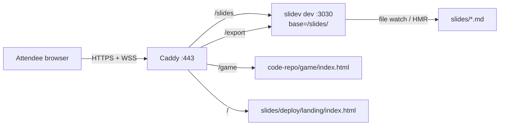

# Hosting the Workshop on a VPS

This guide hosts the full Replay 2026 Nexus workshop on a single VPS behind one domain. The room sees live presenter-follow (you advance a slide, attendees advance), file edits propagate via HMR, the topology sandbox is one click away, and Slidev's built-in export UI is exposed for attendees who want a PDF or PNGs.

## What this gives you

A single host (`nexus.example.com` in this guide; replace with your domain) serves four surfaces via subpaths:

| URL | What it serves |
| :--- | :--- |
| `/` | Landing page with five cards (Instruqt, Slides, AhaSlides, Topology Sandbox, Export Slides) |
| `/slides` | Live Slidev deck (Vite HMR + presenter sync over WebSocket) |
| `/slides/presenter` | Presenter view, locked behind HTTP basic auth |
| `/export` | Slidev's built-in export UI (browser print-to-PDF / PNG capture) |
| `/game` | Single-file topology sandbox from the sibling code repo |

## Architecture

Caddy on `:443` terminates HTTPS for everything and routes by path. The Slidev dev server runs on `localhost:3030` with its Vite base set to `/slides/` so emitted asset URLs and HMR WebSockets line up with the proxy. `/export` is rewritten to Slidev's built-in `/slides/export` client page (the export UI ships with `@slidev/client`; `pages/export.vue`), so attendees who want a PDF use their browser's print-to-PDF from there. No headless Chromium on the VPS, no file on disk, no regeneration step.

Only the game and the landing page are served directly by Caddy as static files.



## Quick start

You need:

- A 2 vCPU / 4 GB Debian 12 or Ubuntu 22.04+ droplet (a 1c/1G box also works for ~100 attendees).
- A domain. An `A` record for the host (e.g. `nexus.ziggy.codes`) pointing at the droplet's public IP.
- Ports 80 and 443 open at the cloud firewall.
- Root SSH access.

SSH in as root, then run one of these:

```bash
# A. Curl the bootstrap script and pipe it. Easiest for a fresh box.
curl -fsSL https://raw.githubusercontent.com/temporalio/workshop-nexus-intro-instruqt/main/slides/deploy/bootstrap.sh \
  | bash -s -- --domain nexus.ziggy.codes
```

```bash
# B. Or clone first, then run the script from the checkout.
apt-get update && apt-get install -y git
git clone https://github.com/temporalio/workshop-nexus-intro-instruqt /opt/workshop-nexus-intro-instruqt
bash /opt/workshop-nexus-intro-instruqt/slides/deploy/bootstrap.sh --domain nexus.ziggy.codes
```

The script prompts for a presenter password (or pass `--password "..."`), then:

1. Installs Node 22, pnpm, git, rsync, and Caddy via apt.
2. Clones both repos to `/opt/workshop-nexus-intro-instruqt` and `/opt/workshop-nexus-intro-code` (or `git pull`s if they're already there).
3. Runs `pnpm install` for the Slidev deck (`PLAYWRIGHT_SKIP_BROWSER_DOWNLOAD=1` because we use Slidev's runtime export UI, not the CLI's headless render).
4. Installs the `slidev.service` systemd unit. The unit runs `pnpm dev --base /slides/` as root so Slidev emits prefixed asset URLs that match the Caddy reverse-proxy.
5. Renders `/etc/caddy/Caddyfile` with your domain and a bcrypt-hashed presenter password.
6. Validates the Caddyfile, restarts both services, and prints smoke-test commands.

The script is idempotent. Re-run it any time to apply config changes or pick up a new repo ref (`--deck-ref`, `--code-ref`).

### Smoke-test the install

After DNS has propagated and Caddy has fetched a Let's Encrypt cert (a few seconds on first hit):

```bash
curl -I https://nexus.ziggy.codes/                            # 200, landing
curl -I https://nexus.ziggy.codes/slides/                     # 200, Slidev (no auth, trailing slash required)
curl -I https://nexus.ziggy.codes/slides/presenter            # 401
curl -I -u mason:<password> https://nexus.ziggy.codes/slides/presenter   # 200
curl -I https://nexus.ziggy.codes/game                        # 200, text/html
curl -I https://nexus.ziggy.codes/export                      # 200, Slidev /export UI
```

`/export` is Slidev's built-in export page. Attendees pick options (slide range, dark/light, etc.) and use their browser's print-to-PDF or Slidev's built-in PNG capture from there.

## Update workflow

Edits live in git. Push from your laptop, then `git pull` on the VPS. There is no rsync side channel.

### Pick up a slide or landing-page change

```bash
ssh root@your.actual.domain
cd /opt/workshop-nexus-intro-instruqt
git pull
```

Slidev's file watcher picks up the changed files and HMRs every connected attendee browser. No restart needed for content edits.

If `package.json` or `pnpm-lock.yaml` changed:

```bash
cd slides && PLAYWRIGHT_SKIP_BROWSER_DOWNLOAD=1 pnpm install && systemctl restart slidev
```

There is no separate "refresh the PDF" step. `/export` is Slidev's runtime UI; whatever's in the deck right now is what attendees export.

### Refresh the game

The game lives in the sibling code repo. Pull when needed:

```bash
ssh root@your.actual.domain 'cd /opt/workshop-nexus-intro-code && git pull'
```

Or re-run `bootstrap.sh --code-ref <ref>` to pin a specific tag.

### Re-run the bootstrap

The bootstrap is idempotent. Re-running with the same args is a clean way to apply config changes, pick up a new ref, or rotate the presenter password:

```bash
bash /opt/workshop-nexus-intro-instruqt/slides/deploy/bootstrap.sh \
    --domain your.actual.domain \
    --deck-ref v1.2.0 \
    --password "new-password"
```

## Operations

### Tail logs

```bash
journalctl -u slidev -f      # the dev server
journalctl -u caddy -f       # TLS, proxying, WebSocket upgrades
```

### Restart

```bash
systemctl restart slidev     # if HMR gets wedged
systemctl reload caddy       # after Caddyfile edits
```

### Pre-workshop checklist

- `git pull` in `/opt/workshop-nexus-intro-instruqt` if you've edited slides since the last deploy.
- Hit `/export` in a browser and click "Export as PDF" to confirm the print dialog opens with the current deck.
- Hit `/` and confirm all five landing buttons resolve.
- Hit `/slides` in two browsers, advance one, click "sync" in the other and confirm it follows.
- Open `/slides/presenter` in your driver browser, log in with the basic-auth credentials, and confirm the presenter view loads with notes. That is the view you drive the deck from.
- Hit `/game`, click Stop on the Compliance Worker, confirm a payment turns yellow and `Lost` does not increment.
- Tail `journalctl -u slidev -f` and `journalctl -u caddy -f` in side terminals during the live workshop.

## Troubleshooting

- **Slides load but assets 404.** The `--base` flag passed to `pnpm dev` in the systemd unit must end with a trailing slash (`/slides/`, not `/slides`) and match the Caddy reverse-proxy prefix. Slidev does not honour `base` in `vite.config.ts`; the flag is the only mechanism. Restart the unit after changing it.
- **Presenter view shows "No notes for this slide" on every slide.** Slidev's `/@server-reactive/*` Vite endpoints emit at the root path even when `--base /slides/` is set, so the SPA's data fetches fall through to the landing-page handler. The Caddyfile has a `handle /@*` block that rewrites un-prefixed Vite-internal paths to `/slides{uri}` before proxying. If you removed it, presenter notes break.
- **WebSocket disconnects.** Caddy 2 supports the WebSocket upgrade transparently. If sync stops, check `journalctl -u caddy` for upgrade errors and verify the upstream is `localhost:3030`. The Vite HMR WebSocket connects under `/slides/` because of the base path; that path must reach the proxy.
- **Presenter URL not protected.** The matcher is `path /slides/presenter /slides/presenter/*`. Both forms are needed; without the wildcard, deep links into the presenter UI bypass auth.
- **`/export` 404s.** It's a Slidev client route, served by the dev server. Confirm `slidev` is running (`systemctl status slidev`) and that the Caddyfile rewrites `/export` to `/slides/export` before proxying.
- **`/game` 403s.** Caddy can't read the file. Check `ls -ld /opt/workshop-nexus-intro-code/game` and the file inside it; both need to be world-readable. Default umask gives this; if you've changed it, `chmod -R o+rX /opt/workshop-nexus-intro-code` is the fix.
- **Slidev crashes on startup.** Run `journalctl -u slidev -n 200`. The most common cause is a syntax error in a chapter file. Fix locally, sync, the unit auto-restarts.
- **`pnpm: command not found` in the unit.** The unit assumes pnpm at `/usr/bin/pnpm` (NodeSource install location). If `which pnpm` returns a different path on your VPS, edit `ExecStart=` in the unit accordingly.
- **`caddy hash-password` not found.** The script depends on Caddy being installed before it generates the hash. If you ran the script before Caddy finished installing for some reason, just re-run it.
- **pnpm warns about running as root.** Expected. The whole VPS is root-owned; the warning is harmless. We accept the trade-off for setup simplicity.

## Manual setup (reference)

The bootstrap script wraps the steps below. If you want to do it by hand or understand what the script is doing, this is the unrolled version. Run as root.

### 1. Install Node, pnpm, git, Caddy

```bash
# Node 22 LTS via NodeSource
curl -fsSL https://deb.nodesource.com/setup_22.x | bash -
apt install -y nodejs git rsync

# pnpm
npm install -g pnpm

# Caddy
apt install -y debian-keyring debian-archive-keyring apt-transport-https curl
curl -1sLf 'https://dl.cloudsmith.io/public/caddy/stable/gpg.key' \
  | gpg --dearmor -o /usr/share/keyrings/caddy-stable-archive-keyring.gpg
curl -1sLf 'https://dl.cloudsmith.io/public/caddy/stable/debian.deb.txt' \
  | tee /etc/apt/sources.list.d/caddy-stable.list
apt update && apt install -y caddy
```

### 2. Clone both repos

```bash
git clone https://github.com/temporalio/workshop-nexus-intro-instruqt \
  /opt/workshop-nexus-intro-instruqt
git clone https://github.com/temporalio/workshop-nexus-intro-code \
  /opt/workshop-nexus-intro-code

cd /opt/workshop-nexus-intro-instruqt/slides
PLAYWRIGHT_SKIP_BROWSER_DOWNLOAD=1 pnpm install --frozen-lockfile
```

### 3. Install the systemd unit

```bash
cp /opt/workshop-nexus-intro-instruqt/slides/deploy/slidev.service /etc/systemd/system/
systemctl daemon-reload
systemctl enable --now slidev
systemctl status slidev
```

The unit runs `pnpm dev --port 3030 --base /slides/` as root. Slidev's `--base` flag prefixes every asset URL and HMR WebSocket so they line up with the Caddy reverse-proxy at `/slides*`. Local dev (`pnpm dev` with no flag) stays at `/`. Slidev does not merge `base` from `vite.config.ts`, so the CLI flag is required.

### 4. Configure Caddy

```bash
cp /opt/workshop-nexus-intro-instruqt/slides/deploy/Caddyfile /etc/caddy/Caddyfile
sed -i 's/nexus.example.com/your.actual.domain/' /etc/caddy/Caddyfile

caddy hash-password
# Enter password: ********
# $2a$14$abc...xyz       <-- copy this line

nano /etc/caddy/Caddyfile
# replace the REPLACE_WITH_BCRYPT_HASH_FROM_CADDY_HASH_PASSWORD placeholder

systemctl reload caddy
```

Caddy provisions a Let's Encrypt cert automatically on the first HTTPS request.

## Cost and capacity

A $5/month VPS (1 vCPU, 1 GB RAM, 1 TB bandwidth) handles ~100 concurrent attendees. The 2c/4G droplet is comfortable headroom for the deck, the static game, and the landing page combined. The bottleneck during a workshop is bandwidth, not CPU; DO's monthly transfer is well above what one workshop consumes.
