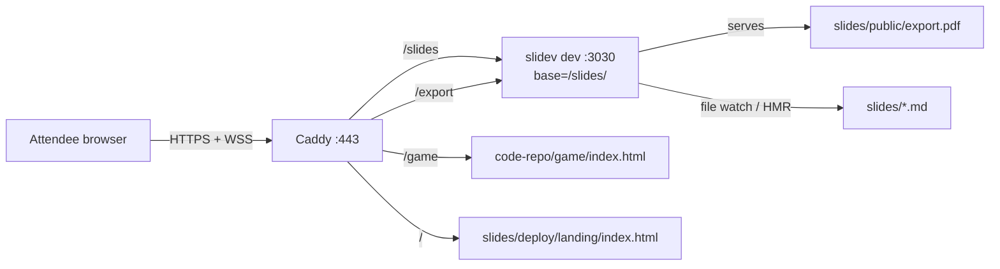

# Hosting the Workshop on a VPS

This guide hosts the full Replay 2026 Nexus workshop on a single VPS behind one domain. The room sees live presenter-follow (you advance a slide, attendees advance), file edits propagate via HMR, the topology sandbox is one click away, and a PDF export is downloadable.

## What this gives you

A single host (`nexus.example.com` in this guide; replace with your domain) serves four surfaces via subpaths:

| URL | What it serves |
| :--- | :--- |
| `/` | Landing page with three buttons |
| `/slides` | Live Slidev deck (Vite HMR + presenter sync over WebSocket) |
| `/slides/presenter` | Presenter view, locked behind HTTP basic auth |
| `/export` (and `/export.pdf`) | Downloadable PDF, proxied through Slidev |
| `/game` | Single-file topology sandbox from the sibling code repo |

## Architecture

Caddy on `:443` terminates HTTPS for everything and routes by path. The Slidev dev server runs on `localhost:3030` with its Vite base set to `/slides/` so emitted asset URLs and HMR WebSockets line up with the proxy. The deck owns its own assets: `/export` is rewritten to `/slides/export.pdf` and proxied through to Slidev, which serves the file from `slides/public/`. Only the game and the landing page are served directly by Caddy.



## Quick start

You need:

- A 2 vCPU / 4 GB Debian 12 or Ubuntu 22.04+ droplet (a 1c/1G box also works for ~100 attendees).
- A domain. An `A` record for the host (e.g. `nexus.ziggy.codes`) pointing at the droplet's public IP.
- Ports 80 and 443 open at the cloud firewall.
- SSH access as a sudoer.

SSH into the droplet, then run one of these:

```bash
# A. Curl the bootstrap script and pipe it. Easiest for a fresh box.
curl -fsSL https://raw.githubusercontent.com/temporalio/workshop-nexus-intro/main/slides/deploy/bootstrap.sh \
  | sudo bash -s -- --domain nexus.ziggy.codes
```

```bash
# B. Or clone first, then run the script from the checkout.
sudo apt-get update && sudo apt-get install -y git
sudo git clone https://github.com/temporalio/workshop-nexus-intro /opt/workshop-nexus-intro
sudo bash /opt/workshop-nexus-intro/slides/deploy/bootstrap.sh --domain nexus.ziggy.codes
```

The script prompts for a presenter password (or pass `--password "..."`), then:

1. Installs Node 22, pnpm, git, rsync, and Caddy via apt.
2. Creates a `slidev` system user.
3. Clones both repos to `/opt/workshop-nexus-intro` and `/opt/workshop-nexus-intro-code` (or `git pull`s if they're already there).
4. Runs `pnpm install` for the Slidev deck (skips the Playwright Chromium download — the VPS doesn't render PDFs).
5. Installs the `slidev.service` systemd unit with `SLIDEV_BASE=/slides/` so Vite emits prefixed asset URLs.
6. Renders `/etc/caddy/Caddyfile` with your domain and a bcrypt-hashed presenter password.
7. Validates the Caddyfile, restarts both services, and prints smoke-test commands.

The script is idempotent. Re-run it any time to apply config changes or pick up a new repo ref (`--deck-ref`, `--code-ref`).

### Smoke-test the install

After DNS has propagated and Caddy has fetched a Let's Encrypt cert (a few seconds on first hit):

```bash
curl -I https://nexus.ziggy.codes/                            # 200, landing
curl -I https://nexus.ziggy.codes/slides                      # 200, Slidev (no auth)
curl -I https://nexus.ziggy.codes/slides/presenter            # 401
curl -I -u mason:<password> https://nexus.ziggy.codes/slides/presenter   # 200
curl -I https://nexus.ziggy.codes/game                        # 200, text/html
curl -I https://nexus.ziggy.codes/export                      # 404 until the first PDF sync
```

### Push the initial PDF

From your laptop, in the deck repo:

```bash
cd slides
pnpm export                                          # writes slides/public/export.pdf
cd ..
slides/deploy/sync-to-vps.sh slidev@nexus.ziggy.codes
```

`/export` now serves the PDF.

## Sync workflow

You edit slides and the landing page locally; the VPS picks up changes and HMRs the room.

### Push a slide or landing-page change

From the repo root, after editing:

```bash
slides/deploy/sync-to-vps.sh slidev@your.actual.domain
```

The script `rsync`s the `slides/` directory (minus `node_modules`, `dist`, `.git`) to `/opt/workshop-nexus-intro/slides/` on the VPS. The landing page lives at `slides/deploy/landing/`, so it's swept up by the same sync. Slidev pushes HMR updates to every attendee browser; landing-page edits go live on the next page load.

### Refresh the PDF

```bash
cd slides
pnpm export                                          # generates slides/public/export.pdf locally
cd ..
slides/deploy/sync-to-vps.sh slidev@your.actual.domain
```

`pnpm export` writes `slides/public/export.pdf`. The sync uploads it; Vite picks it up under Slidev's base path; Caddy rewrites `/export` and `/export.pdf` to `/slides/export.pdf` and proxies, so the deck stays the single owner of the file. The PDF is generated locally so the VPS does not need Playwright Chromium.

### Refresh the game

The game is a single static file in the sibling code repo. It rarely changes during a workshop. Pull on the VPS when needed:

```bash
ssh slidev@your.actual.domain 'cd /opt/workshop-nexus-intro-code && git pull'
```

Or re-run `bootstrap.sh --code-ref <ref>` to pin a specific tag.

## Operations

### Tail logs

```bash
sudo journalctl -u slidev -f      # the dev server
sudo journalctl -u caddy -f       # TLS, proxying, WebSocket upgrades
```

### Restart

```bash
sudo systemctl restart slidev     # if HMR gets wedged
sudo systemctl reload caddy       # after Caddyfile edits
```

### Rotate the presenter password

```bash
sudo bash /opt/workshop-nexus-intro/slides/deploy/bootstrap.sh \
    --domain your.actual.domain \
    --password "new-password"
```

The script regenerates the bcrypt hash and reloads Caddy. Browser sessions still hold the old password until they close the tab.

### Pre-workshop checklist

- Re-sync the deck and PDF from your laptop. Hit `/export` in a browser, confirm the file downloads.
- Hit `/` and confirm the three landing buttons all resolve.
- Hit `/slides` in two browsers, advance one, click "sync" in the other and confirm it follows.
- Open `/slides/presenter` in your driver browser, log in with the basic-auth credentials, and confirm the presenter view loads with notes. That is the view you drive the deck from.
- Hit `/game`, click Stop on the Compliance Worker, confirm a payment turns yellow and `Lost` does not increment.
- Tail `journalctl -u slidev -f` and `journalctl -u caddy -f` in side terminals during the live workshop.

## Troubleshooting

- **Slides load but assets 404.** The `SLIDEV_BASE` env var in the systemd unit must end with a trailing slash (`/slides/`, not `/slides`). Confirm `vite.config.ts` is present in `slides/`. Restart the unit after changing either.
- **WebSocket disconnects.** Caddy 2 supports the WebSocket upgrade transparently. If sync stops, check `journalctl -u caddy` for upgrade errors and verify the upstream is `localhost:3030`. The Vite HMR WebSocket connects under `/slides/` because of the base path; that path must reach the proxy.
- **Presenter URL not protected.** The matcher is `path /slides/presenter /slides/presenter/*`. Both forms are needed; without the wildcard, deep links into the presenter UI bypass auth.
- **PDF appears stale.** Browsers cache `/export.pdf`. After syncing a new PDF, hard-refresh, or announce a versioned URL like `/export.pdf?v=2`.
- **`/game` 403s.** Caddy can't read the file. Check `ls -ld /opt/workshop-nexus-intro-code/game` and the file inside it; both need to be world-readable. The bootstrap script runs `chmod -R o+rX` to fix this; re-run it if you cloned manually.
- **Slidev crashes on startup.** Run `journalctl -u slidev -n 200`. The most common cause is a syntax error in a chapter file. Fix locally, sync, the unit auto-restarts.
- **`pnpm: command not found` in the unit.** The unit assumes pnpm at `/usr/bin/pnpm` (NodeSource install location). If `which pnpm` returns a different path on your VPS, edit `ExecStart=` in the unit accordingly.
- **`caddy hash-password` not found.** The script depends on Caddy being installed before it generates the hash. If you ran the script before Caddy finished installing for some reason, just re-run it.

## Manual setup (reference)

The bootstrap script wraps the steps below. If you want to do it by hand or understand what the script is doing, this is the unrolled version.

### 1. Install Node, pnpm, git, Caddy

```bash
# Node 22 LTS via NodeSource
curl -fsSL https://deb.nodesource.com/setup_22.x | sudo -E bash -
sudo apt install -y nodejs git rsync

# pnpm
sudo npm install -g pnpm

# Caddy
sudo apt install -y debian-keyring debian-archive-keyring apt-transport-https curl
curl -1sLf 'https://dl.cloudsmith.io/public/caddy/stable/gpg.key' \
  | sudo gpg --dearmor -o /usr/share/keyrings/caddy-stable-archive-keyring.gpg
curl -1sLf 'https://dl.cloudsmith.io/public/caddy/stable/debian.deb.txt' \
  | sudo tee /etc/apt/sources.list.d/caddy-stable.list
sudo apt update && sudo apt install -y caddy
```

### 2. Create the slidev user and clone both repos

```bash
sudo useradd --system --create-home --shell /bin/bash slidev
sudo mkdir -p /opt/workshop-nexus-intro /opt/workshop-nexus-intro-code
sudo chown slidev:slidev /opt/workshop-nexus-intro /opt/workshop-nexus-intro-code

sudo -u slidev git clone https://github.com/temporalio/workshop-nexus-intro \
  /opt/workshop-nexus-intro
sudo -u slidev git clone https://github.com/temporalio/workshop-nexus-intro-code \
  /opt/workshop-nexus-intro-code

cd /opt/workshop-nexus-intro/slides
sudo -u slidev PLAYWRIGHT_SKIP_BROWSER_DOWNLOAD=1 pnpm install --frozen-lockfile
```

The `caddy` user reads both `/opt` trees directly, so the cloned files need to be world-readable. The default umask gives you that (dirs `755`, files `644`); if you've changed it, `sudo chmod -R o+rX /opt/workshop-nexus-intro /opt/workshop-nexus-intro-code` puts it back.

### 3. Install the systemd unit

```bash
sudo cp /opt/workshop-nexus-intro/slides/deploy/slidev.service /etc/systemd/system/
sudo systemctl daemon-reload
sudo systemctl enable --now slidev
sudo systemctl status slidev
```

The unit runs `pnpm dev --port 3030` as the `slidev` user with `SLIDEV_BASE=/slides/`. The `slides/vite.config.ts` reads that env var and sets Vite's `base` accordingly, so all asset URLs and HMR WebSockets emit prefixed with `/slides/`. Local dev (no env var set) stays at `/`.

### 4. Configure Caddy

```bash
sudo cp /opt/workshop-nexus-intro/slides/deploy/Caddyfile /etc/caddy/Caddyfile
sudo sed -i 's/nexus.example.com/your.actual.domain/' /etc/caddy/Caddyfile

caddy hash-password
# Enter password: ********
# $2a$14$abc...xyz       <-- copy this line

sudo nano /etc/caddy/Caddyfile
# replace the REPLACE_WITH_BCRYPT_HASH_FROM_CADDY_HASH_PASSWORD placeholder

sudo systemctl reload caddy
```

Caddy provisions a Let's Encrypt cert automatically on the first HTTPS request.

## Cost and capacity

A $5/month VPS (1 vCPU, 1 GB RAM, 1 TB bandwidth) handles ~100 concurrent attendees. The 2c/4G droplet is comfortable headroom for the deck, the static game, and the landing page combined. The bottleneck during a workshop is bandwidth, not CPU; DO's monthly transfer is well above what one workshop consumes.
