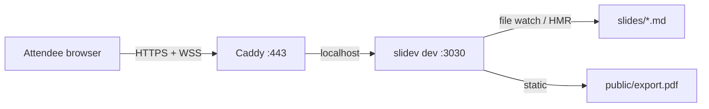

# Hosting the Slidev Deck on a VPS

This guide hosts the Nexus workshop deck on a single VPS so the room sees live presenter-follow (you advance a slide, attendees advance), file edits propagate via HMR, and a PDF export is downloadable at `URL/export.pdf`.

## What this gives you

- A stable HTTPS URL the room hits during the workshop.
- Slidev's WebSocket sync: when you navigate, attendees who clicked "follow" navigate too.
- Live edits propagate via Vite HMR. Push a change, attendees see it.
- A PDF download at `URL/export.pdf`, regenerated whenever you choose.

## Architecture

Caddy on `:443` reverse-proxies HTTPS and WebSockets to Slidev's dev server on `localhost:3030`. The dev server keeps WebSockets open to attendee browsers and watches the slides directory for changes. The PDF lives at `slides/public/export.pdf` and is served by Vite's static-file passthrough.



## Prerequisites

- A VPS. 1 vCPU and 1 GB RAM is plenty for ~100 concurrent attendees. Debian 12 or Ubuntu 22.04+ assumed below.
- A domain name with an A record pointing at the VPS public IP.
- Ports 80 and 443 open at the cloud firewall / security group.
- SSH access as a sudoer.

## One-time VPS setup

Run these as a sudoer on the VPS.

### 1. Install Node, pnpm, git, Caddy

```bash
# Node 22 LTS via NodeSource
curl -fsSL https://deb.nodesource.com/setup_22.x | sudo -E bash -
sudo apt install -y nodejs git rsync

# pnpm
sudo npm install -g pnpm

# Caddy
sudo apt install -y debian-keyring debian-archive-keyring apt-transport-https curl
curl -1sLf 'https://dl.cloudsmith.io/public/caddy/stable/gpg.key' \
  | sudo gpg --dearmor -o /usr/share/keyrings/caddy-stable-archive-keyring.gpg
curl -1sLf 'https://dl.cloudsmith.io/public/caddy/stable/debian.deb.txt' \
  | sudo tee /etc/apt/sources.list.d/caddy-stable.list
sudo apt update && sudo apt install -y caddy
```

### 2. Create the slidev user and clone the repo

```bash
sudo useradd --system --create-home --shell /bin/bash slidev
sudo mkdir -p /opt/workshop-nexus-intro
sudo chown slidev:slidev /opt/workshop-nexus-intro

sudo -u slidev git clone https://github.com/temporalio/workshop-nexus-intro \
  /opt/workshop-nexus-intro
cd /opt/workshop-nexus-intro/slides
sudo -u slidev pnpm install
```

### 3. Install the systemd unit

```bash
sudo cp /opt/workshop-nexus-intro/slides/deploy/slidev.service /etc/systemd/system/
sudo systemctl daemon-reload
sudo systemctl enable --now slidev
sudo systemctl status slidev
```

The unit runs `pnpm dev --port 3030` as the `slidev` user, with stdout going to journald. It restarts on crash.

### 4. Configure Caddy

The shipped Caddyfile reverse-proxies HTTPS to the dev server **and** locks the presenter view behind HTTP basic auth so only you can drive the room. Attendees hitting `URL/` are not prompted; only `URL/presenter` and `URL/presenter/*` are.

```bash
# Copy the template and set your domain.
sudo cp /opt/workshop-nexus-intro/slides/deploy/Caddyfile /etc/caddy/Caddyfile
sudo sed -i 's/slides.example.com/your.actual.domain/' /etc/caddy/Caddyfile
```

Now generate a bcrypt hash for your presenter password:

```bash
caddy hash-password
# Enter password: ********
# Confirm password: ********
# $2a$14$abc...xyz       <-- copy this whole line
```

Open the Caddyfile and replace the `REPLACE_WITH_BCRYPT_HASH_FROM_CADDY_HASH_PASSWORD` placeholder with the hash you just copied:

```bash
sudo nano /etc/caddy/Caddyfile
# find:    mason REPLACE_WITH_BCRYPT_HASH_FROM_CADDY_HASH_PASSWORD
# replace: mason $2a$14$abc...xyz
```

If you want a username other than `mason`, change it in the same line. Multiple presenters can be added by listing them inside the `basicauth` block, one per line.

Reload Caddy:

```bash
sudo systemctl reload caddy
```

Caddy provisions a Let's Encrypt cert automatically on the first HTTPS request. Confirm everything is up:

```bash
curl -I https://your.actual.domain                 # 200 from Slidev (no auth)
curl -I https://your.actual.domain/presenter       # 401 Unauthorized
curl -I -u mason:yourpw https://your.actual.domain/presenter   # 200
```

## Sync workflow

You edit slides locally; the VPS picks up changes and HMRs the room.

### Push a slide change

From the repo root, after editing a chapter file:

```bash
slides/deploy/sync-to-vps.sh slidev@your.actual.domain
```

The script `rsync`s the `slides/` directory (minus `node_modules`, `dist`, `.git`) to the VPS. Slidev detects file changes and pushes HMR updates over WebSocket to every attendee browser. No restart needed.

### Refresh the PDF

```bash
cd slides
pnpm export                                          # generates slides/public/export.pdf locally
cd ..
slides/deploy/sync-to-vps.sh slidev@your.actual.domain
```

The new PDF is served at `URL/export.pdf` immediately. Tell the room about it at the end of the workshop.

> The PDF is generated locally so the VPS does not need Playwright Chromium or its system deps. Keeps the VPS lean.

## Operations

### Tail logs

```bash
sudo journalctl -u slidev -f      # the dev server
sudo journalctl -u caddy -f       # TLS, proxying, WebSocket upgrades
```

### Restart

```bash
sudo systemctl restart slidev     # if HMR gets wedged
sudo systemctl reload caddy       # after Caddyfile edits
```

### Pre-workshop checklist

- Generate the PDF locally and sync. Hit `URL/export.pdf` in a browser.
- Hit `URL/` in two browsers, advance one, click "sync" in the other and confirm it follows.
- Open `URL/presenter` in your driver browser, log in with the basic-auth credentials, and confirm the presenter view loads with notes. That is the view you drive the deck from.
- Tail `journalctl -u slidev -f` in a side terminal during the live workshop.

## Troubleshooting

- **WebSocket disconnects.** Caddy 2 supports the WebSocket upgrade transparently. If sync stops, check `journalctl -u caddy` for upgrade errors and verify the upstream is `localhost:3030`.
- **PDF appears stale.** Browsers cache `/export.pdf`. After syncing a new PDF, hard-refresh, or announce a versioned URL like `URL/export.pdf?v=2`.
- **Slidev crashes on startup.** Run `journalctl -u slidev -n 200`. The most common cause is a syntax error in a chapter file. Fix locally, sync, the unit auto-restarts.
- **Attendees see stale content.** Slidev HMR is incremental and usually transparent. If something looks stuck, ask one attendee to refresh the page.
- **`pnpm: command not found` in the unit.** The unit assumes pnpm at `/usr/bin/pnpm` (NodeSource install location). If `which pnpm` returns a different path on your VPS, edit `ExecStart=` in the unit accordingly.

## Rotating the presenter password

Generate a new hash and edit the Caddyfile:

```bash
caddy hash-password
sudo nano /etc/caddy/Caddyfile          # update the bcrypt hash on the `mason` line
sudo systemctl reload caddy
```

Browser sessions still hold the old password until they close the tab. Force a re-prompt by closing and reopening the browser window before the workshop.

To add a co-presenter, list a second user inside the `basicauth` block in the Caddyfile, one user per line:

```
basicauth @presenter {
    mason   $2a$14$...
    co-host $2a$14$...
}
```

## Cost and capacity

A $5/month VPS (1 vCPU, 1 GB RAM, 1 TB bandwidth) handles ~100 concurrent attendees. The dev server is efficient over WebSocket and slide assets cache after first load.
