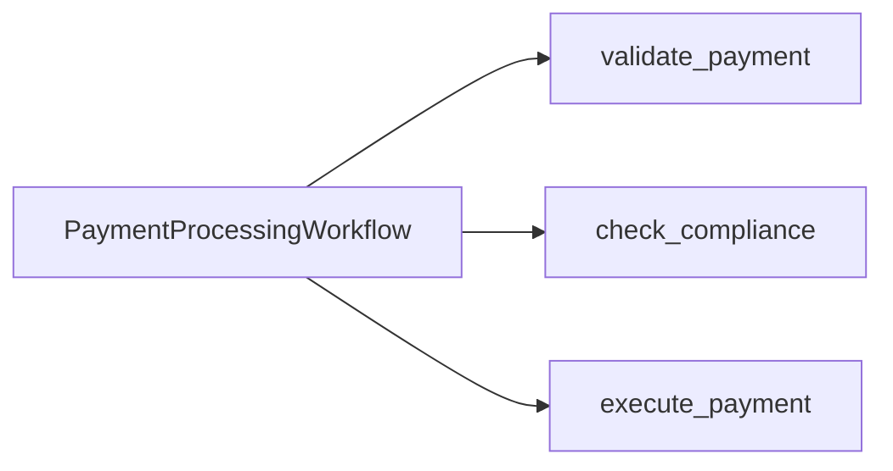

---
layout: default
---

# Two Teams, One Workflow

Today's monolith: `PaymentProcessingWorkflow`.

<v-clicks>

- **Payments team** owns `validate_payment` and `execute_payment`
- **Compliance team** owns `check_compliance`
- **The Problem** One Worker. One namespace. One deployment.

</v-clicks>

<!--
- Optional opener (welding metaphor anchor): "My dad just retired after 43 years as a welder. He'd tell you the seam is the part that matters: the line where two pieces meet. A bad weld at the seam, the whole thing fails. A good weld is stronger than the metal around it. Today we're going to find the seams in this payment app, see why this particular seam is bad, and learn how to make a clean one."
  - Sets up the metaphor for the rest of the chapter. "Where Are the Seams?" lands harder when "seam" is already grounded.
  - Skip if you don't feel like personal stories that day. The chapter still works without it.
- Today's monolith: `PaymentProcessingWorkflow`.
  - One Workflow type that calls three Activities back-to-back.
- The diagram is intentionally simple. validate → compliance → execute. That's the whole app.
  - Activities are owned by different teams in real life, even though they're called from one Workflow.
  - Who are the actors in our story here?
- **Build 1 -** **Payments team** owns `validate_payment` and `execute_payment`
  - These are the bookends. They check the request and they move the money.
- **Build 2 -** **Compliance team** owns `check_compliance`
  - Risk rules. Sanctions screening. KYC. The kind of code that gets scrutinized in audits.
- **Build 3 -** **The Problem** One Worker. One namespace. One deployment.
  - This is the architectural fact that creates all the pain we're about to enumerate.
  - Blast radius is effectively zero
  - The code is correct. The Workflows run, it's the structure and deployment model that is complex.
-->

---
layout: default
---

# Meet the Teams

Two teams, one transaction.

<v-clicks>

- **Payments**: processes payment transactions end-to-end. Validates the request, calls Compliance, executes the transfer. Owns the customer-facing SLA.
- **Compliance**: assesses regulatory risk on every transaction. Sanctions screening, KYC, threshold rules. Decisions land in three buckets:
  - **LOW**: auto-approve
  - **MEDIUM**: flagged for additional checks
  - **HIGH**: auto-decline

</v-clicks>

 

<v-click>

Compliance must pass before Payments executes. **No payment goes out unchecked.**

</v-click>

<!--
- Business framing before the chapter's pain enumeration. The structural picture from the previous slide gave the room the topology; this slide gives the stakes.
- "Before we look at what goes wrong, here's what each team is actually trying to do."
- **Build 1 -** **Payments**: processes payment transactions end-to-end.
  - Three steps: validate, check compliance, execute. Validate and execute are theirs; the middle step is Compliance's.
  - SLA framing: Payments owns the customer-facing uptime guarantee. When Compliance is co-tenant, Compliance gets dragged into Payments' SLA whether or not their own product team signed up for it.
- **Build 2 -** **Compliance**: assesses regulatory risk on every transaction.
  - Sanctions screening: matching against OFAC and similar lists.
  - KYC: identity verification, customer-history checks.
  - Threshold rules: dollar amounts, jurisdictions, transaction types that flag for review.
  - Three risk levels are the workshop's business logic:
    - LOW: auto-approve. The bulk of transactions.
    - MEDIUM: flagged for additional checks. Today the rule check approves with an AML monitoring note attached; the bucket exists so we can act on it differently when the workshop's logic catches up.
    - HIGH: auto-decline. Sanctions hits, threshold breaches.
- **Build 3 -** Compliance must pass before Payments executes. **No payment goes out unchecked.**
  - Hard dependency. Not optional. Every payment touches Compliance.
  - This dependency is what makes the coupling so painful. Compliance broken means Payments grinds to a halt. Compliance slow means Payments slow. Compliance's blast radius is Payments' blast radius until the seam is cut.
- Lands the business stakes the room needs to hear before pain enumeration. With "Payments owns the SLA" and "Compliance has audit accountability" loaded, the next slide's "Mixed SLAs" and "Shared blast radius" bullets land harder.

## Teaching notes

- **Anecdotal anchor (verbal-only, optional).** The two-team scenario you're about to learn is structurally identical to a published cross-namespace self-service pattern: a platform team owns workflows for repeatable infrastructure operations (database deletion, RDS resizing, cache upgrades, etc.); engineering teams need to trigger those workflows but shouldn't have full namespace write access; the platform team retains approval over critical steps. Replace "platform team" with "Compliance" and "engineering teams" with "Payments" and you have the workshop's shape. Mention if the room asks "where does this pattern come from in the wild?"; do not put the customer name on the slide.
-->

---
layout: default
---

# What Goes Wrong as Teams Grow

<v-clicks>

- **Shared blast radius.** A bug in `check_compliance` takes down `execute_payment`.
- **Shared deploys.** Compliance ships every Thursday. Payments ships every hour. Now what?
- **Shared knowledge.** Every Payments engineer needs to read every Compliance change.
- **Mixed SLAs.** Payments has an SLA of 4 9s. Compliance now _also_ has this SLA.

</v-clicks>

 

<v-click>

The code is fine. The **boundary** is wrong.

</v-click>

<!--
- **Build 1 -** **Shared blast radius.** A bug in `check_compliance` takes down `execute_payment`.
  - The Worker hosts both. A panic in one means a restart for both.
- **Build 2 -** **Shared deploys.** Compliance ships every Thursday. Payments ships every hour. Now what?
  - Either Compliance deploys faster than they want, or Payments deploys slower than they want.
  - "Coordinated deploys" sounds harmless until your company has 30 services.
- **Build 3 -** **Shared knowledge.** Every Payments engineer needs to read every Compliance change.
  - PR reviews stretch across teams. Cognitive load grows linearly with team count.
- **Build 4 -** **Mixed SLAs.** Payment's has an SLA of 4 9s. Compliance now _also_ has this SLA.
  - One slow Activity blocks the entire Workflow. 
- **Build 5 -** The code is fine. The **boundary** is wrong.
  - We are not fixing bugs. We are fixing organizational structure expressed in code.

## Teaching notes

- **Anecdotal pain-point delivery anchors (verbal-only).** Concrete pre-Nexus pains the presenter can reach for when the on-slide bullets land. Lean on these only if the room responds to concrete-example framing; skip if the on-slide pains are landing on their own.
  - **Build 1 anchors (shared blast radius).**
    - Communication isn't durable. When an Activity makes an HTTP or gRPC call to another Workflow, Temporal doesn't track it; this is the one place where Temporal's guarantees stop.
    - Security is too broad without a gateway. Access between namespaces is all-or-nothing without a bespoke gateway; teams grant broad namespace access, and risk grows with cross-team or sensitive data.
    - Network requests lost between services. Fire-and-forget HTTP/gRPC; silent failures, no durable retries.
  - **Build 3 anchor (shared knowledge).**
    - Debugging takes minutes across services. Cross-team teams stitch things together using IDs and institutional knowledge; connecting workflows by hand can add several minutes to any investigation.
  - **Slide-closer anchor ("the boundary is wrong").**
    - The gateway is a liability. Many teams end up maintaining an entire gateway service just so workflows can talk to each other; it is a vulnerable part of the system, and it is not the team's product.
-->

---
layout: default
---

# The Architecture May Look Familiar

Today's monolith is the **most extreme** form of coupling: Compliance code is registered as an Activity on the Payments Worker.

 

<v-clicks>

- More common in real codebases: two teams sharing **one namespace**, **one task queue**, sometimes **one database**, with no contract between them.
- Coupled at the import level, the deploy level, or the schema level instead of the service contract level.
- Nexus addresses both.

</v-clicks>

 

<v-click>

We use the visceral monolith because it's easier to see the issue in the Worker registration and the Event History. The lessons here transfer to other use cases.

</v-click>

<!--
- Today's monolith is the most extreme form of coupling: Compliance code is registered as an Activity on the Payments Worker.
- **Build 1 -** More common in real codebases: two teams sharing one namespace, one task queue, sometimes one database, with no contract between them.
  - "Does anyone here actually have a Workflow that imports another team's activity registration directly?"
  - "Does anyone share a namespace with a team that owns a different domain?" That is the audience for Nexus.
- **Build 2 -** Coupled at the import level, the deploy level, or the schema level instead of the activity-registration level.
  - The pain is the same. The mechanism is different.
- **Build 3 -** Nexus is the canonical fix for both shapes.
  - The structural intent (typed contract, separate namespace, separate blast radius) applies regardless of which coupling shape you started from.
- **Build 4 -** We use the visceral monolith because the seam is visible in the Worker registration and the Event History.
  - By the end of the morning they will have built two namespaces, two Workers, one Endpoint. Whichever coupling they have at home, they can map this onto it.
-->

---
layout: section
---

# Quick Poll

ahaslides.com/NEXUSWS

<!--
- **AhaSlides live 4** (the poll). The next advance lands on live 5 (start of the Ch 1 graded block).
- "Quick show of hands, AhaSlides edition. One question."
- AhaSlides live 4, poll: "Have you ever wrapped a teammate's Workflow in an HTTP API?"
- "OK, so this isn't a hypothetical for any of you."
- "Lucky you, most teams hit this within their first year on Temporal. Today is the easy way to skip the pain."
- "Now, before we look at fixes, let's actually run the monolith. Feel the architecture before we change it."
-->

---
layout: exercise
minutes: 7
heading: Exercise 1
---

**Run the monolith. Feel the problem.**

You will run the starter end-to-end against a single-Worker, single-namespace
application and inspect what one team's Activity looks like inside another
team's Workflow.

Full instructions are in the Instruqt tab.

<!--
- "Run the monolith. Feel the problem."
  - The point is for the monolith to **work**. We need a working baseline so the decoupling has something to compare against.
- Three transactions: TXN-A (LOW), TXN-B (MEDIUM), TXN-C (HIGH). All three should run end-to-end through one Workflow.
- "Look at the activity events. validate, check_compliance, execute. All in one Workflow."
- Pedagogical note: this exercise lands BEFORE the Nexus intro on purpose. Run the bad shape, then we name the fix. Not the other way around.
- 7 minutes. Walk the room. When they come back, we debrief, then look at the patterns they could reach for.
-->

---
layout: default
---

# Where Are the Seams?

<v-clicks depth="2">

- **What did you notice was wrong?**
  - Compliance code is registered on the Payments Worker
  - Same `default` namespace, same `payments-processing` task queue
  - No boundary in the Event History; `check_compliance` looks like any other Activity
- **How does this become a problem when Compliance grows into its own team?**
  - Compliance can't ship without coordinating with Payments
  - A bad Compliance deploy crashes the Payments Worker
  - Same process holds PCI scope and KYC scope

</v-clicks>

 

<v-click>

How do teams typically address this?

</v-click>

<!--
- This slide is a debrief, not a lecture. Each bullet clicks in one at a time so you can pace the reveal against the room.
- Pattern: ask the question, take 2 to 3 answers, click in the bullets they hit (or didn't). If someone calls one out, click it in to confirm. If the room is quiet, click it in to prime the next answer.
- Cold start: if no one answers Build 1, lead with "Did anyone notice the Worker banner showed `check_compliance` registered with the parenthetical `(monolith - will decouple)`?"
- **Build 1 -** **What did you notice was wrong?**
  - Pause. Take 2 to 3 answers from the room before clicking anything in.
  - **Build 2 -** Compliance code is registered on the Payments Worker.
    - The loudest signal. The Worker banner literally says it.
  - **Build 3 -** Same `default` namespace, same `payments-processing` task queue.
    - No isolation. One blast radius. One access policy.
  - **Build 4 -** No boundary in the Event History; `check_compliance` looks like any other Activity.
    - Compliance has zero visibility into runs of their own logic.
- **Build 5 -** **How does this become a problem when Compliance grows into its own team?**
  - Forward-projection question. Aim at scaling intuition. Pause again.
  - **Build 6 -** Compliance can't ship without coordinating with Payments.
    - Deploy coupling. The most common cross-team gripe.
  - **Build 7 -** A bad Compliance deploy crashes the Payments Worker.
    - Blast radius. The higher-SLA team gets dragged down by the lower-SLA team's mistakes.
  - **Build 8 -** Same process holds PCI scope and KYC scope.
    - Data isolation. Audit and compliance teams care a lot about this.
- **Build 9 -** How do teams typically address this?
  - Bridge to "What About Patterns We Already Have?" Activity wrapping HTTP, Shared Activity, Child Workflow.
  - These are the obvious-looking fixes. None of them fully work. That's the gap Nexus fills.
-->

---
layout: default
---

# What About Patterns We Already Have?

| Pattern                    | What it solves                       | What it doesn't                      |
| :------------------------- | :----------------------------------- | :----------------------------------- |
| **Activity → HTTP gateway → Workflow** | Calling another team's Workflow      | Reinvents Temporal across the seam   |
| **Shared Activity**        | Reusing code in one team             | Same namespace, same blast radius, external team access    |
| **Child Workflow**         | Decomposing inside one Workflow      | Same namespace, same Worker pool     |

 

<v-click>

None of these draw a line between **teams**.

</v-click>

<!--
- **Activity → HTTP gateway → Workflow** | Calling another team's Workflow | Reinvents Temporal across the seam
  - The shape: Workflow A in your namespace calls an Activity. The Activity HTTP-calls a REST gateway someone built in front of Workflow B in another namespace. The gateway starts Workflow B, holds the connection or polls for the result, returns it.
  - "Just put it behind an HTTP API" is the default thing people turn to. It is the bespoke gateway, restated in code.
  - Both sides are durable **internally**. Workflow A is durable. Workflow B is durable. What you lose is durability **across the seam**.
    - HTTP delivery is best-effort. Response drops on the return, Workflow A's Activity retries, and now you have a duplicate Workflow B. Unless you built deterministic IDs + USE_EXISTING by hand.
    - A 5-minute Workflow B doesn't fit in a 30-second HTTP request. So you build a polling loop. With its own retries. Its own cancellation. Its own dedup. You have reinvented Nexus, badly.
  - You also lose retries-as-first-class. You write 4xx-vs-5xx classification, backoff, circuit breaker. All by hand, in every Activity.
  - And you've taken on a new service to operate: the gateway itself. Auth, security patches, observability, on-call rotation. A vulnerable part of your system, and not your team's product.
- **Shared Activity** | Reusing code in one team | Same namespace, same blast radius, external team access
  - Compliance ships their code into the Payments Worker. Same deploy pipeline, same secrets, same crash blast radius. That's not a team boundary; it's the opposite.
- **Child Workflow** | Decomposing inside one Workflow | Same namespace, same Worker pool
  - Decomposition tool, not a team boundary. Same namespace, same Worker pool, same tenancy unit. Cross-team needs cross-namespace.
- **Build 1 -** None of these draw a line between **teams**.

## Teaching notes

- Scope clarifier (verbal only, do not put on slide): the workshop's framing is cross-team Temporal-to-Temporal integration. For arbitrary external HTTP calls to flaky third-party APIs, a sync Nexus handler is the wrong tool: 5 consecutive retryable errors trip the circuit breaker for the (caller-Namespace, Endpoint) pair for 60 seconds, and rate-limited APIs trigger the same failure. The right tool for unreliable external HTTP is **standalone activities** (GA-imminent on Temporal Cloud). Mention only if asked. The workshop teaches Nexus for cross-team workflow integration, which is its strongest case.
-->

---
layout: default
---

# From Weld to Contract

A Nexus call is **a way of invoking a typed Operation behind a contract, with durable delivery**. Think **durable RPC**.

 

<v-clicks>

- The unit you ship is a **Service**.
- The unit the operator registers is an **Endpoint**.
- The unit a **caller** invokes is an **Operation**. The team that implements it is the **implementer**.
- **Workflow-as-a-Service**: reusable workflows behind a typed contract.
- The same Service contract works in any Temporal SDK. **Cross-language by design.**
- **Generally Available.** Battle-tested in production today.

</v-clicks>

 

<v-click>

**The contract is the integration.**

</v-click>

<!--
- Title hooks the welding metaphor. What you saw in Instruqt was `check_compliance` registered on the Payments Worker. That's the weld. Right now it's tight. By 12:30 it's a contract.
- A Nexus call is a way of invoking a typed Operation behind a contract, with durable delivery. Think durable RPC.
  - The words that matter: typed, contract, durable delivery.
  - Mental model anchor: "durable RPC." Like gRPC, but the call survives a Worker crash, retries until schedule-to-close, and the underlying Operation can run for days. The docs use the same framing word-for-word: "Nexus RPC is a protocol designed with durable execution in mind."
  - "Durable delivery" is precise: the Nexus Machinery delivers with at-least-once semantics, retries until schedule-to-close, surfaces the result reliably. The work behind the call may or may not be durable on its own (Workflow start, Signal, Update = durable; Query = not), but the call itself always is.
  - Verbal scope, don't put on slide: in the workshop's case the work belongs to another team in another namespace. More broadly, Nexus works across namespaces, regions, and clouds, or within a single namespace for contract discipline. Not just an org-chart fix.
  - Future roadmap, don't say on stage unless asked: today the caller must be a Workflow. Non-Workflow callers (bash, service, app) are on the Temporal Nexus roadmap per the GA announcement and Public Preview blog. The slide says "a way of invoking" rather than "a Workflow invoking" intentionally so it stays accurate when that ships.
- **Build 1 -** The unit you ship is a Service.
  - The Service is the code artifact. Both teams import it.
- **Build 2 -** The unit the operator registers is an Endpoint.
  - The Endpoint is the server-side artifact. Created with a CLI command, not in code.
- **Build 3 -** The unit a caller invokes is an Operation. The team that implements it is the implementer.
  - The Operation is the call site. One Operation = one cross-team call.
  - Caller, not Workflow, on purpose: the connector roadmap brings non-Workflow callers later.
- **Build 4 -** The pattern this enables is Workflow-as-a-Service.
  - Vocabulary anchor for production conversations. A team builds reusable durable workflows and exposes them through a typed Nexus contract; consumers depend on the contract, not the implementation. One of four canonical Nexus patterns alongside Cross-Namespace Service Mesh, Router Worker, and Self-Service Portal.
  - The room will read posts and case studies after this workshop. They'll see "Workflow-as-a-Service" in writing. Naming it here gives them the hook.
- **Build 5 -** The same Service contract works in any Temporal SDK. Cross-language by design.
  - Python implementer, Java caller, Go caller, .NET caller. Same wire format, same Operation names, same Service shape across every SDK.
- **Build 6 -** Generally Available. Battle-tested in production today.
  - Anecdotal color for delivery if the room asks "who's running this?": Netflix runs an internal control plane on Nexus (MetaPlane) for federated team-owned infrastructure resources; Miro uses Nexus for cross-region data migration where regions have no direct network connectivity; Duolingo runs a self-service portal where Cloud Ops exposes workflows that engineering teams trigger via Nexus Endpoints (the same shape this workshop is about to build). Mention any of these only if asked; skip if pacing is tight.
- **Build 7 -** **The contract is the integration.**
  - **Key point:** plant the thesis here. It returns at Ch 2's "Why Types Matter Here" close, and again at the wrap.
  - Say it once, slowly, then advance.
-->

---
layout: default
---

# Same Word, Three Different Things

Temporal docs use **"handler"** for three different things:

<v-clicks>

- A **piece of code**: `@sync_operation`, `OperationHandler.sync`
- A **side**: a team or a namespace ("handler side" in the docs)
- A **Worker process**: the one polling the Task Queue

</v-clicks>

 

<v-click>

Three meanings, one word. Each sentence asks you to figure out which one is meant.

</v-click>

 

<v-click>

This workshop splits them:

</v-click>

<v-clicks>

- **handler** = the code
- **implementer** = the side
- **Worker** stays Worker

</v-clicks>

 

<!--
- This slide names the vocabulary issue so the room can stop second-guessing it.
- "If you've read the Nexus docs and felt like the word 'handler' was doing too much, you're not crazy. It's used for three different things."
- **Build 1 -** A **piece of code**: `@sync_operation`, `OperationHandler.sync`.
  - The function or class decorated with `@sync_operation` or `@workflow_run_operation`. The thing you write in your editor.
- **Build 2 -** A **side**: a team or a namespace ("handler side" in the docs).
  - The organizational unit that owns the handler code.
- **Build 3 -** A **Worker process**: the one polling the Task Queue.
  - The process polling the Task Queue and dispatching Nexus Tasks.
- **Build 4 -** Three meanings, one word. Each sentence asks you to figure out which one is meant.
  - Developer intuition reads "handler" as a code object. That reading is fine for the code referent. The slide just makes the side and the Worker distinct so each sentence reads cleanly.
- **Build 5 -** This workshop splits them.
- **Build 6 -** **handler** = the code only.
- **Build 7 -** **implementer** = the side, the team, the role.
- **Build 8 -** **Worker** stays "Worker." Already its own concept.
  - "caller" stays "caller." The docs only use that word one way.
- "When you read real Nexus docs and Slack threads after this workshop, mentally substitute 'implementer' wherever the docs say 'handler' for the role. After a week you won't notice you're doing it."
-->

---
layout: default
---

# Four Building Blocks

<v-clicks depth="2">

- **Service**: the typed contract between teams (`@nexusrpc.service`).
  - Think a gRPC service definition.
- **Operation**: one typed method on the Service (`Operation[Input, Output]`).
  - Think a method on the service.
- **Endpoint**: the routing target, namespace + task queue. 
  - Think a reverse proxy for a service.
- **Registry**: Temporal's index of which Endpoints exist where. 
  - Think Service Discovery or DNS Server.

</v-clicks>

 

<v-click>

Service + Operation are **code-level**. Endpoint + Registry are **operator-level**.

</v-click>

<!--
- Four primitives. Two are code-level, two are operator-level. That split is the closing beat.
- **Build 1 -** **Service**: typed contract between teams.
  - One Python file. Both teams import it. No IDL.
  - Like a gRPC `service` definition, expressed in your SDK's native types.
- **Build 2 -** **Operation**: one typed method on the Service.
  - One Operation = one cross-team call.
  - We'll define two on our Service: `check_compliance` and `submit_review`.
- **Build 3 -** **Endpoint**: routing target, namespace + task queue.
  - Reverse proxy. The caller names the Endpoint, never the namespace.
  - Created with `temporal operator nexus endpoint create`. Lives outside your code.
- **Build 4 -** **Registry**: index of which Endpoints exist where.
  - You manage Endpoints in the Registry via CLI / UI / Terraform. You don't write code against it.
  - Like DNS. It's just there, doing its job.
- **Build 5 -** **Service + Operation are code-level. Endpoint + Registry are operator-level.**
  - The split that matters: developers write Service + Operation, operators wire Endpoint + Registry.
  - Two artifacts, two owners. That's the team-boundary discipline Nexus enforces.
- Service, Operation, Endpoint, Registry: the vocabulary the rest of the workshop runs on.
-->

---
layout: default
---

# Two Operation Types

Two types for **Operation**: _synchronous_ or _asynchronous_. The implementer picks, per Operation.

 

|              | Synchronous                                  | Asynchronous                          |
| :----------- | :------------------------------------------- | :------------------------------------ |
| Behavior     | Returns the result inline                    | Starts a Workflow, returns a token    |
| Used for     | Forwarding to a Workflow; reliable work under 10s | Long-running work; the handler IS a Workflow |
| Bounded by   | The 10s start-request window                 | Schedule-to-close (60d cap on Cloud)  |

<!--
- **Synchronous**: the handler returns the result inline.
  - Three canonical sync uses: forward to a Workflow (start it, or send a Signal/Query/Update); reliable low-latency code via the Temporal SDK Client; deterministic in-process compute. All bounded by the 10-second handler deadline.
  - The whole work fits in the start request. Caller waits, gets the answer back.
  - Mental shorthand: "wait here for the answer."
- **Asynchronous**: the handler starts a Workflow and returns a token.
  - The token is how the caller's Operation tracks the handler Workflow.
  - The Workflow then runs to completion under schedule-to-close.
  - Used for anything that won't fit comfortably in 10s, anything cancellable, anything multi-step.
  - Mental shorthand: "start something, I'll get back to you."
- The next slide turns this binary into the two hard numbers (10s and 60d). They map directly: sync to 10s budget, async to 60d ceiling.
-->

---
layout: default
---

# Two Hard Limits

Nexus has two constraints that affect design choices.

 

<v-clicks depth="2">

- **10 seconds per attempt, depending on handler type.** Applies to a single handler start (or cancel) request.
  - **Sync:** the result must return inside the window.
  - **Async:** only the Workflow start has to fit.
- **Async ceiling: 60 days on Temporal Cloud.** Self-hosted is configurable above 60 days.

</v-clicks>

 

<v-click>

**Decision rule:** under five seconds with margin, sync. Anything else, async.

</v-click>

 

<v-click>

**Sync also requires the work to be reliable and not rate-limited.**

</v-click>

<!--
- Nexus has two constraints worth memorizing. Two numbers.
- **Build 1 -** 10 seconds per attempt, depending on handler type.
  - Per-request deadline, measured by the caller's Nexus Machinery against a single start (or cancel) request.
  - NOT an end-to-end cap on the operation. Misses are retried with exponential backoff up to `schedule_to_close_timeout`.
  - Sync handler: the result must return inside the window. Async handler: only the workflow start has to fit (`start_workflow` returns in milliseconds).
  - Available time is often less than 10s. The request goes through matching first, eating into the budget.
- **Build 2 -** Async ceiling: 60 days on Temporal Cloud.
  - This is the maximum `schedule_to_close_timeout` Temporal Cloud will accept for a Nexus Operation.
  - Self-hosted's maximum is governed by the `component.nexusoperations.limit.scheduleToCloseTimeout` dynamic config and can exceed 60 days; Temporal Cloud locks the cap at 60 days.
  - 60 days handles human-in-the-loop scenarios, slow compliance reviews, asynchronous batch jobs, etc.
- **Build 3 -** Decision rule: under five seconds with margin, sync. Anything else, async.
  - Memorize these two numbers. They show up everywhere.
- **Build 4 -** Sync also requires the work to be reliable and not rate-limited. Five consecutive retryable errors on a (caller-Namespace, Endpoint) pair open the circuit breaker for 60 seconds.
  - Reliability and rate limits are as load-bearing as the time budget.
  - "Reliable" means Temporal, Kafka, durable infra you operate. Not arbitrary third-party HTTP.
  - Five users hitting the same flaky endpoint at the same time can trip the breaker in seconds. The scope is per (caller-Namespace, Endpoint) pair, not per user, not per Operation.
  - Standalone activities are the right tool for unreliable external HTTP, GA-imminent on Temporal Cloud.

## Teaching notes

- Source: 2026-05-01 call with Phil Prasek (lead PM, Nexus) and Alex Mazzeo (Nexus engineer). Phil: "you should only be doing sync handler code to reliable APIs." Alex: "it's not just reliability, it's also rate limiting; even if it's reliable but it's a third-party API, you could get rate limited, and now your circuit breaker is in cascading failure mode."
- Circuit breaker scope is per (caller-Namespace, Endpoint) pair, not global to the Endpoint. 5 consecutive retryable errors. Open for 60 seconds, then half-open with a single probe.
- Standalone activities (GA-imminent, Coinbase co-launch) are the canonical answer for unreliable external HTTP. SDK helper to make "one function, both standalone activity AND Nexus operation" is in flight.
-->

---
layout: exercise
minutes: 2
heading: Durable Simulation
---

**Watch a Nexus-connected system survive a Worker crash.**

Open the **Topology Sandbox**. Stop a service. Watch in-flight Workflows
wait, not fail. Start it again. Watch them resume.

The `Lost` counter stays at zero. That's the property worth the rest of the morning.

<!--
- "Before you go hands-on with the actual code, I want you to *see* the property we're chasing. Open the Topology Sandbox link. This is a browser-only simulation, no Temporal cluster, no real workers. But the shape it's drawing is exactly what you'll build by 12:30."
- Why a fake: a real Temporal cluster with three workers, dashboards, and event history would take 10 minutes to set up and another 10 to talk through. The simulation strips it down to the four things that matter and lets the room *play* with the chaos in 60 seconds.
- Tell the room what they're looking at — four panes, left to right, top to bottom:
  - **Topology** (top): three services, each with a Stop button. Payments Worker on the left, Nexus Endpoint in the middle, Compliance Worker on the right. The wires animate while traffic flows.
  - **Score**: Completed, Declined, In Flight, Blocked, Lost. *Lost is the one to watch.*
  - **Workflows In Flight**: each row is a synthetic payment moving through three steps — `validate_payment`, `check_compliance` (the Nexus async call), `execute_payment`. Step color tells you state: blue running, yellow blocked, green done.
  - **Event History** (right): same event names you'll see in the real Temporal Web UI later — `ActivityTaskScheduled`, `NexusOperationScheduled`, `NexusOperationStarted`, `NexusOperationCompleted`, `WorkflowExecutionCompleted`. Worth pointing at: "the labels are real, the cluster is fake."
- The talk track:
  1. **Let it run for a beat.** New payments spawn every ~2 seconds. Most complete (green ✓), about 15% auto-decline as HIGH-risk (those are the synthetic Compliance checks; we'll build the real ones in Ch 5/6). Lost = 0.
  2. **"Click Stop on the Compliance Worker."** In-flight payments at step 2 turn yellow — *blocked*, not failed. The Event History prints `NexusOperation pending — handler service unavailable`. New payments still spawn, validate fine, then queue at step 2. **Lost is still 0.**
  3. **"Click Start on the Compliance Worker."** Yellow → blue → green. They resume from where they were, not from the beginning. The pause was free.
  4. **"Now do the same with the Nexus Endpoint."** (the middle box). Same story, same Event History pattern, same `Lost = 0`. The Endpoint is the routing layer — when it's gone, the cross-team call can't be scheduled, but the caller workflow waits.
  5. **Optional: Stop the Payments Worker** to show the symmetric case. The block is at step 1 (validate) or step 3 (execute), not step 2. Same property: pause-not-fail.
- Land the punchline slowly: "**Look at the `Lost` counter. It's still zero.** Stop any service, any time, for any reason — the in-flight work waits. That property is what the rest of this workshop earns. The labels on those boxes — `Nexus Endpoint`, `compliance-endpoint`, `NexusOperationScheduled` — get defined chapter by chapter. The shape you're looking at *is* the destination."
- Off-ramp before the energy fades: "Come back to the slides when you're ready. We're going to take a quick graded quiz and then start writing the contract."
- After this, advance to Quiz Time. The room takes the AhaSlides graded checkpoint with both the theory AND the running system fresh in their head.

## Teaching notes

- This is the destination, what the room is going to build by the end of the morning. They've just heard the vocabulary (Service, Endpoint, Operation, sync vs async, the 10s and 60-day numbers). Now they get to see one running.
- 2 minutes. Their hands, their tab. The point is them clicking, not you presenting. If the room is into it, let it stretch to 3; never let it eat into Ch 2.
- **Honesty about the fake matters.** Calling it a "Durable Simulation" instead of a "Durable RPC demo" lands the right framing: we're not pretending Temporal magic — we're previewing the property your code will have when we finish. The room respects you more for the disclosure, and the punchline ("the property is real even though this isn't") lands harder.
- The sandbox lives at `/game` on the workshop VPS (link from the landing page) or directly via Instruqt. It's a single HTML file from `temporalio/workshop-nexus-intro-code/game/index.html` — no server, no cluster, no dependencies.
- Naming note: this is intentionally NOT numbered Exercise 1; that label belongs to "Run the Monolith." This is the destination tease, framed as a quick observation exercise rather than a numbered build step.
- Common room reaction worth being ready for: someone asks "but it's just a JS simulation, would it really do this?" Answer: yes, and the second half of today is exactly that — you'll write the real code, run it on a real Temporal Cloud namespace, kill the worker mid-flight, and watch the same pause-not-fail. The simulation is the trailer; the workshop is the movie.
-->

---
layout: section
---

# Quiz Time

ahaslides.com/NEXUSWS

<!--
- **AhaSlides live 5 to 11** (Comp 1 graded checkpoint, 7 questions). **Live 12 is the Ch 1 leaderboard.**
- "OK, before you go hands-on, let's see what's actually stuck. Seven questions, all graded. Don't overthink, leaderboard rewards speed."
- AhaSlides live 5, pick answer: "Two teams, two namespaces, an audit boundary between them. Best fit?" Correct: **Nexus Operation**.
- AhaSlides live 6, pick answer: "Same namespace, sibling workflow you control end-to-end. Best fit?" Correct: **Child Workflow**.
- AhaSlides live 7, pick answer: "You need to call a third-party HTTP API from inside a workflow. Best fit?" Correct: **Activity**.
- AhaSlides live 8, multi-select: "Which of these are Nexus building blocks?" Correct (all four): **Service, Operation, Endpoint, Registry**. Distractors: Channel, Topic.
- AhaSlides live 9, match pairs: "Match each Nexus primitive to its job."
  - Service → Shared contract between teams
  - Operation → One unit of cross-team work
  - Endpoint → Reverse proxy: routing entry to a namespace and task queue
  - Registry → Runtime lookup by name
- AhaSlides live 10, short answer (numeric): "Maximum sync handler runtime, in seconds?" Answer: **10**.
- AhaSlides live 11, short answer (numeric): "Maximum async Schedule-to-Close on Temporal Cloud, in days?" Answer: **60**.
- AhaSlides live 12, leaderboard: standings after Ch 1. Pause for a beat, name top 3, then advance to Slidev.
- "Standings are live. Let's recap before Ch 2."
-->

---
layout: default
---

# Review

<v-clicks>

- Cross-team Temporal integration creates shared blast radius, deploys, knowledge, and SLAs
- Nexus is the canonical fix for cross-namespace and intra-namespace coupling
- A Nexus call is invoking a typed Operation behind a contract, with **durable delivery**. Think **durable RPC**.
- The four building blocks: **Service**, **Operation**, **Endpoint**, **Registry**. Service and Operation are code-level; Endpoint and Registry are operator-level.
- Every Operation is **synchronous** (handler returns inline) or **asynchronous** (handler starts a Workflow, returns a token)
- The **10-second per-attempt deadline** applies to both. For sync the full result must return inside it; for async only the Workflow start has to fit.
- **Schedule-to-Close** caps the overall Operation, **60 days max on Temporal Cloud**.

</v-clicks>

<!--
- **Build 1 -** Cross-team Temporal integration creates shared blast radius, deploys, knowledge, and SLAs.
  - The four pains we opened with. The boundary, not the code, is the problem.
- **Build 2 -** Nexus is the canonical fix for cross-namespace and intra-namespace coupling.
  - Not just an org-chart fix. Works for isolation, blast radius, and security boundaries too.
- **Build 3 -** A Nexus call is invoking a typed Operation behind a contract, with durable delivery. Think durable RPC.
  - The chapter's thesis. "Durable RPC" is the mental model worth taking home.
- **Build 4 -** The four building blocks: Service, Operation, Endpoint, Registry. Service and Operation are code-level; Endpoint and Registry are operator-level.
  - Service + Operation = developers. Endpoint + Registry = operators. Two artifacts, two owners.
- **Build 5 -** Every Operation is synchronous or asynchronous.
  - The binary the rest of the workshop pivots on. Per-Operation choice by the implementer.
- **Build 6 -** The 10-second per-attempt deadline applies to both. For sync the full result must return inside it; for async only the Workflow start has to fit.
  - Common misread: that 10s only applies to sync. It applies to both; what fits in the window differs.
- **Build 7 -** Schedule-to-Close caps the overall Operation, 60 days max on Temporal Cloud.
  - Practically only matters for async. For sync, you'd never set schedule-to-close anywhere near 60 days.
-->
