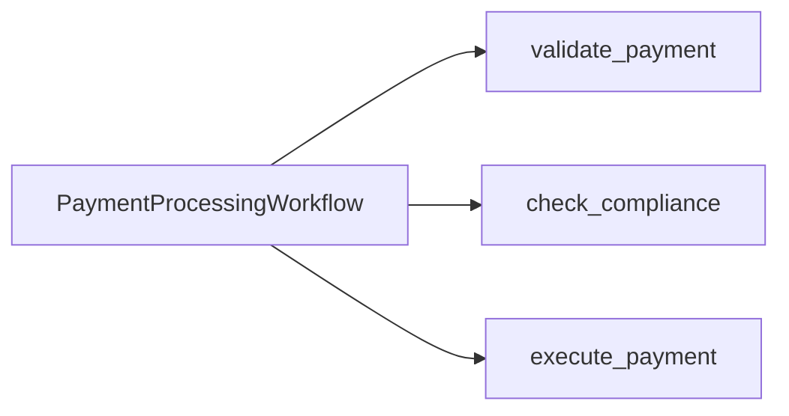

---
layout: default
---

# Two Teams, One Workflow

Today's monolith: `PaymentProcessingWorkflow`.

<v-clicks>

- **Payments team** owns `validate_payment` and `execute_payment`
- **Compliance team** owns `check_compliance`
- **The Problem** One Worker. One namespace. One deployment.

</v-clicks>

<!--
- Optional opener (welding metaphor anchor): "My dad just retired after 43 years as a welder. He'd tell you the seam is the part that matters: the line where two pieces meet. A bad weld at the seam, the whole thing fails. A good weld is stronger than the metal around it. Today we're going to find the seams in this payment app, see why this particular seam is bad, and learn how to make a clean one."
  - Sets up the metaphor for the rest of the chapter. "Where Are the Seams?" lands harder when "seam" is already grounded.
  - Skip if you don't feel like personal stories that day. The chapter still works without it.
- Today's monolith: `PaymentProcessingWorkflow`.
  - One Workflow type that calls three Activities back-to-back.
- The diagram is intentionally simple. validate → compliance → execute. That's the whole app.
  - Activities are owned by different teams in real life, even though they're called from one Workflow.
  - Who are the actors in our story here?
- **Build 1** **Payments team** owns `validate_payment` and `execute_payment`
  - These are the bookends. They check the request and they move the money.
- **Build 2** **Compliance team** owns `check_compliance`
  - Risk rules. Sanctions screening. KYC. The kind of code that gets scrutinized in audits.
- **Build 3** **The Problem** One Worker. One namespace. One deployment.
  - This is the architectural fact that creates all the pain we're about to enumerate.
  - Blast radius is effectively zero
  - The code is correct. The Workflows run, it's the structure and deployment model that is complex.
-->

---
layout: default
---

# What Goes Wrong as Teams Grow

<v-clicks>

- **Shared blast radius.** A bug in `check_compliance` takes down `execute_payment`.
- **Shared deploys.** Compliance ships every Thursday. Payments ships every hour. Now what?
- **Shared knowledge.** Every Payments engineer needs to read every Compliance change.
- **Mixed SLAs.** Payment's has an SLA of 4 9s. Compliance now _also_ has this SLA.

</v-clicks>

 

<v-click>

The code is fine. The **boundary** is wrong.

</v-click>

<!--
- **Build 1** **Shared blast radius.** A bug in `check_compliance` takes down `execute_payment`.
  - The Worker hosts both. A panic in one means a restart for both.
- **Build 2** **Shared deploys.** Compliance ships every Thursday. Payments ships every hour. Now what?
  - Either Compliance deploys faster than they want, or Payments deploys slower than they want.
  - "Coordinated deploys" sounds harmless until your company has 30 services.
- **Build 3** **Shared knowledge.** Every Payments engineer needs to read every Compliance change.
  - PR reviews stretch across teams. Cognitive load grows linearly with team count.
- **Build 4** **Mixed SLAs.** Payment's has an SLA of 4 9s. Compliance now _also_ has this SLA.
  - One slow Activity blocks the entire Workflow. 
- **Build 5** The code is fine. The **boundary** is wrong.
  - We are not fixing bugs. We are fixing organizational structure expressed in code.
-->

---
layout: default
---

# The Architecture May Look Familiar

Today's monolith is the **most extreme** form of coupling: Compliance code is registered as an Activity on the Payments Worker.

 

<v-clicks>

- More common in real codebases: two teams sharing **one namespace**, **one task queue**, sometimes **one database**, with no contract between them.
- Coupled at the import level, the deploy level, or the schema level instead of the service contract level.
- Nexus addresses both.

</v-clicks>

 

<v-click>

We use the visceral monolith because the it's easier to see the issue in the Worker registration and the Event History. The lessons here transfer to other use cases.

</v-click>

<!--
- Today's monolith is the most extreme form of coupling: Compliance code is registered as an Activity on the Payments Worker.
- **Build 1** More common in real codebases: two teams sharing one namespace, one task queue, sometimes one database, with no contract between them.
  - "Does anyone here actually have a Workflow that imports another team's activity registration directly?"
  - "Does anyone share a namespace with a team that owns a different domain?" That is the audience for Nexus.
- **Build 2** Coupled at the import level, the deploy level, or the schema level instead of the activity-registration level.
  - The pain is the same. The mechanism is different.
- **Build 3** Nexus is the canonical fix for both shapes.
  - The structural intent (typed contract, separate namespace, separate blast radius) applies regardless of which coupling shape you started from.
- **Build 4** We use the visceral monolith because the seam is visible in the Worker registration and the Event History.
  - By the end of the morning they will have built two namespaces, two Workers, one Endpoint. Whichever coupling they have at home, they can map this onto it.
-->

---
layout: section
---

# Quick Poll

ahaslides.com/NEXUSWS

<!--
- "Quick show of hands, AhaSlides edition. One question."
- AhaSlides poll: "Have you ever wrapped a teammate's Workflow in an HTTP API?"
- "OK, so this isn't a hypothetical for any of you."
- "Lucky you, most teams hit this within their first year on Temporal. Today is the easy way to skip the pain."
- "Now, before we look at fixes, let's actually run the monolith. Feel the architecture before we change it."
-->

---
layout: exercise
minutes: 7
heading: Exercise 1
---

**Run the monolith. Feel the problem.**

You will run the starter end-to-end against a single-Worker, single-namespace
application and inspect what one team's Activity looks like inside another
team's Workflow.

Full instructions are in the Instruqt tab.

<!--
- "Run the monolith. Feel the problem."
  - The point is for the monolith to **work**. We need a working baseline so the decoupling has something to compare against.
- Three transactions: TXN-A (LOW), TXN-B (MEDIUM), TXN-C (HIGH). All three should run end-to-end through one Workflow.
- "Look at the activity events. validate, check_compliance, execute. All in one Workflow."
- Pedagogical note: this exercise lands BEFORE the Nexus intro on purpose. Run the bad shape, then we name the fix. Not the other way around.
- 7 minutes. Walk the room. When they come back, we debrief, then look at the patterns they could reach for.
-->

---
layout: default
---

# Where Are the Seams?

<v-clicks depth="2">

- **What did you notice was wrong?**
  - Compliance code is registered on the Payments Worker
  - Same `default` namespace, same `payments-processing` task queue
  - No boundary in the Event History; `check_compliance` looks like any other Activity
- **How does this become a problem when Compliance grows into its own team?**
  - Compliance can't ship without coordinating with Payments
  - A bad Compliance deploy crashes the Payments Worker
  - Same process holds PCI scope and KYC scope

</v-clicks>

 

<v-click>

How do teams typically address this?

</v-click>

<!--
- This slide is a debrief, not a lecture. Each bullet clicks in one at a time so you can pace the reveal against the room.
- Pattern: ask the question, take 2 to 3 answers, click in the bullets they hit (or didn't). If someone calls one out, click it in to confirm. If the room is quiet, click it in to prime the next answer.
- Cold start: if no one answers Build 1, lead with "Did anyone notice the Worker banner showed `check_compliance` registered with the parenthetical `(monolith - will decouple)`?"
- **Build 1** **What did you notice was wrong?**
  - Pause. Take 2 to 3 answers from the room before clicking anything in.
  - **Build 2** Compliance code is registered on the Payments Worker.
    - The loudest signal. The Worker banner literally says it.
  - **Build 3** Same `default` namespace, same `payments-processing` task queue.
    - No isolation. One blast radius. One access policy.
  - **Build 4** No boundary in the Event History; `check_compliance` looks like any other Activity.
    - Compliance has zero visibility into runs of their own logic.
- **Build 5** **How does this become a problem when Compliance grows into its own team?**
  - Forward-projection question. Aim at scaling intuition. Pause again.
  - **Build 6** Compliance can't ship without coordinating with Payments.
    - Deploy coupling. The most common cross-team gripe.
  - **Build 7** A bad Compliance deploy crashes the Payments Worker.
    - Blast radius. The higher-SLA team gets dragged down by the lower-SLA team's mistakes.
  - **Build 8** Same process holds PCI scope and KYC scope.
    - Data isolation. Audit and compliance teams care a lot about this.
- **Build 9** How do teams typically address this?
  - Bridge to "What About Patterns We Already Have?" Activity wrapping HTTP, Shared Activity, Child Workflow.
  - These are the obvious-looking fixes. None of them fully work. That's the gap Nexus fills.
-->

---
layout: default
---

# What About Patterns We Already Have?

| Pattern                    | What it solves                       | What it doesn't                      |
| :------------------------- | :----------------------------------- | :----------------------------------- |
| **Activity wrapping HTTP** | Calling external services            | Loses durability, contract, identity |
| **Shared Activity**        | Reusing code in one team             | Same namespace, same blast radius, external team access    |
| **Child Workflow**         | Decomposing inside one Workflow      | Same namespace, same Worker pool     |

 

<v-click>

None of these draw a line between **teams**.

</v-click>

<!--
- **Activity wrapping HTTP** | Calling external services | Loses durability, contract, identity
  - "Just put it behind an HTTP API" is the default thing people turn to.
  - Both sides are durable internally. Payments' Activity is durable. Compliance's workflow is durable. What you lose is durability **across the seam**.
    - HTTP delivery is best-effort. Response drops on the return, Payments retries, you've started a duplicate Compliance workflow. Unless you built deterministic IDs + USE_EXISTING by hand.
    - 5-minute Compliance workflow doesn't fit in a 30-second HTTP request. So you build a polling loop. With its own retries. Its own cancellation. Its own dedup. You've reinvented Nexus, badly.
  - You also lose retries-as-first-class. You write 4xx-vs-5xx classification, backoff, circuit breaker. All by hand, in every Activity.
- **Shared Activity** | Reusing code in one team | Same namespace, same blast radius, external team access
  - Compliance ships their code into the Payments Worker. Same deploy pipeline, same secrets, same crash blast radius. That's not a team boundary; it's the opposite.
- **Child Workflow** | Decomposing inside one Workflow | Same namespace, same Worker pool
  - Decomposition tool, not a team boundary. Same namespace, same Worker pool, same tenancy unit. Cross-team needs cross-namespace.
- **Build 1** None of these draw a line between **teams**.
-->

---
layout: default
---

# From Weld to Contract

A Nexus call is **a way of invoking a typed Operation behind a contract, with durable delivery**. Think **durable RPC**.

 

<v-clicks>

- The unit you ship is a **Service**.
- The unit the operator registers is an **Endpoint**.
- The unit a **caller** invokes is an **Operation**. The team that implements it is the **implementer**.
- Built on the open Nexus RPC protocol at `github.com/nexus-rpc/api`. Cross-language by design.

</v-clicks>

 

<v-click>

**The contract is the integration.**

</v-click>

<!--
- Title hooks the welding metaphor. What you saw in Instruqt was `check_compliance` registered on the Payments Worker. That's the weld. Right now it's tight. By 12:30 it's a contract.
- A Nexus call is a way of invoking a typed Operation behind a contract, with durable delivery. Think durable RPC.
  - The words that matter: typed, contract, durable delivery.
  - Mental model anchor: "durable RPC." Like gRPC, but the call survives a Worker crash, retries until schedule-to-close, and the underlying Operation can run for days. The docs use the same framing word-for-word: "Nexus RPC is a protocol designed with durable execution in mind."
  - "Durable delivery" is precise: the Nexus Machinery delivers with at-least-once semantics, retries until schedule-to-close, surfaces the result reliably. The work behind the call may or may not be durable on its own (Workflow start, Signal, Update = durable; Query = not), but the call itself always is.
  - Verbal scope, don't put on slide: in the workshop's case the work belongs to another team in another namespace. More broadly, Nexus works across namespaces, regions, and clouds, or within a single namespace for contract discipline. Not just an org-chart fix.
  - Future roadmap, don't say on stage unless asked: today the caller must be a Workflow. Non-Workflow callers (bash, service, app) are on the Temporal Nexus roadmap per the GA announcement and Public Preview blog. The slide says "a way of invoking" rather than "a Workflow invoking" intentionally so it stays accurate when that ships.
- **Build 1** The unit you ship is a Service.
  - The Service is the code artifact. Both teams import it.
- **Build 2** The unit the operator registers is an Endpoint.
  - The Endpoint is the server-side artifact. Created with a CLI command, not in code.
- **Build 3** The unit a Workflow calls is an Operation.
  - The Operation is the call site. One Operation = one cross-team call.
- **Build 4** Built on the open Nexus RPC protocol at github.com/nexus-rpc/api.
  - This is not a Temporal proprietary wire format. It is an open spec.
- **Build 5** **GA at Replay 2025** on Temporal Cloud and self-hosted. In production at Netflix, Miro, and Duolingo.
  - Netflix: each team owns a Namespace and exposes capabilities to other teams.
  - Miro: cross-region data migration over days/weeks across regions with no direct network connectivity.
  - Duolingo: self-service infrastructure case study.
- **Build 6** **The contract is the integration.**
  - **Key point:** plant the thesis here. It returns at Ch 2's "Why Types Matter Here" close, and again at the wrap.
  - Say it once, slowly, then advance.
-->

---
layout: default
---

# Same Word, Three Different Things

Temporal docs use **"handler"** for three different things:

<v-clicks>

- A **piece of code**: `@sync_operation`, `OperationHandler.sync`
- A **side**: a team or a namespace ("handler side" in the docs)
- A **Worker process**: the one polling the Task Queue

</v-clicks>

 

<v-click>

Three meanings, one word. Each sentence asks you to figure out which one is meant.

</v-click>

 

<v-click>

This workshop splits them:

</v-click>

<v-clicks>

- **handler** = the code
- **implementer** = the side
- **Worker** stays Worker

</v-clicks>

 

<v-click>

Different word per thing. No mid-sentence substitution.

</v-click>

<!--
- This slide names the vocabulary issue so the room can stop second-guessing it.
- "If you've read the Nexus docs and felt like the word 'handler' was doing too much, you're not crazy. It's used for three different things."
- The three referents:
  - **Side**: "handler side" in the docs. A team, a namespace, the organizational unit that owns the handler code.
  - **Code**: the function or class decorated with `@sync_operation` or `@workflow_run_operation`. The thing you write in your editor.
  - **Worker**: the process polling the Task Queue and dispatching Nexus Tasks.
- Developer intuition reads "handler" as a code object. That reading is fine for the code referent. The slide just makes the side and the Worker distinct so each sentence reads cleanly.
- Workshop convention from this slide forward:
  - "handler" = the code only.
  - "implementer" = the side, the team, the role.
  - "Worker" stays "Worker." Already its own concept.
  - "caller" stays "caller." The docs only use that word one way.
- "When you read real Nexus docs and Slack threads after this workshop, mentally substitute 'implementer' wherever the docs say 'handler' for the role. After a week you won't notice you're doing it."
-->

---
layout: default
---

# Four Building Blocks

<v-clicks depth="2">

- **Service**: the typed contract between teams (`@nexusrpc.service`).
  - Think a gRPC service definition.
- **Operation**: one typed method on the Service (`Operation[Input, Output]`).
  - Think a method on the service.
- **Endpoint**: the routing target, namespace + task queue. 
  - Think a reverse proxy for a service.
- **Registry**: Temporal's index of which Endpoints exist where. 
  - Think Service Discovery or DNS Server.

</v-clicks>

 

<v-click>

Service + Operation are **code-level**. Endpoint + Registry are **operator-level**.

</v-click>

<!--
- Four primitives. Two are code-level, two are operator-level. That split is the closing beat.
- **Build 1** **Service**: typed contract between teams.
  - One Python file. Both teams import it. No IDL.
  - Like a gRPC `service` definition, expressed in your SDK's native types.
- **Build 2** **Operation**: one typed method on the Service.
  - One Operation = one cross-team call.
  - We'll define two on our Service: `check_compliance` and `submit_review`.
- **Build 3** **Endpoint**: routing target — namespace + task queue.
  - Reverse proxy. The caller names the Endpoint, never the namespace.
  - Created with `temporal operator nexus endpoint create`. Lives outside your code.
- **Build 4** **Registry**: index of which Endpoints exist where.
  - You manage Endpoints in the Registry via CLI / UI / Terraform. You don't write code against it.
  - Like DNS. It's just there, doing its job.
- **Build 5** **Service + Operation are code-level. Endpoint + Registry are operator-level.**
  - The split that matters: developers write Service + Operation, operators wire Endpoint + Registry.
  - Two artifacts, two owners — that's the team-boundary discipline Nexus enforces.
- Service, Operation, Endpoint, Registry: the vocabulary the rest of the workshop runs on.
-->

---
layout: default
---

# Two Operation Types

Two types for **Operation**: _synchronous_ or _asynchronous_. The implementer picks, per Operation.

 

|              | Synchronous                                  | Asynchronous                          |
| :----------- | :------------------------------------------- | :------------------------------------ |
| Behavior     | Returns the result inline                    | Starts a Workflow, returns a token    |
| Used for     | Signals, Queries, Updates                    | Anything longer than ~5 seconds       |
| Bounded by   | The 10s start-request window                 | Schedule-to-close (60d cap on Cloud)  |

<!--
- **Synchronous**: the handler returns the result inline.
  - Signals, Queries, Updates, or other reliable low-latency code via the Temporal SDK Client.
  - The whole work fits in the start request. Caller waits, gets the answer back.
  - Mental shorthand: "wait here for the answer."
- **Asynchronous**: the handler starts a Workflow and returns a token.
  - The token is how the caller's Operation tracks the handler Workflow.
  - The Workflow then runs to completion under schedule-to-close.
  - Used for anything that won't fit comfortably in 10s, anything cancellable, anything multi-step.
  - Mental shorthand: "start something, I'll get back to you."
- The next slide turns this binary into the two hard numbers (10s and 60d). They map directly: sync to 10s budget, async to 60d ceiling.
-->

---
layout: default
---

# Two Hard Limits

Nexus has two constraints that affect design choices.

 

<v-clicks depth="2">

- **10 seconds per attempt, depending on handler type.** Applies to a single handler start (or cancel) request.
  - **Sync:** the result must return inside the window.
  - **Async:** only the Workflow start has to fit.
- **Async ceiling: 60 days on Temporal Cloud.** Self-hosted is configurable above 60 days.

</v-clicks>

 

<v-click>

**Decision rule:** under five seconds with margin, sync. Anything else, async.

</v-click>

<!--
- Nexus has two constraints worth memorizing. Two numbers.
- **Build 1** **10 seconds per attempt, depending on handler type.**
  - Per-request deadline, measured by the caller's Nexus Machinery against a single start (or cancel) request.
  - NOT an end-to-end cap on the operation. Misses are retried with exponential backoff up to `schedule_to_close_timeout`.
  - Sync handler: the result must return inside the window. Async handler: only the workflow start has to fit (`start_workflow` returns in milliseconds).
  - Available time is often less than 10s — the request goes through matching first, eating into the budget.
- **Build 2** **Async ceiling: 60 days on Temporal Cloud.**
  - This is the maximum `schedule_to_close_timeout` Temporal Cloud will accept for a Nexus Operation.
  - Self-hosted's maximum is governed by the `component.nexusoperations.limit.scheduleToCloseTimeout` dynamic config and can exceed 60 days; Temporal Cloud locks the cap at 60 days.
  - 60 days handles human-in-the-loop scenarios, slow compliance reviews, asynchronous batch jobs, etc.
- **Decision rule:** under five seconds with margin, sync. Anything else, async.
  - Memorize these two numbers. They show up everywhere.
  
-->

---
layout: exercise
minutes: 2
heading: Durable Activity
---

**Watch a Nexus-connected system survive a Worker crash.**

Open Instruqt → **Topology Sandbox**. Stop a service. Watch in-flight Workflows
wait, not fail. Start it again. Watch them resume.

The `Lost` counter stays at zero. That's the property worth the rest of the morning.

<!--
- This is the destination — what the room is going to build by the end of the morning. They've just heard the vocabulary (Service, Endpoint, Operation, sync vs async, the 10s and 60-day numbers). Now they get to see one running.
- 2 minutes. Their hands, their tab. The point is them clicking, not you presenting.
  - "Click Stop on the Compliance Worker. Watch the in-flight payments. They turn yellow. They do not fail."
  - "Click Start. They resume from where they were."
  - "Now do the same to the Nexus Endpoint. Same story."
  - Pause. Let the room watch their own screens for a beat.
- Land the punchline: "Look at the `Lost` counter. It's still zero. That's the property worth the rest of the morning."
- Off-ramp before energy fades. "Come back to the slides when you're ready."
- After this, advance to Quiz Time. The room takes the AhaSlides graded checkpoint with both the theory AND the running system fresh in their head.
- Naming note: this is intentionally NOT numbered Exercise 1 — that label belongs to "Run the Monolith." This is the destination tease, framed as a quick observation exercise rather than a numbered build step.
-->

---
layout: section
---

# Quiz Time

ahaslides.com/NEXUSWS

<!--
- "OK, before you go hands-on, let's see what's actually stuck. Seven questions, all graded. Don't overthink, leaderboard rewards speed."
- AhaSlides pick answer: "Two teams, two namespaces, an audit boundary between them", correct: **Nexus**.
- AhaSlides pick answer: "Same namespace, sibling Workflow you control end-to-end", correct: **Child Workflow**.
- AhaSlides pick answer: "Third-party HTTP API from inside a Workflow", correct: **Activity**.
- AhaSlides multi-select: "Which of these are Nexus building blocks?", correct: **Service, Operation, Endpoint, Registry**.
- AhaSlides match pairs: match each primitive to its job.
- AhaSlides numeric: "Maximum sync handler runtime, in seconds?", answer: **10**.
- AhaSlides numeric: "Maximum async Schedule-to-Close on Temporal Cloud, in days?", answer: **60**.
- "Score doesn't matter yet — leaderboard's at halftime. Let's recap before Ch 2."
-->

---
layout: default
---

# Review

<v-clicks>

- Cross-team Temporal integration creates shared blast radius, deploys, knowledge, and SLAs
- Nexus is the canonical fix for cross-namespace and intra-namespace coupling
- A Nexus call is invoking a typed Operation behind a contract, with **durable delivery**. Think **durable RPC**.
- The four building blocks: **Service**, **Operation**, **Endpoint**, **Registry**. Service and Operation are code-level; Endpoint and Registry are operator-level.
- Every Operation is **synchronous** (handler returns inline) or **asynchronous** (handler starts a Workflow, returns a token)
- The **10-second per-attempt deadline** applies to both. For sync the full result must return inside it; for async only the Workflow start has to fit.
- **Schedule-to-Close** caps the overall Operation, **60 days max on Temporal Cloud**.

</v-clicks>

<!--
- **Build 1** Cross-team Temporal integration creates shared blast radius, deploys, knowledge, and SLAs.
  - The four pains we opened with. The boundary, not the code, is the problem.
- **Build 2** Nexus is the canonical fix for cross-namespace and intra-namespace coupling.
  - Not just an org-chart fix. Works for isolation, blast radius, and security boundaries too.
- **Build 3** A Nexus call is invoking a typed Operation behind a contract, with durable delivery. Think durable RPC.
  - The chapter's thesis. "Durable RPC" is the mental model worth taking home.
- **Build 4** The four building blocks: Service, Operation, Endpoint, Registry. Service and Operation are code-level; Endpoint and Registry are operator-level.
  - Service + Operation = developers. Endpoint + Registry = operators. Two artifacts, two owners.
- **Build 5** Every Operation is synchronous or asynchronous.
  - The binary the rest of the workshop pivots on. Per-Operation choice by the implementer.
- **Build 6** The 10-second per-attempt deadline applies to both. For sync the full result must return inside it; for async only the Workflow start has to fit.
  - Common misread: that 10s only applies to sync. It applies to both; what fits in the window differs.
- **Build 7** Schedule-to-Close caps the overall Operation, 60 days max on Temporal Cloud.
  - Practically only matters for async. For sync, you'd never set schedule-to-close anywhere near 60 days.
-->
