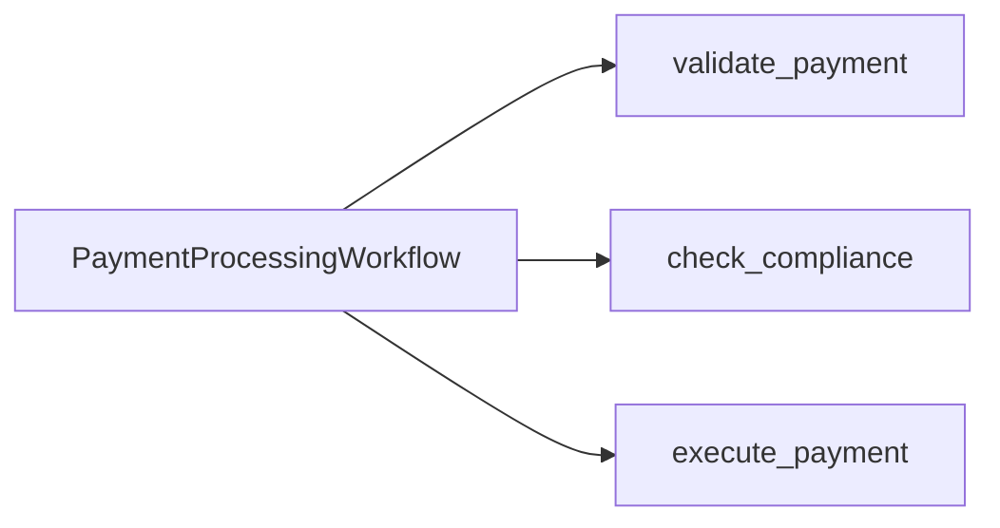

---
layout: section
---

# 01 / Why Nexus

---
layout: default
---

# Two Teams, One Workflow

Today's monolith: `PaymentProcessingWorkflow`.

<v-clicks>

- **Payments team** owns `validate_payment` and `execute_payment`
- **Compliance team** owns `check_compliance`
- One Worker. One namespace. One deployment.

</v-clicks>

<!--
- Today's monolith: `PaymentProcessingWorkflow`.
  - One Workflow type that calls three Activities back-to-back.
  - Show the diagram for a beat. Let it land.
- The diagram is intentionally simple. validate → compliance → execute. That's the whole app.
  - Activities are owned by different teams in real life, even though they're called from one Workflow.
- **Build 1** **Payments team** owns `validate_payment` and `execute_payment`
  - These are the bookends. They check the request and they move the money.
- **Build 2** **Compliance team** owns `check_compliance`
  - Risk rules. Sanctions screening. KYC. The kind of code that gets scrutinized in audits.
- **Build 3** One Worker. One namespace. One deployment.
  - This is the architectural fact that creates all the pain we're about to enumerate.
  - Every team's code runs in the same Python process, on the same machines.
- The code is correct. We're not refactoring for correctness. We're refactoring for **organizational shape**.
-->

---
layout: default
---

# What Goes Wrong as Teams Grow

 

<v-clicks>

- **Shared blast radius.** A bug in `check_compliance` takes down `execute_payment`.
- **Shared deploys.** Compliance ships every Thursday. Payments ships every hour. Now what?
- **Shared knowledge.** Every Payments engineer needs to read every Compliance change.
- **Shared SLAs.** A slow compliance rule slows every transaction.

</v-clicks>

 

<v-click>

The code is fine. The **boundary** is wrong.

</v-click>

<!--
- The monolith works until headcount grows. The Temporal audience knows this story.
- **Build 1** **Shared blast radius.** A bug in `check_compliance` takes down `execute_payment`.
  - The Worker hosts both. A panic in one means a restart for both.
  - This is the most concrete pain. Lead with it.
- **Build 2** **Shared deploys.** Compliance ships every Thursday. Payments ships every hour. Now what?
  - Either Compliance deploys faster than they want, or Payments deploys slower than they want.
  - "Coordinated deploys" sounds harmless until your company has 30 services.
- **Build 3** **Shared knowledge.** Every Payments engineer needs to read every Compliance change.
  - PR reviews stretch across teams. Cognitive load grows linearly with team count.
- **Build 4** **Shared SLAs.** A slow compliance rule slows every transaction.
  - One slow Activity blocks the entire Workflow. There's no backpressure between teams.
- **Build 5** The code is fine. The **boundary** is wrong.
  - Strong concluding line. Pause here. This is the thesis of the chapter.
  - We are not fixing bugs. We are fixing organizational structure expressed in code.
  - Land the SRE anecdote on the pause: "I was an SRE in a past life. I have seen dead-simple business logic topple enterprises because of mismanaged shared state. I can hear the pagers going off." 🤣
  - Then watch the room. "I just saw some of you wince. You've felt this before." Name the emotion before they have to articulate it. Then advance.
- This slide is the "feel the pain" beat. Sell it.
-->

---
layout: default
---

# The Shape You Probably Have

 

Today's monolith is the **most extreme** form of coupling: Compliance code is registered as an Activity on the Payments Worker.

 

<v-clicks>

- More common in real codebases: two teams sharing **one namespace**, **one task queue**, sometimes **one database**, with no contract between them.
- Coupled at the import level, the deploy level, or the schema level instead of the activity-registration level.
- Nexus is the canonical fix for **both** shapes.

</v-clicks>

 

<v-click>

We use the visceral monolith because the seam is visible in the Worker registration and the Event History. The lesson transfers.

</v-click>

<!--
- Inclusion slide. Tells the half of the room without an exact monolith that they're still in the right room.
- Today's monolith is the most extreme form of coupling: Compliance code is registered as an Activity on the Payments Worker.
  - Recap from the prior slide. The diagram on slide 1 of this chapter showed exactly this.
- **Build 1** More common in real codebases: two teams sharing one namespace, one task queue, sometimes one database, with no contract between them.
  - Ask the room: "Does anyone here actually have a workflow that imports another team's activity registration directly?" Hands up are rare.
  - Then: "Does anyone share a namespace with a team that owns a different domain?" Hands up are common. That is the audience for Nexus.
- **Build 2** Coupled at the import level, the deploy level, or the schema level instead of the activity-registration level.
  - The pain is the same. The mechanism is different.
- **Build 3** Nexus is the canonical fix for both shapes.
  - The structural intent (typed contract, separate namespace, separate blast radius) applies regardless of which coupling shape you started from.
- **Build 4** We use the visceral monolith because the seam is visible in the Worker registration and the Event History.
  - The lesson transfers. By the end of the morning they will have built two namespaces, two Workers, one Endpoint. Whichever coupling they have at home, they can map this onto it.
- This is a 30 second slide. Don't dwell. The room just needs to feel seen.
-->

---
layout: section
---

# Quick Poll

ahaslides.com/O8RSE

<!--
- **Switch to AhaSlides slide 4** (poll, single question, ~30 seconds).
- This is the only interactive moment inside Chapter 1's lecture flow. Lightweight.
- **Lead-in**: "Quick show of hands, AhaSlides edition. One question."
- **AhaSlides slide 4 (poll)**: "Have you ever wrapped a teammate's Workflow in an HTTP API?"
  - Watch for the "yes, and it broke" responses, those are gold for the cross-team pain hook.
  - If most of the room says yes, lean into: "OK, so this isn't a hypothetical for any of you."
  - If most say no, lean into: "Lucky you, most teams hit this within their first year on Temporal. Today is the easy way to skip the pain."
- **Lead-out**: "Great. Now let's look at the tools you already have, and why none of them fully solve this."
- After this transition, the Slidev deck continues with "What About Patterns We Already Have?"
-->

---
layout: default
---

# What About Patterns We Already Have?

 

| Pattern                    | What it solves                       | What it doesn't                      |
| :------------------------- | :----------------------------------- | :----------------------------------- |
| **Activity wrapping HTTP** | Calling external services            | Loses durability, contract, identity |
| **Shared Activity**        | Reusing code in one team             | Same namespace, same blast radius    |
| **Child Workflow**         | Decomposing inside one Workflow      | Same namespace, same Worker pool     |

 

<v-click>

None of these draw a line between **teams**.

</v-click>

<!--
- The audience will reach for these tools first. Acknowledge them, then explain the gap.
- **Activity wrapping HTTP** | Calling external services | Loses durability, contract, identity
  - "Just put it behind an HTTP API" is the default reach.
  - The moment you do that, you lose the durable, typed, observable thing Temporal gave you.
  - You also lose retries-as-first-class. You're back to writing your own retry loops in Activities.
- **Shared Activity** | Reusing code in one team | Same namespace, same blast radius
  - Co-locating a Compliance Activity in the Payments Worker shares a process. Same blast radius problem.
- **Child Workflow** | Decomposing inside one Workflow | Same namespace, same Worker pool
  - Child Workflows are great for decomposition. They are not a team boundary.
  - One namespace = one tenancy unit in Temporal. Cross-team needs cross-namespace.
- **Build 1** None of these draw a line between **teams**.
  - Strong landing. The room should now be ready for "so what does?"
  - Optional tag-question to invite quiet agreement before the pivot: "That seems like a gap, ya?"
- This slide buys credibility. If you skip it, the engineers in the room will spend the rest of the morning thinking "but what about Activities?"
-->

---
layout: default
---

# What Nexus Is, In One Sentence

 

A Nexus call is **a workflow asking another team to do work**, durably, with a typed contract, across namespaces (the workshop's case) or within one.

 

<v-clicks>

- The unit you ship is a **Service**.
- The unit the operator registers is an **Endpoint**.
- The unit a workflow calls is an **Operation**.
- Built on the open Nexus RPC protocol at `github.com/nexus-rpc/api`. Cross-language by design.

</v-clicks>

<!--
- Memorize this sentence. It is the mental model for the whole morning.
  - Read it slowly. Twice if needed.
  - Four words to land: workflow, team, durably, contract.
  - The workshop's topology is cross-namespace, but Nexus also works inside a single namespace; the primitive is not namespace-bound.
- **Build 1** The unit you ship is a Service.
  - The Service is the code artifact. Both teams import it.
- **Build 2** The unit the operator registers is an Endpoint.
  - The Endpoint is the server-side artifact. Created with a CLI command, not in code.
- **Build 3** The unit a workflow calls is an Operation.
  - The Operation is the call site. One Operation = one cross-team call.
- **Build 4** Built on the open Nexus RPC protocol at github.com/nexus-rpc/api.
  - Important credibility note for senior engineers: this is not a Temporal proprietary wire format. It is an open spec.
- This slide is the one-line summary. Memorize the sentence; everything else in the morning hangs off it.
-->

---
layout: default
---

# Enter Nexus: Four Building Blocks

 

<v-clicks>

- **Service**: the typed contract between teams (`@nexusrpc.service`). Mental model: a gRPC service definition.
- **Operation**: one typed method on the Service (`Operation[Input, Output]`). Mental model: one method on the service.
- **Endpoint**: the routing target, namespace + task queue. Mental model: a DNS entry / public URL.
- **Registry**: Temporal's index of which Endpoints exist where. Mental model: DNS itself.

</v-clicks>

 

<v-click>

Service + Operation are **code-level**. Endpoint + Registry are **operator-level**.

</v-click>

<!--
- Four primitives. Service + Operation are code-level. Endpoint + Registry are operator-level.
- **Build 1** **Service**: the typed contract between teams (`@nexusrpc.service`)
  - The shared Python file. Both teams import it.
  - Mental model: like a gRPC `service` definition, but expressed in your SDK's native types.
- **Build 2** **Operation**: a single typed method on the Service (`Operation[Input, Output]`)
  - One Operation = one cross-team call.
  - We'll have two on our Service: `check_compliance` and `submit_review`.
- **Build 3** **Endpoint**: the routing target, namespace plus task queue
  - Created with the Temporal CLI, lives outside your code.
  - Mental model: the URL. The caller names the Endpoint, never the namespace.
- **Build 4** **Registry**: Temporal's index of which endpoints exist where
  - You don't usually interact with the Registry directly.
  - Mental model: DNS. It's just there, doing its job.
- **Build 5** A Nexus call is **a workflow in one namespace asking another namespace to do work**, durably, with a contract.
  - Memorize this sentence. It's the mental model for the whole morning.
- Plant the four words now: Service, Operation, Endpoint, Registry. They are the vocabulary the rest of the workshop runs on.
-->

---
layout: default
---

# Two Hard Limits

 

Nexus has two constraints worth memorizing.

 

<v-clicks>

- **Sync handler request deadline: 10 seconds per attempt.** A sync handler must respond inside this window; misses are retried by the Nexus Machinery up to `schedule_to_close_timeout`.
- **Async ceiling: 60 days on Temporal Cloud.** Self-hosted is configurable above 60 days via `component.nexusoperations.limit.scheduleToCloseTimeout`.

</v-clicks>

 

<v-click>

**Decision rule:** under five seconds with margin, sync. Anything else, async.

</v-click>

 

<v-click>

Memorize these two numbers. They show up everywhere.

</v-click>

<!--
- Nexus has two constraints worth memorizing. Two numbers.
- **Build 1** **Sync handler request deadline: 10 seconds per attempt.**
  - This is a per-request handler deadline, measured by the caller's Nexus Machinery against the handler's processing of a single start request.
  - It is NOT an end-to-end cap on the operation. If the handler misses the deadline, the Nexus Machinery retries with exponential backoff up to `schedule_to_close_timeout`.
  - If your handler routinely needs more than ~5 seconds, you want an async Operation, not retried sync attempts.
- **Build 2** **Async ceiling: 60 days on Temporal Cloud.**
  - This is the maximum `schedule_to_close_timeout` Temporal Cloud will accept for a Nexus Operation.
  - Self-hosted's maximum is governed by the `component.nexusoperations.limit.scheduleToCloseTimeout` dynamic config and can exceed 60 days; Temporal Cloud locks the cap at 60 days.
  - 60 days handles human-in-the-loop scenarios, slow compliance reviews, asynchronous batch jobs, etc.
- **Build 3** Memorize these two numbers. They show up everywhere.
  - The decision rule lives off these numbers.
- Cycle: 10s sync per-request max, 60d async Temporal Cloud max. Twice. Out loud.
-->

---
layout: section
---

# Quiz Time

ahaslides.com/O8RSE

<!--
- **Switch to AhaSlides slides 6-12** (Comp 1 graded checkpoint, 7 questions, ~3 minutes total).
- This is the **first graded block** of the workshop. Scoring is on. Speed counts (fastAnswerGetMorePoint enabled).
- **Lead-in**: "OK, before you go hands-on, let's see what's actually stuck. Seven questions, all graded. Don't overthink, leaderboard rewards speed."
- Run each AhaSlides slide one at a time. Read each question aloud. Don't reveal the answer until the timer ends.
- **Slide 6 (pick answer)**: "Two teams, two namespaces, an audit boundary between them", correct: **Nexus**.
- **Slide 7 (pick answer)**: "Same namespace, sibling workflow you control end-to-end", correct: **Child Workflow**.
- **Slide 8 (pick answer)**: "Third-party HTTP API from inside a workflow", correct: **Activity**.
- **Slide 9 (pick answer multi-select)**: "Which of these are Nexus building blocks?", correct: **Service, Operation, Endpoint, Registry**.
  - Watch for partial credit attempts. The four are the canonical four.
- **Slide 10 (match pairs)**: "Building-Block Bingo", match each primitive to its job. Allow extra time (45-60s).
- **Slide 11 (numeric)**: "Maximum sync handler runtime, in seconds?", answer: **10**.
- **Slide 12 (numeric)**: "Maximum async Schedule-to-Close on Temporal Cloud, in days?", answer: **60**.
- After each question, briefly call out the answer + a one-sentence "why" before advancing.
- **Do NOT show a leaderboard yet.** The halftime board is at slide 19, before the break. Resist the temptation.
- **Lead-out**: "Alright, score doesn't matter yet, leaderboard is at halftime. Let's get hands-on. Switch over to Instruqt."
- After this transition, advance to Exercise 1 card and ship them to Instruqt.
-->

---
layout: exercise
minutes: 7
heading: Exercise 1
---

**Run the monolith. Feel the problem.**

You will run the starter end-to-end against a single-Worker, single-namespace
application and inspect what one team's Activity looks like inside another
team's Workflow.

Full instructions are in the Instruqt tab.

<!--
- 7 minute exercise. Smoke test, mostly.
- "Run the monolith. Feel the problem."
  - The point is for the monolith to **work**. We need a working baseline so the decoupling has something to compare against.
- Open the Instruqt tab. Run the starter.
  - Three transactions: TXN-A (LOW), TXN-B (MEDIUM), TXN-C (HIGH).
  - All three should run end-to-end through one Workflow.
- Watch all three transactions execute through one Workflow, in one namespace, on one Worker.
  - Point them at the Web UI. Have them find the Workflow's Event History.
  - "Look at the activity events. validate, check_compliance, execute. All in one Workflow."
- When they finish, advance to the Review slide, then on to Chapter 2.
  - The Ch1 quiz already happened (slides 6-12) before the exercise.
  - Ch2 opens with its own warmup (AhaSlides slide 13) right at the chapter start.
-->

---
layout: default
---

# Review

<v-clicks>

- Cross-team Temporal integration creates shared blast radius, deploys, knowledge, and SLAs
- Nexus is the canonical fix for cross-namespace and intra-namespace coupling
- The four Nexus building blocks are **Service**, **Operation**, **Endpoint**, and **Registry**
- Service and Operation are code-level. Endpoint and Registry are operator-level.
- Synchronous Nexus handlers must respond within a **10-second** per-request deadline
- Asynchronous Nexus Operations have a **60-day** Schedule-to-Close ceiling on Temporal Cloud

</v-clicks>

<!--
- Build each one back. Same order as the chapter. Forty-five seconds total.
- **Build 1** Cross-team Temporal integration creates shared blast radius, deploys, knowledge, and SLAs
- **Build 2** Nexus is the canonical fix for cross-namespace and intra-namespace coupling
- **Build 3** The four Nexus building blocks are Service, Operation, Endpoint, and Registry
- **Build 4** Service and Operation are code-level. Endpoint and Registry are operator-level.
- **Build 5** Synchronous Nexus handlers must respond within a 10-second per-request deadline
- **Build 6** Asynchronous Nexus Operations have a 60-day Schedule-to-Close ceiling on Temporal Cloud
- After the last build, advance to Chapter 2.
-->
