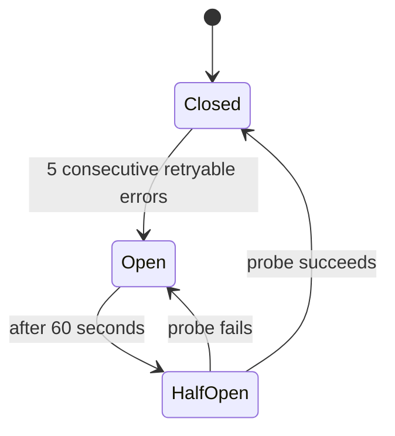
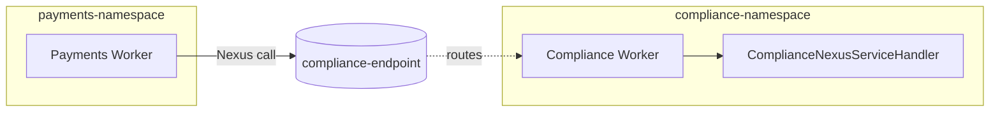

---
layout: default
---

# What Is a Sync Nexus Handler?

A Nexus Operation handler that runs and returns the typed result in one call, within the caller's deadline.

<v-clicks>

- In Python: a method decorated with `@nexusrpc.handler.sync_operation`.
- **Runs inline** in the implementer's Worker process. No Workflow runs on the implementer side.
- Returns the typed result directly. The caller awaits it like an Activity result.

</v-clicks>

<br>

<v-click>

In our workshop, **Compliance implements** `check_compliance` as a sync handler. Payments awaits the result through the Endpoint.

</v-click>

<!--
- A Nexus Operation handler that runs and returns the typed result in one call, within the caller's deadline.
- **Build 1** In Python: a method decorated with `@nexusrpc.handler.sync_operation`.
  - Per-method decorator. The class itself carries its own service-handler decorator that binds it to the Service contract.
  - The decorator accepts either `def` or `async def`; the workshop sample uses `async def` to stay consistent with the rest of the Python lab.
- **Build 2** Runs inline in the implementer's Worker process. No Workflow runs on the implementer side.
  - Sync = no handler Workflow exists. The handler is just a function call.
- **Build 3** Returns the typed result directly. The caller awaits it like an Activity result.
  - Same shape the room already knows from `await execute_activity(...)`. The new thing is that a different team runs it.
- **Build 4** In our workshop, Compliance implements `check_compliance` as a sync handler. Payments awaits the result through the Endpoint.

## Teaching notes

- For a sync Operation, no handler-side Workflow Execution is created, so there's no implementer-side Workflow Event History for this call to inspect. The structural payoff of sync over async; covered explicitly when async lands later.
- The SDK accepts `def` or `async def` for sync handlers (per the Python SDK README). The workshop sample uses `async def` to match the rest of the Python lab; mention only if asked.
- Doc sources: `docs.temporal.io/nexus#how-nexus-works` ("Synchronous - Completes within the 10-second handler deadline") and `docs.temporal.io/nexus/operations` ("Synchronous Operations must complete within the 10-second handler deadline, as measured from the caller's Nexus Machinery").
- Headline frames the handler by what it does (return inline within the deadline), not by its Python form. The Python form is one bullet, not the whole slide. Same structural choice Ch2 makes for "What Is a Nexus Service?"
- Closing v-click mirrors Ch2's workshop anchor: name the implementer (Compliance) and the relationship (Payments awaits through the Endpoint).
-->

---
layout: default
---

# When to Use a Sync Handler

Sync handlers are bound by a hard 10-second per-request deadline. Use them for **fast, reliable handoffs**.

<v-clicks>

- **Forward to a workflow.** The handler bridges to a workflow on the implementer side.
- **Reliable in-process compute.** Deterministic checks, cached lookups, simple math.
- **Reliable downstream Temporal infrastructure.** Temporal Cloud, Kafka, durable persistence.

</v-clicks>

<br>

<v-click>

**Avoid for arbitrary external HTTP.** Rate limits, timeouts, and 5xx trip the circuit breaker fast.

</v-click>

<br>

<v-click>

In our workshop, `check_compliance` runs a deterministic in-process rule check. **That is the reliable case.**

</v-click>

<!--
- Sync handlers are bound by a hard 10-second per-request deadline. Use them for fast, reliable handoffs.
- **Build 1** Forward to a workflow.
  - The most common production use case. The handler does almost nothing; it forwards to a workflow on the implementer side via `nexus.client()`.
  - The actual work runs on that workflow, durably, for as long as it needs to. The sync handler is the wire-level bridge.
- **Build 2** Reliable in-process compute.
  - Finishes in tens of milliseconds; never fails for retryable reasons. Deterministic rule checks, cached lookups, simple math.
  - Bounded by 10s, but in practice should be well under five seconds with margin.
- **Build 3** Reliable downstream Temporal infrastructure.
  - Temporal Cloud APIs, Kafka producers, durable persistence layers your team already operates. The word "reliable" is doing the work in this bullet.
- **Build 4** Avoid for arbitrary external HTTP.
  - Five consecutive retryable errors on a (caller-Namespace, Endpoint) pair open the circuit breaker for 60 seconds. Timeouts, rate limits, 5xx all count as retryable.
  - Five users hitting the same flaky third-party API at once will trip it in seconds.
  - Standalone activities (GA-imminent on Temporal Cloud) are the right tool for unreliable HTTP. Same Service contract surface area is on the roadmap.
- **Build 5** In our workshop, `check_compliance` runs a deterministic in-process rule check. That is the reliable case.
  - Bringing it back to the actual workshop code. The compliance check is basic math against the request, no external call. That is why sync is safe here.

## Teaching notes

- This slide implements Phil Prasek's authoritative guidance from the 2026-05-01 PM call: "you should only be doing sync handler code to reliable APIs." Alex Mazzeo's add: rate-limited APIs count as unreliable; "even if it's reliable, but it's a third-party API, you could get rate limited, and now your circuit breaker is in cascading failure mode."
- Circuit breaker scope is per (caller-Namespace, Endpoint) pair, not global to the Endpoint. 5 consecutive retryable errors. Open for 60 seconds, then half-open with a single probe. (Mechanism is covered in detail on the next slide.)
- The workshop's sync handler in `check_compliance` deliberately uses in-process compute precisely so the sync framing holds. If a learner adapts this workshop for a different domain, swap the in-process compute for a reliable workflow forward, not for a third-party HTTP call.
- Standalone activities (GA-imminent, Coinbase co-launch) are the canonical answer for unreliable external HTTP. SDK helper to make "one function, both standalone activity AND Nexus operation" is in flight.
-->

---
layout: default
---

# The Circuit Breaker

A platform safety valve. Stops retries from piling up across callers in your Namespace.

<v-clicks>

- **What it is.**
  - Per `(caller-Namespace, Endpoint)` pair. Closed normally; opens when unhealthy.
- **When it trips.**
  - 5 consecutive retryable errors. Timeouts, rate limits, 5xx, no-Worker-polling all count.
- **What happens.**
  - New Operations get `State: Blocked`. After 60s, one probe decides close or re-open.
- **Why a trip is bad.**
  - Every caller targeting that Endpoint freezes for at least a minute.

</v-clicks>

<style>
.slidev-layout li { margin-top: 0.15rem; margin-bottom: 0.15rem; }
.slidev-layout ul ul { margin-top: 0.05rem; margin-bottom: 0.3rem; }
</style>

<!--
- Set up the slide: most rooms have heard "circuit breaker" three times by now without knowing what it is. This slide pays that off.
- **Build 1** **What it is.** Per-pair breaker. Closed during normal operation, opens when an endpoint looks unhealthy.
  - Scope is `(caller-Namespace, Endpoint)`. Not global to the Endpoint, not per-Operation, not per-caller-Workflow. The smallest unit is the pair.
  - Same shape as the breaker pattern from any service-mesh background. The mechanism is not Temporal-specific; the placement (Nexus Machinery) is.
- **Build 2** **When it trips.** Five consecutive retryable errors on the pair.
  - Retryable means: timeouts, rate limits, 5xx, and the "no Worker polling the handler Task Queue" case which surfaces as a timeout.
  - Five users hitting the same flaky downstream at the same time will trip it in seconds. The breaker counts errors, not callers.
- **Build 3** **What happens.** New Operations get `State: Blocked` immediately. Handler never called.
  - 60 seconds open, then half-open with one probe.
  - Probe success: closed, normal traffic resumes.
  - Probe failure: another 60 seconds open. Repeats until the underlying problem is fixed.
- **Build 4** **Why a trip is bad.** Every caller Workflow in your Namespace targeting that Endpoint is blocked.
  - This is the part the room needs to feel. A single bad downstream Endpoint freezes the whole integration for at least a minute at a time, and longer if the underlying problem persists.
  - Recovery is automatic, blast radius during the open window is not.
  - The state diagram for these transitions is on the next slide; flip to it when the room wants to see the lifecycle.
  - The "most production trips are Workers not running" reflex now lives on its own slide a few beats later — keeps this slide focused on the model.

## Teaching notes

- This slide carries the mechanism: the 4-question structure (what / when / what happens / why bad) plus the production reflex. Pacing target ~60-75 seconds.
- The state diagram is on the next slide, by itself, so the model lands without overflow.
- Ch7's "Spotting a Circuit-Breaker Trip" is the diagnostic surface (BlockedReason, Pending Nexus Operations).
- Source for trigger and 60-second open: `docs.temporal.io/nexus/operations#circuit-breaking`.
- Source for scope (per pair, not global): same page, "The circuit breaker activates after 5 consecutive retryable errors" with the pair definition.
- Phil Prasek (2026-05-01 PM call): "5 consecutive retryable errors in a row from any handler in your namespace will trigger the circuit breaker... so it's not, like, global to the whole Nexus endpoint, it's just for the specific [caller] destination endpoint pair."
- Alex Mazzeo (same call): rate-limited APIs count, even if otherwise reliable. Mention if the room asks "but what if my API is rock-solid?"
- The "why a trip is bad" framing is Mason's andragogy call (2026-05-01): "It's a major inhibiter for folks when implementing and they need to know that." Land Build 4 slowly; this is the takeaway.
-->

---
layout: default
---

# The Breaker's Three States

Closed → Open → HalfOpen → Closed (or back to Open).



<v-click>

A trip self-recovers. Fix the underlying handler, the half-open probe succeeds, and traffic resumes.

</v-click>

<!--
- This slide is the visual companion to the previous "The Circuit Breaker" mechanism slide.
- Walk the diagram once aloud: Closed during normal operation, Open after 5 retryable errors, HalfOpen after the 60-second window, then either Closed on probe success or back to Open on probe failure (which restarts the 60-second clock).
- **Build 1** A trip self-recovers.
  - You don't push a button to reset the breaker. The half-open probe is the platform's way of asking the endpoint "are you healthy yet?" Fix the underlying problem and the next probe carries traffic through.
  - The 60-second cadence keeps the system from hammering an unhealthy endpoint while still giving it a chance to recover quickly.

## Teaching notes

- Pacing target: ~30 seconds. Walk the arrows and the recovery line, then advance.
- Source for state transitions: `docs.temporal.io/nexus/operations#circuit-breaking`.
-->

---
layout: default
---

# Defining a Sync Handler

```python {all|1-2|4|5-9|10|all}
@nexusrpc.handler.service_handler(service=ComplianceNexusService)
class ComplianceNexusServiceHandler:

    @nexusrpc.handler.sync_operation
    async def check_compliance(
        self,
        ctx: nexusrpc.handler.StartOperationContext,
        input: ComplianceRequest,
    ) -> ComplianceResult:
        return run_rule_based_check(input)
```

<!--
- **Build 1 (whole code)** The full handler.
- **Build 2 (lines 1-2, service_handler decorator + class)** `@nexusrpc.handler.service_handler(service=ComplianceNexusService)`
  - The class-level decorator binds this implementation to the Service contract Compliance owns.
  - Compliance ships this class; the contract is the same one Payments imports.
- **Build 3 (line 4, sync_operation decorator)** `@nexusrpc.handler.sync_operation`
  - Per-method decorator. Says "run inline, return within the deadline."
  - Decorator accepts `def` or `async def`; the workshop sample uses `async def` for consistency with the rest of the Python lab.
- **Build 4 (lines 5-9, method signature)** Takes a `StartOperationContext` and the typed input; returns the typed output.
  - Shape comes from the Service contract. Same `Input -> Output` shape as a function or an Activity.
- **Build 5 (line 10, body)** `return run_rule_based_check(input)`
  - Just a function call. The handler runs, the result returns. No Workflow on this side.
- **Build 6 (whole code again)** Recap: two decorators, one method, one return.

## Teaching notes

- Sync handler is the simplest possible Nexus handler: function call shape, input in, output out. Frame the slide that way before walking the code.
- The takeaway bullets ("class binds to the Service contract" / "@sync_operation says run inline, return within the deadline") landed as their own slide next, so the room sees them after the code walk completes.
- Title is verb-led ("Defining a Sync Handler") to match the Ch2 code-slide pattern ("Defining the Nexus Service") rather than a noun-phrase title.
-->

---
layout: default
---

# Defining a Sync Handler Explained

<v-clicks>

- `@service_handler(service=...)` binds the class to the Service contract.
- `@sync_operation` declares this Operation's shape: run inline, return within the deadline.

</v-clicks>

<br>

<v-click>

The class decorator picks the contract. The method decorator picks sync or async. The implementer chooses per Operation.

</v-click>

<!--
- Two decorators, two decisions. Pull them apart so the room can see what each one is doing.
- **Build 1** `@service_handler(service=...)` binds the class to the Service contract.
  - Decorator on the class = "I implement this contract." Same as `class Foo(Bar)` in any OO language.
- **Build 2** `@sync_operation` declares this Operation's shape: run inline, return within the deadline.
  - Per-method decision. Each Operation on the Service can be sync or async independently.
- **Build 3** The class decorator picks the contract. The method decorator picks sync or async. The implementer chooses per Operation.

## Teaching notes

- This slide carries the synthesis bullets that previously trailed the code slide. Splitting them out gives them their own beat and lets the code slide stay focused on the line-by-line walk.
- The closing v-click is the bridge to "The 10-Second Deadline": the method decorator declares the shape, the next slide unpacks the deadline that comes with that shape.
-->

---
layout: default
---

# When the Workers Aren't Running

The most common circuit-breaker trip in production has nothing to do with bad handler code.

<v-clicks>

- **The Worker pool scaled to zero.** Aggressive autoscaler, traffic dropped, no pollers left on the Task Queue.
- **The deploy failed.** New version crashed on startup; old pods already drained.
- **The pod crashed.** OOM, panic, init-container failure.
- **The Task Queue moved.** The Endpoint still points at the old queue; the new Workers poll a different one.

</v-clicks>

<br>

<v-click>

The breaker can't tell the difference between "your handler has a bug" and "your handler isn't there." **Watch your Worker fleet, not just your handler code.**

</v-click>

<!--
- The most common circuit-breaker trip in production has nothing to do with bad handler code.
- **Build 1** Worker pool scaled to zero.
  - Autoscalers tuned for cost can drain pollers when traffic dips. The next request can't find a Worker; the request times out.
  - Reflex: alert on poll count + Schedule-to-Start latency, not just on exception rates.
- **Build 2** Deploy failed.
  - Rolling deploy where the new image crashes during startup. The old Workers have already drained, the new ones never come up.
  - Reflex: monitor deploy health, not just deploy completion.
- **Build 3** Pod crashed.
  - OOM, panic, init-container failure. Pod restart loop while traffic still arrives at the Endpoint.
  - Reflex: handler-side liveness/readiness probes, k8s pod-restart alerts.
- **Build 4** Task Queue moved.
  - Endpoint configured against the old queue name; new Workers poll a different one. Endpoint sees zero pollers, every request times out.
  - Reflex: changing a handler's Task Queue is a coordinated change with the Endpoint registration.
- **Build 5** The breaker can't tell the difference between "your handler has a bug" and "your handler isn't there."
  - Same five-timeouts-then-open behavior either way. The fix is operational, not code.
  - Production reflex: when a circuit breaker trips, check the Worker fleet first. Code changes second.

## Teaching notes

- This slide expands the "most trips are Workers not running" reflex that used to close the Circuit Breaker mechanism slide. Lives here per Mason's request: it's important enough to talk about separately, and it sets up "The 10-Second Deadline" + "Where the 10 Seconds Goes" which dig into the timeout-budget mechanics behind the same failure mode.
- Source: `docs.temporal.io/nexus/operations#circuit-breaking` ("If no workers are polling the handler task queue... Nexus requests will time out.").
- Pacing target: ~45 seconds. Walk the four operational causes, then land Build 5 as the production reflex.
-->

---
layout: default
---

# The 10-Second Deadline

A sync handler runs inline on the **implementer's** Worker, bound by a 10-second per-request deadline measured by the caller's Nexus Machinery.

<br>

<v-clicks>

- Configured by `component.nexusoperations.request.timeout` (default 10s).
- Miss the deadline and the Machinery retries with exponential backoff up to `schedule_to_close_timeout`.
- Five consecutive timeouts trip the circuit breaker, blocking all calls from that caller-Namespace to the Endpoint.

</v-clicks>

<br>

<v-click>

**Decision rule:** under five seconds with margin, sync. Anything else, async.

</v-click>

<!--
- A sync handler runs inline on the implementer's Worker, bound by a 10-second per-request deadline measured by the caller's Nexus Machinery.
- **Build 1** Configured by `component.nexusoperations.request.timeout` (default 10s).
  - Same number on Temporal Cloud and on self-hosted; not a knob you tune in production.
- **Build 2** Miss the deadline and the Machinery retries with exponential backoff up to `schedule_to_close_timeout`.
  - One sync operation can wall-clock past 10 seconds across retried attempts; each individual attempt is still bounded by 10s.
- **Build 3** Five consecutive timeouts trip the circuit breaker, blocking all calls from that caller-Namespace to the Endpoint.
  - Open state lasts 60 seconds, then a probe in half-open. Probe passes and we close; probe fails and we re-open.
- **Build 4** Decision rule: under five seconds with margin, sync. Anything else, async.
  - Recall the rule from Ch1's Two Hard Limits. Five seconds is a safer ceiling: half the limit, plus headroom for slow days. The decision lives at design time, not at runtime.

## Teaching notes

- Ch1's "Two Hard Limits" already covered the 10s window, sync vs async framing, and the decision rule. This slide expands on the mechanism: where the number comes from, retry behavior, the circuit breaker. The decision rule is reiterated intentionally to anchor it before the quiz.
- The deadline is request-level, measured by the caller's Nexus Machinery, not derived from Workflow Task runtime. The handler runs on the implementer-side Worker that polled the Nexus Task. The caller's Workflow Task already closed when it issued the `ScheduleNexusOperation` command; a new caller-side Workflow Task is scheduled later to deliver the result.
- Source for the 10s per-attempt limit: `docs.temporal.io/cloud/limits#nexus-operation-request-timeout`. "Less than 10 seconds for a handler to process a start or cancel request."
- Source for retry-until-schedule-to-close: `docs.temporal.io/nexus/operations#timeouts`. "The Nexus Machinery automatically retries failed requests internally until [schedule-to-close] is exceeded."
- Source for the circuit breaker: `docs.temporal.io/nexus/operations#circuit-breaking`. "The circuit breaker activates after 5 consecutive retryable errors." Scope is per caller-Namespace/Endpoint pair. Timeouts count as retryable errors, including the case where no Workers are polling the handler Task Queue.
- The production-observation closing line ("Most production sync timeouts in the wild are implementer Workers not running") moved to its own slide, "Where the 10 Seconds Goes," which expands on the infrastructure-side budget.
-->

---
layout: default
---

# Where the 10 Seconds Goes

The clock starts at the caller's History Service. Your handler code only runs after the request has crossed the network and a Worker has picked it up.

<v-clicks>

- **Network hop.** Caller's Service to handler's, possibly cross-region.
- **Matching.** A Worker has to be polling. Sync-match is fast; async-match writes to persistence first.
- **Schedule-to-Start latency.** Target 150ms p95. Without enough pollers, tasks queue.
- **Handler code + outbound calls.** DB reads, downstream APIs, and `nexus.client()` calls share the budget.

</v-clicks>

<br>

<v-click>

**"My code runs in 200ms" ≠ "my call returns in under 10s."** Infra is most of the budget.

</v-click>

<!--
- The clock starts at the caller's History Service. Your handler code only runs after the request has crossed the network and a Worker has picked it up.
- **Build 1** Network hop. Caller's Service to handler's Service, potentially across regions.
  - Multi-region Nexus calls add tens to hundreds of milliseconds before the handler is even reached. Same-region is closer to a few ms.
- **Build 2** Matching. A Worker has to be polling the Endpoint's Task Queue.
  - Sync-match: a poller is already waiting, the Matching service hands the task straight over. Fastest path.
  - Async-match: no poller waiting, the task is written to persistence and picked up later. Adds a DB write and a DB read.
  - Healthy systems aim for 99%+ Poll Sync Rate.
- **Build 3** Schedule-to-Start latency. The target SLO is 150ms p95. Without enough pollers, tasks queue up before they reach a Worker.
  - "Add more pollers" is the lever. More pollers per Worker, more Worker replicas, until your Schedule-to-Start metric stays under SLO.
- **Build 4** Handler code, plus its outbound calls.
  - Every database read, every downstream HTTP call, every `nexus.client()` Signal/Query/Update counts against the same 10s budget.
- **Build 5** "My code runs in 200ms" is not the same as "my call returns in under 10s." The infra is most of the budget.
  - The takeaway. Sync handlers are about end-to-end budget, not code budget. The "five seconds with margin" rule from earlier is meant to leave room for everything above your code.
- And as said before: most production sync timeouts in the wild are implementer Workers not running. The Worker pool scaled to zero, the deploy failed, the pod crashed. The 10s budget runs out waiting for a Worker that never picks up.

## Teaching notes

- Source for "available time is often much less than 10 seconds": `docs.temporal.io/cloud/limits#nexus-operation-request-timeout`. "The timeout is measured from the calling History Service and the request must go through matching, so the available time for a handler to respond is often much less than 10 seconds."
- Source for sync-vs-async match and the 99% Poll Sync Rate target: `temporal.io/blog/scaling-temporal-the-basics`. Async match adds a DB write + read.
- Source for the 150ms p95 Schedule-to-Start SLO: same scaling blog.
- Source for Worker-availability → timeout → circuit breaker: `docs.temporal.io/nexus/operations#circuit-breaking`. "If no workers are polling the handler task queue... Nexus requests will time out."
- Python-specific gotcha worth knowing if asked: blocking calls inside `async def` stall the asyncio event loop and slow other tasks on the same Worker. Fix is a `def` handler with a `ThreadPoolExecutor`. Per Python SDK README. Too detailed for the slide; keep here for Q&A.
- This slide expands on the production observation that previously closed "The 10-Second Deadline." The previous slide gives the mechanism; this one gives the operational reality.
-->

---
layout: section
---

# Quiz Time

ahaslides.com/NEXUSWS

<!--
- "Two questions, both graded. First one's a multi-select."
- "OK, sync handler concepts locked in. Now let's wire one up. Back to slides for the Worker registration, then off to Instruqt."

## Teaching notes

- AhaSlides multi-select trigger: "When is a sync Nexus handler the right tool?"
  - Correct answers: Send a Signal, Query, or Update to a running Workflow; latency-sensitive lookups under 10s; simple operations with no durable state.
  - Distractors: long-running approval workflows; operations that must survive a Worker restart.
- AhaSlides pick-answer trigger: "Your sync handler routinely takes 9.8s. What's the safe move?"
  - Correct: Convert it to a `workflow_run_operation` (async).
  - 9.8s isn't a problem until it is. The safe move is to move out of the sync envelope entirely.
- Andragogy: the Signal/Query/Update answer is the canonical sync use case per the docs and is exactly what `submit_review` does later in the workshop.
-->

---
layout: default
---

# Registering the Handler on the Worker

```python {all|2|5|11|all}
from temporalio.worker import Worker
from compliance.service_handler import ComplianceNexusServiceHandler

client = await Client.connect(
    "localhost:7233", namespace="compliance-namespace"
)

worker = Worker(
    client,
    task_queue="compliance-risk",
    nexus_service_handlers=[ComplianceNexusServiceHandler()],
)
await worker.run()
```

<v-click>

The Compliance Worker is now the only thing that listens for `compliance-risk`.

</v-click>

<style>
.slidev-layout pre.shiki,
.slidev-layout pre code { font-size: 1.0rem; line-height: 1.3; }
</style>

<!--
- Worker registration is one new argument: `nexus_service_handlers=`. That's it.
- **Build 1 (whole code)** The full Worker setup.
- **Build 2 (line 2, handler import)** `from compliance.service_handler import ComplianceNexusServiceHandler`
  - The handler class we just wrote on the previous slide.
- **Build 3 (line 5, namespace)** `"localhost:7233", namespace="compliance-namespace"`
  - This Worker connects to compliance-namespace, not payments-namespace.
  - The handler lives in the same Namespace as the Compliance team's other Workflows.
- **Build 4 (line 11, nexus_service_handlers arg)** `nexus_service_handlers=[ComplianceNexusServiceHandler()]`
  - The new argument. Pass a list of handler instances.
  - Right now this Worker only serves Nexus Operations; later in the workshop the same Worker also serves Workflows and Activities.
- **Build 5 (whole code)**
- **Build 6** The Compliance Worker is now the only thing that listens for `compliance-risk`.
  - Compliance owns its task queue. Payments doesn't poll it.
  - This is the structural change that makes Nexus useful.

## Teaching notes

- One handler instance per registration. No special pooling. The platform handles concurrency the same way it does for Activities.
- Nexus handlers run alongside Workflows and Activities on the same Worker; no separate Worker process is required.
-->

---
layout: default
---

# What Is a Nexus Endpoint?

A **routing rule** in the Temporal server's Nexus Registry. It is not code.

<v-clicks>

- Carries a **name**, **target Namespace**, **target Task Queue**, and Markdown **description**.
- Created by the **operator**. Cluster-scoped on self-hosted; **Account-scoped** on Temporal Cloud.
- Caller code references the **name only**; the platform routes to Namespace + Task Queue.

</v-clicks>

<v-click>

Mental model: a **DNS entry**. Caller names `compliance-endpoint`; the platform routes.

</v-click>

<br>

<v-click>

**Temporal Cloud has built-in security:** every Endpoint specifies the **allowed caller Namespaces.** Default-deny. **Self-hosted does not have this.**

</v-click>

<!--
- A routing rule in the Temporal server's Nexus Registry. Server-side artifact. Not code. Not committed to git. Created with a CLI command. Lives in the Registry until you delete it.
- **Build 1** Carries a name, a target Namespace, a target Task Queue, and a Markdown description.
  - Four fields. The name is the public identifier. The Namespace + Task Queue is the routing target. The description renders as Markdown in the Web UI.
- **Build 2** Created by the operator. Lives at the cluster level on self-hosted; at the Account level on Temporal Cloud.
  - Operator = whoever runs `temporal` CLI commands. Could be platform team, could be the dev.
  - On Temporal Cloud the Endpoint is account-scoped. One Endpoint can be reached by callers across all your Namespaces.
- **Build 3** The caller code references the name only.
  - Caller code: `endpoint="compliance-endpoint"`. That's it.
- **Build 4** Mental model: a DNS entry.
  - DNS entry: `compliance.api.company.com -> 10.0.0.42:8080`. Same shape. Caller never resolves the IP. Just uses the name.
- **Build 5** Temporal Cloud has built-in security: every Endpoint specifies the allowed list of caller Namespaces. Default-deny, even for Workflows in the same Namespace as the target. Self-hosted does not have this.
  - Key takeaway worth landing slowly. The Endpoint is the access-control boundary. Compliance decides who can reach the contract; Payments doesn't unilaterally connect.
  - Default-deny means a misconfigured caller fails fast at runtime, not silently leaks access.
  - Self-hosted relies on Namespace-level controls; the per-Endpoint allowlist is a Temporal Cloud differentiator.

## Teaching notes

- This v-click is elevated per Phil Prasek's authoritative guidance from the 2026-05-01 PM call: "one key takeaway I would like them to walk away with is the fact that Cloud has built-in security, and you can specify the allowed list of namespace callers that can use your Nexus endpoint. And that's not available in open source." The slide previously buried this; now it lands as the Endpoint slide's punchline.
- Source for account-scoping: `docs.temporal.io/cloud/security#the-platform`. "A Nexus Endpoint is an account-scoped resource that is global within a Temporal Cloud account."
- Source for default-deny: `docs.temporal.io/nexus/registry`. "No callers are allowed by default, even if in the same Namespace as the Endpoint target."
- Endpoint UUIDs are server-allocated; renaming an Endpoint while Workflows reference it by name will stick those Workflows in a Workflow Task retry loop. Mention only if asked.
- **Anecdotal pain-point anchor (verbal-only).** Pre-Nexus, teams that wanted per-Operation access control had to build a custom gateway with a custom "guard" implementation. One published deployment reports it took **3 months and 1 engineer per new service** to onboard, and even then gave only namespace-level all-or-nothing access. Nexus's per-Endpoint allowlist replaces all of that. Mention if the room is enterprise-security-sensitive; the quantified time cost is the strongest enterprise selling point in the customer reference.
- **Cloud differentiator (verbal-only).** On Temporal Cloud, Nexus calls travel over an **mTLS-secured global Envoy mesh** that connects all Namespaces in the account, with built-in audit logs, metrics, and HA Namespace support. The allowlist runs on top of that mesh. Same wire-level security as cross-region Workflow operations.
-->

---
layout: default
---

# Creating the Endpoint

The Endpoint is a routing entry. Operator-side, not code-side.

<br>

```bash
temporal operator nexus endpoint create \
  --name compliance-endpoint \
  --target-namespace compliance-namespace \
  --target-task-queue compliance-risk \
  --description-file compliance-endpoint.md
```

<br>

<v-clicks>

- Endpoint name is what the **caller** uses
- Target Namespace + Task Queue is where the **handler** lives
- Created once, shared by all callers

</v-clicks>

<!--
- The Endpoint is a routing entry. Operator-side, not code-side.
  - "Operator" = whoever runs `temporal` CLI commands. Could be a platform team, could be the developer.
  - The Endpoint is created once and shared by all callers. Not per-deployment.
- The CLI command line by line:
  - `--name compliance-endpoint`: the name callers will use. Treat it like a public URL.
  - `--target-namespace compliance-namespace`: where the handler runs.
  - `--target-task-queue compliance-risk`: which Task Queue the handler polls.
  - `--description-file`: optional, a markdown file shown in the Web UI for documentation.
- **Build 1** Endpoint name is what the caller uses.
  - Caller code names the Endpoint. Period. Not the Namespace, not the Task Queue.
  - Hide the implementation detail behind a stable name.
- **Build 2** Target Namespace + Task Queue is where the handler lives.
  - The Endpoint is the indirection: callers point at the name, the platform points the name at the handler location.
  - Move the handler? Update the Endpoint. Caller code unchanged.
- **Build 3** Created once, shared by all callers.
  - One Endpoint per Service. Multiple caller Workflows can hit it. Multiple Worker instances on the implementer side handle the load.
- Mental model recap: Service = the API. Endpoint = the URL. Registry = DNS.

## Teaching notes

- Endpoints are global per Temporal cluster (self-hosted) and account-scoped (Temporal Cloud); they are not per-Namespace. Source: `docs.temporal.io/nexus/registry`.
- The `temporal operator nexus endpoint create` CLI is the self-hosted path. On Temporal Cloud the equivalent is `tcld nexus endpoint create` or the Web UI; both are documented at `docs.temporal.io/cloud/tcld/nexus`.
- Common gotcha when students try this on Cloud: forgetting `--target-namespace` or `--target-task-queue`. Both are required.
-->

---
layout: default
---

# What Just Happened



<br>

<v-clicks>

- Two namespaces, two Workers, one Endpoint
- Compliance owns its task queue and its handler
- Payments doesn't import Compliance code, only the Service contract

</v-clicks>

<br>

<v-click>

The Compliance Worker is alive in `compliance-namespace` and the Endpoint can route to it. **The caller is unchanged.**

</v-click>

<!--
- Payments Worker on the left, Compliance Worker on the right, the Endpoint between them.
  - The arrow from Payments Worker to the Endpoint is the Nexus call.
  - The dotted arrow from Endpoint to Compliance Worker is the routing.
  - Inside the Compliance Worker, the handler runs.
- **Build 1** Two namespaces, two Workers, one Endpoint.
- **Build 2** Compliance owns its task queue and its handler.
  - "Owns" means: deploys it, scales it, monitors it. Nobody else polls `compliance-risk`.
- **Build 3** Payments doesn't import Compliance code, only the Service contract.
  - The Payments Worker only depends on `shared/service.py` and the dataclasses.
  - Compliance can rewrite `run_rule_based_check` however they want; Payments doesn't know.
- **Build 4** The Compliance Worker is alive in `compliance-namespace` and the Endpoint can route to it. The caller is unchanged.
-->

---
layout: exercise
minutes: 18
heading: Exercise 3
---

**Implement the synchronous handler.**

You will implement the `check_compliance` Nexus handler, register it on a
brand new Compliance Worker in `compliance-namespace`, and watch the Worker
poll the `compliance-risk` task queue.

Full instructions are in the Instruqt tab.

<!--
- "Implement the handler. Register the Worker. Create the Endpoint."
- "Three TODOs, three distinct mental modes: write a class, modify a Worker, run a CLI command."

## Teaching notes

- TODO 2: Add `@nexusrpc.handler.sync_operation` to `check_compliance`. The exercise file has the class skeleton with a `NotImplementedError`. Students replace it.
- TODO 3: Add the handler to the Worker via `nexus_service_handlers=`. One-line change to `compliance/worker.py`.
- TODO 4: Run `temporal operator nexus endpoint create` from the terminal. Single CLI command. The check script polls `temporal operator nexus endpoint list | grep compliance-endpoint`.
- Common gotcha: forgetting `--target-namespace` or `--target-task-queue`. Both are required.
- Some attendees will hit `endpoint already exists` if they re-run the command. That's fine; idempotent retry.
- Most issues will be typos in the CLI command.
-->

---
layout: default
---

# Review

<v-clicks>

- A sync Nexus handler is decorated with `@nexusrpc.handler.sync_operation` and runs **inline** on the implementer's Worker — no handler workflow runs.
- It is bound by a **10-second per-request deadline**, retried up to `schedule_to_close_timeout`.
- The Worker registers it via `nexus_service_handlers=[...]`; one new argument.
- A Nexus **Endpoint** is a routing rule the operator creates with `temporal operator nexus endpoint create`.
- The **circuit breaker** opens after 5 consecutive retryable errors on a `(caller-Namespace, Endpoint)` pair, stays open for 60 seconds, then half-opens.
- Most production breaker trips are **handler Workers that aren't running.**

</v-clicks>

<!--
- **Build 1** Sync handler decorator + inline + no handler workflow. The simplest shape.
- **Build 2** 10-second per-request deadline + retry behavior.
- **Build 3** Worker registration via `nexus_service_handlers=`. One new arg.
- **Build 4** Endpoint creation via the CLI. Operator-side artifact.
- **Build 5** Circuit breaker mechanism — per-pair, 5 errors, 60s.
- **Build 6** Production reflex: most trips are Workers not running.
-->
