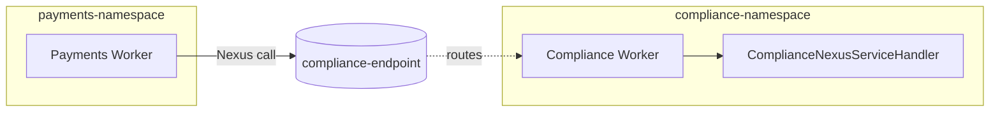

---
layout: section
---

# 03 / Sync Handlers and the Endpoint

---
layout: default
---

# What Is a Sync Nexus Handler?

<br>

A single `async def` method that implements one Operation on the Service contract.

<v-clicks>

- Decorated with `@nexusrpc.handler.sync_operation`.
- Runs **inline** in the handler Worker's process. **No workflow** on the handler side.
- Returns the typed result directly. The caller awaits it.

</v-clicks>

<br>

<v-click>

Mental model: a function call across a namespace boundary. Same shape as an Activity, except a different team runs it.

</v-click>

<!--
- Definition slide. Names the primitive before the code drops.
- A single async def method that implements one Operation on the Service contract.
  - Concrete. Not abstract.
- **Build 1** Decorated with @nexusrpc.handler.sync_operation.
  - Per-method decorator. The class itself carries its own decorator that binds it to the Service contract.
- **Build 2** Runs inline in the handler Worker's process. No workflow on the handler side.
  - This is the load-bearing fact. Sync = no handler workflow exists. The handler is just a function call.
  - Compliance namespace stays empty for sync calls.
- **Build 3** Returns the typed result directly. The caller awaits it.
  - The shape is `Input -> Output`. Same as a function. Same as an Activity.
- **Build 4** Mental model: a function call across a namespace boundary.
  - Anchor the room. They already know how to call functions and Activities.
  - The new thing is "across a namespace boundary." Everything else is familiar.
-->

---
layout: default
---

# A Synchronous Handler

<br>

```python {all|1-2|3|5|7-9|all}
@nexusrpc.handler.service_handler(service=ComplianceNexusService)
class ComplianceNexusServiceHandler:

    @nexusrpc.handler.sync_operation
    async def check_compliance(
        self,
        ctx: nexusrpc.handler.StartOperationContext,
        input: ComplianceRequest,
    ) -> ComplianceResult:
        return run_rule_based_check(input)
```

<br>

<v-clicks>

- The class binds to the Service contract.
- `@sync_operation` says "run inline, return within the deadline."

</v-clicks>

<!--
- Sync handler is the simplest possible Nexus handler. Function call shape: input in, output out.
- **Build 1 (whole code)** Show the full handler.
  - Read top to bottom once. Then we zoom into each piece.
- **Build 2 (lines 1-2, decorator + class)** `@nexusrpc.handler.service_handler(service=ComplianceNexusService)`
  - The class-level decorator binds this implementation to the Service contract from Chapter 2.
  - Compliance ships this class; the contract is the same one Payments imports.
- **Build 3 (line 3, blank class body)** The class itself has no `__init__`, no state. Pure handler container.
  - Stateless class. All state belongs on the workflow side.
- **Build 4 (line 5, sync_operation decorator)** `@nexusrpc.handler.sync_operation`
  - This is the per-method decorator that says "run inline, return synchronously, finish in ≤10s."
  - This decorator is the difference between a sync Operation and an async one. Same shape, different behavior.
- **Build 5 (lines 7-9, body)** `return run_rule_based_check(input)`
  - Just a function call. The handler runs, the result returns. No workflow on this side.
  - Note `async def` even though we're calling a sync function. The handler signature is async; the work inside doesn't have to be.
- **Build 6 (whole code again)** Pull back out for the closing bullets.
- **Build 7** The class binds to the Service contract.
  - Decorator on the class = "I implement this contract." Same as `class Foo(Bar)` in any OO language.
- **Build 8** `@sync_operation` says "run inline, return within the deadline."
  - One-line summary the audience can carry forward.
- This handler is a function. There's no workflow on the Compliance side. Yet.
-->

---
layout: default
---

# The 10 Second Deadline

<br>

A sync handler runs inline on the **handler's** Worker, bound by a 10-second per-request deadline measured by the caller's Nexus Machinery.

<br>

<v-clicks>

- The 10 seconds is the time the caller's Nexus Machinery gives a single start (or cancel) request before timing out. Per attempt, not per operation.
- The number comes from `component.nexusoperations.request.timeout` (default 10s).
- If the handler misses the deadline, the Machinery retries with exponential backoff up to `schedule_to_close_timeout`.
- This isn't a soft target. It's a hard per-request limit.

</v-clicks>

<br>

<v-click>

**Decision rule:** under five seconds with margin, sync. Anything else, async.

</v-click>

<br>

<v-click>

Most production sync timeouts in the wild are **handler workers not running.** Five consecutive timeouts trip a circuit breaker.

</v-click>

<!--
- A sync handler runs inline on the **handler's** Worker, bound by a 10-second per-request deadline measured by the caller's Nexus Machinery.
  - The load-bearing architectural fact. Per the docs, the deadline is request-level, measured by the caller's Nexus Machinery, not derived from Workflow Task runtime.
  - The handler runs on the handler-side Worker that polled the Nexus Task. The caller's Workflow Task already closed when it issued the `ScheduleNexusOperation` command; a new caller-side Workflow Task is scheduled later to deliver the result.
- **Build 1** The 10 seconds is the time the caller's Nexus Machinery gives a single start (or cancel) request before timing out. Per attempt, not per operation.
  - Different from `schedule_to_close_timeout` (the operation-level envelope across retries). 10s is per-attempt; schedule-to-close is per-operation.
- **Build 2** The number comes from `component.nexusoperations.request.timeout` (default 10s).
  - Same number on Temporal Cloud and on self-hosted dev servers; not a knob you tune in production.
- **Build 3** If the handler misses the deadline, the Machinery retries with exponential backoff up to `schedule_to_close_timeout`.
  - From the cloud/limits doc: "the caller will retry, with an exponential backoff, for the ScheduleToClose duration for the overall Nexus Operation."
  - One sync operation can wall-clock past 10 seconds across retried attempts; each individual attempt is bounded by 10s.
- **Build 4** This isn't a soft target. It's a hard per-request limit.
  - Don't design for "usually under 10s." Design for "always under 10s, with margin."
- **Build 5** Decision rule: under five seconds with margin, sync. Anything else, async.
  - Five seconds is a safer ceiling. Half the limit, plus headroom for slow days.
  - The decision lives at design time, not at runtime.
- **Build 6** Most production sync timeouts in the wild are handler workers not running.
  - This is the production anchor. Mystery 10s timeouts are almost always "the worker pool scaled to zero."
  - Five timeouts trip the circuit breaker.
-->

---
layout: section
---

# Quiz Time

ahaslides.com/O8RSE

<!--
- **Switch to AhaSlides slides 15-16** (two graded questions, ~1 minute total).
- These run right after the 10s deadline beat, the room's just heard the constraint, now we test it.
- **Lead-in**: "Two questions, both graded. First one's a multi-select."
- **AhaSlides slide 15 (pick answer multi-select)**: "When is a sync Nexus handler the right tool?"
  - Correct answers: **Send a Signal, Query, or Update to a running Workflow**; **Latency-sensitive lookups under 10s**; **Simple operations with no durable state**.
  - Distractors: long-running approval workflows; operations that must survive a Worker restart.
  - The Signal/Query/Update answer is the canonical sync use case per the docs and is exactly what `submit_review` is going to do later in the workshop. Plant the connection.
  - Walk through the correct answers after the timer.
- **AhaSlides slide 16 (pick answer)**: "Your sync handler routinely takes 9.8s. What's the safe move?"
  - Correct: **Convert it to a workflow_run_operation (async)**.
  - This is the production decision. 9.8s isn't a problem... until it is. The safe move is to move out of the sync envelope entirely.
- **Lead-out**: "OK, sync handler concepts locked in. Now let's wire one up. Back to slides for the Worker registration, then off to Instruqt."
- After this transition, advance to "Registering the Handler on the Worker."
-->

---
layout: default
---

# Registering the Handler on the Worker

<br>

```python {all|3|5|10|all}
from temporalio.worker import Worker

from compliance.service_handler import ComplianceNexusServiceHandler

client = await Client.connect("localhost:7233", namespace="compliance-namespace")

worker = Worker(
    client,
    task_queue="compliance-risk",
    nexus_service_handlers=[ComplianceNexusServiceHandler()],
)
await worker.run()
```

<br>

<v-click>

The Compliance Worker is now the only thing that listens for `compliance-risk`.

</v-click>

<!--
- Worker registration is one new argument: `nexus_service_handlers=`. That's it.
- **Build 1 (whole code)** Show the full Worker setup.
- **Build 2 (line 3, handler import)** `from compliance.service_handler import ComplianceNexusServiceHandler`
  - The handler class we just wrote on the previous slide.
- **Build 3 (line 5, namespace)** `Client.connect("localhost:7233", namespace="compliance-namespace")`
  - Note: this Worker connects to **compliance-namespace**, not payments-namespace.
  - The handler lives in the same namespace as the Compliance team's other workflows.
- **Build 4 (line 10, nexus_service_handlers arg)** `nexus_service_handlers=[ComplianceNexusServiceHandler()]`
  - The new argument. Pass a list of handler instances.
  - In Ch03 this Worker only serves Nexus Operations; Ch05 adds workflows and activities to the same Worker. Nexus handlers run alongside Workflows and Activities, no separate Worker needed.
- **Build 5 (whole code)** Pull back out for the closing line.
- **Build 6** The Compliance Worker is now the only thing that listens for `compliance-risk`.
  - Strong landing. Compliance owns its task queue. Payments doesn't poll it.
  - This is the structural change that makes Nexus useful.
- One handler instance per registration. No special pooling. The platform handles concurrency the same way it does for Activities.
-->

---
layout: default
---

# What Is a Nexus Endpoint?

<br>

A **routing rule** in the Temporal server's Nexus registry. It is not code.

<v-clicks>

- Carries a **name** (what callers use), a **target namespace**, a **target task queue**, and a Markdown **description**.
- Created by the **operator**. Lives at the cluster level on self-hosted; at the **account level** on Temporal Cloud.
- The caller code references the **name only**. The platform routes from name to namespace + task queue.

</v-clicks>

<br>

<v-click>

Mental model: a **DNS entry**. Caller asks for `compliance-endpoint`. Platform looks up the row. Routes the call. Caller never knows the namespace or task queue.

</v-click>

<br>

<v-click>

On Temporal Cloud, runtime access is governed by an **allowlist**. By default no callers are allowed, **even Workflows in the same Namespace as the target.**

</v-click>

<!--
- Definition slide. The room needs to know what an Endpoint is before they see the CLI command.
- A routing rule in the Temporal server's Nexus registry.
  - Server-side artifact. Not code. Not committed to git.
  - Created with a CLI command. Lives in the registry until you delete it.
- **Build 1** Carries a name, a target namespace, a target task queue, and a Markdown description.
  - Four fields. The name is the public identifier. The namespace + task queue is the routing target. The description renders as Markdown in the Web UI.
- **Build 2** Created by the operator. Lives at the cluster level on self-hosted; at the account level on Temporal Cloud.
  - Operator = whoever runs `temporal` CLI commands. Could be platform team, could be the dev.
  - On Temporal Cloud the Endpoint is account-scoped. One Endpoint can be reached by callers across all your namespaces.
- **Build 3** The caller code references the name only.
  - Caller code: `endpoint="compliance-endpoint"`. That's it.
  - The Endpoint is the indirection. Caller doesn't know the target.
- **Build 4** Mental model: a DNS entry.
  - DNS entry: `compliance.api.company.com -> 10.0.0.42:8080`. Same shape.
  - Caller never resolves the IP. Just uses the name.
- **Build 5** On Temporal Cloud, runtime access is governed by an allowlist.
  - Important security note. Default-deny.
  - Even a workflow in the same namespace as the target needs to be allowed in.
  - Replay attendees evaluating Temporal Cloud will appreciate the clarity.
- After this slide, the CLI command lands as the implementation of the concept just defined.
-->

---
layout: default
---

# Creating the Endpoint

<br>

The Endpoint is a routing entry. Operator-side, not code-side.

<br>

```bash
temporal operator nexus endpoint create \
  --name compliance-endpoint \
  --target-namespace compliance-namespace \
  --target-task-queue compliance-risk \
  --description-file compliance-endpoint.md
```

<br>

<v-clicks>

- Endpoint name is what the **caller** uses
- Target namespace + task queue is where the **handler** lives
- Created once, shared by all callers

</v-clicks>

<!--
- The Endpoint is a routing entry. Operator-side, not code-side.
  - "Operator" = whoever runs `temporal` CLI commands. Could be a platform team, could be the developer.
  - The Endpoint is created **once** and shared by all callers. Not per-deployment.
- Walk through the CLI command line by line.
  - `--name compliance-endpoint`: the name callers will use. Treat it like a public URL.
  - `--target-namespace compliance-namespace`: where the handler runs.
  - `--target-task-queue compliance-risk`: which task queue the handler polls.
  - `--description-file`: optional, a markdown file shown in the Web UI for documentation.
- **Build 1** Endpoint name is what the **caller** uses
  - Caller code names the Endpoint. Period. Not the namespace, not the task queue.
  - Hide the implementation detail behind a stable name.
- **Build 2** Target namespace + task queue is where the **handler** lives
  - The Endpoint is the indirection: callers point at the name, the platform points the name at the handler location.
  - Move the handler? Update the Endpoint. Caller code unchanged.
- **Build 3** Created once, shared by all callers
  - One Endpoint per Service. Multiple caller workflows can hit it. Multiple Worker instances on the handler side handle the load.
- Mental model recap: Service = the API. Endpoint = the URL. Registry = DNS.
- Operator note: Endpoints are global per Temporal cluster, not per-namespace. They're a shared resource on Temporal Cloud.
-->

---
layout: default
---

# What Just Happened



<br>

<v-clicks>

- Two namespaces, two Workers, one Endpoint
- Compliance owns its task queue and its handler
- Payments doesn't import Compliance code, only the Service contract

</v-clicks>

<br>

<v-click>

The Compliance Worker is alive in `compliance-namespace` and the Endpoint can route to it. **The caller is unchanged.**

</v-click>

<!--
- Big-picture diagram. Last slide before the exercise. Pull everything together.
- Walk the diagram once: Payments Worker on the left, Compliance Worker on the right, the Endpoint between them.
  - The arrow from Payments Worker to the Endpoint is the Nexus call.
  - The dotted arrow from Endpoint to Compliance Worker is the routing.
  - Inside the Compliance Worker, the handler runs.
- **Build 1** Two namespaces, two Workers, one Endpoint
  - Count them on screen. Two boxes for namespaces, two Workers, one routing icon.
  - This is the deployment shape we're aiming for in Exercise 3.
- **Build 2** Compliance owns its task queue and its handler
  - "Owns" means: deploys it, scales it, monitors it. Nobody else polls `compliance-risk`.
- **Build 3** Payments doesn't import Compliance code, only the Service contract
  - Strong landing. The Payments Worker only depends on `shared/service.py` and the dataclasses.
  - Compliance can rewrite `run_rule_based_check` however they want; Payments doesn't know.
- They've now seen all three pieces: the handler in code, the Worker registering it, the Endpoint pointing callers at it.
-->

---
layout: exercise
minutes: 18
heading: Exercise 3
---

**Implement the synchronous handler.**

You will implement the `check_compliance` Nexus handler, register it on a
brand new Compliance Worker in `compliance-namespace`, and watch the Worker
poll the `compliance-risk` task queue.

Full instructions are in the Instruqt tab.

<!--
- 18 minute exercise. The largest of the morning. Three things to wire up.
- "Implement the handler. Register the Worker. Create the Endpoint."
  - Three TODOs, three distinct mental modes (write a class, modify a Worker, run a CLI command).
- TODO 2: Add `@nexusrpc.handler.sync_operation` to `check_compliance`
  - The exercise file has the class skeleton with a `NotImplementedError`. They replace it.
  - Check script greps for the decorator and the function signature.
- TODO 3: Add the handler to the Worker via `nexus_service_handlers=`
  - One-line change to `compliance/worker.py`.
  - Check script greps the Worker file for `nexus_service_handlers=`.
- Run `temporal operator nexus endpoint create` from the terminal
  - Single CLI command. The check script polls `temporal operator nexus endpoint list | grep compliance-endpoint`.
  - Common gotcha: forgetting `--target-namespace` or `--target-task-queue`. Both are required.
- Plan for friction:
  - Some attendees will hit `endpoint already exists` if they re-run the command. That's fine; idempotent retry.
  - Walk the room during this exercise. Most issues will be typos in the CLI command.
- After they finish, advance straight into Chapter 4. Ch3's AhaSlides quiz (slides 15-16) already ran before this exercise.
-->
