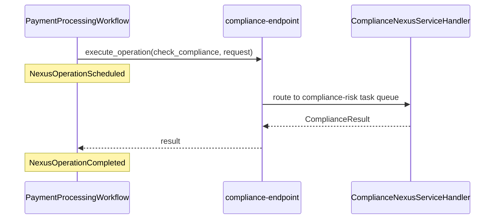

---
layout: section
---

# 04 / Calling Nexus from a Workflow

---
layout: default
---

# What Changes From the Caller's Perspective?

<br>

<v-clicks>

- **Before:** `await workflow.execute_activity(check_compliance, ...)` calls a function the Payments Worker imports and runs.
- **After:** `await nexus_client.execute_operation(...)` calls a function the **Compliance Worker** runs in another namespace.
- Same `await`. Same return value. **Different ownership.**

</v-clicks>

<br>

<v-click>

The Payments engineer six months from now reads this line and the only thing they need to know is that `compliance-endpoint` exists. **They never read Compliance code again.**

</v-click>

<!--
- Concept slide. Frames the architectural shift before the code drops.
- **Build 1** Before: await workflow.execute_activity(check_compliance, ...) calls a function the Payments Worker imports and runs.
  - The "before" picture. Activity is a function the local Worker has imported.
- **Build 2** After: await nexus_client.execute_operation(...) calls a function the Compliance Worker runs in another namespace.
  - The "after" picture. The function lives somewhere else. The caller doesn't import it.
- **Build 3** Same await. Same return value. Different ownership.
  - The shape of the call site is identical. Workflows that already use Activities can swap to Nexus with minimal code change.
  - What changes is who owns the implementation. That's the architectural shift.
- **Build 4** The Payments engineer six months from now reads this line and the only thing they need to know is that compliance-endpoint exists.
  - The maintenance story. Future-Mason, future-anybody, never has to read Compliance code.
  - The Endpoint name is the public surface. Everything else is implementation.
- This slide is the chapter's thesis. The next two slides are the code that implements it.
-->

---
layout: default
---

# The Caller Side

<br>

```python {all|1-4|6-10|all}
nexus_client = workflow.create_nexus_client(
    service=ComplianceNexusService,
    endpoint="compliance-endpoint",
)

compliance: ComplianceResult = await nexus_client.execute_operation(
    ComplianceNexusService.check_compliance,
    comp_req,
    schedule_to_close_timeout=timedelta(minutes=10),
)
```

<br>

<v-clicks>

- `create_nexus_client` is the caller-side stub. Service contract plus endpoint name.
- `execute_operation` looks like an Activity call. Same `await`, same return value.

</v-clicks>

<!--
- This is the entire caller side. Two calls. Set the expectation: it's small.
- **Build 1 (whole code)** Show the full caller block.
- **Build 2 (lines 1-4, create_nexus_client)** `workflow.create_nexus_client(service=..., endpoint=...)`
  - The caller-side stub. Two arguments: the Service contract class and the Endpoint name.
  - That's it. No namespace, no task queue, no handler import.
- **Build 3 (lines 6-10, execute_operation)** `await nexus_client.execute_operation(...)`
  - Looks like an Activity call. Same `await`, same return value, same retry/timeout story.
  - First positional arg is the Operation reference (not a string). Type-checked.
  - Second positional arg is the input dataclass.
- **Build 4 (whole code)** Pull back out for closing bullets.
- **Build 5** `create_nexus_client` is the caller-side stub. Service contract plus endpoint name.
  - The caller's view of the integration: contract + name. Nothing else.
- **Build 6** `execute_operation` looks like an Activity call. Same `await`, same return value.
  - If you can call an Activity, you can call a Nexus Operation. The mental model is the same.
- Notice what the caller does **not** have: the namespace, the task queue, the handler implementation, the type of the handler (sync or async).
  - The caller only knows the contract and the Endpoint name.
  - This is what makes the Java handler swap in the polyglot demo invisible to the Python caller.
-->

---
layout: default
---

# Drop Compliance From the Caller Worker

<br>

Before:

```python {all|3-4|all}
worker = Worker(
    client,
    workflows=[PaymentProcessingWorkflow],
    activities=[validate_payment, execute_payment, check_compliance],
)
```

After:

```python {all|4|all}
worker = Worker(
    client,
    workflows=[PaymentProcessingWorkflow],
    activities=[validate_payment, execute_payment],
)
```

<br>

<v-click>

The Payments Worker no longer **knows about** compliance. That's the win.

</v-click>

<br>

<v-click>

The dependency graph between teams flips: from "Payments imports Compliance" to "Payments depends on a Service contract; Compliance happens to implement it."

</v-click>

<!--
- This is the moment the decoupling becomes real. Big slide. Sell it.
- **Build 1 (Before block, whole)** Show the original Worker registration.
- **Build 2 (Before, line 4 highlight)** `activities=[validate_payment, execute_payment, check_compliance]`
  - Three activities. `check_compliance` is the cross-team one.
  - This Worker can run all three because all three live in this codebase.
- **Build 3 (Before block, whole)** Hold on the before for a beat.
- **Build 4 (After block, whole)** Show the new Worker registration.
- **Build 5 (After, line 4 highlight)** `activities=[validate_payment, execute_payment]`
  - One activity removed. The diff is one word.
  - `check_compliance` is no longer importable from this Worker. The import is gone too (do this in the exercise).
- **Build 6 (After block, whole)** Pull out for closing line.
- **Build 7** The Payments Worker no longer **knows about** compliance. That's the win.
  - Strong landing. The Worker can't run a compliance check even if it wanted to.
  - The only path is through Nexus, which means the only path is through the Compliance team's Worker.
  - Cross-team blast radius dropped to zero on this one call.
- Stress this: the diff is one word, but the architectural shift is enormous.
  - You can change Compliance's implementation, scale it, deploy it, monitor it independently. The Payments team will never know.
-->

---
layout: default
---

# Two Events, One Sync Call

<br>

In the caller's Event History, a sync Nexus Operation produces:

<br>

<v-clicks>

- `NexusOperationScheduled`: caller workflow has emitted "I want this Operation to run." Analogue of `ActivityTaskScheduled`.
- `NexusOperationCompleted`: handler returned a result. The result payload is on this event.

</v-clicks>

<br>

<v-click>

That's it. Two events. Same shape as a single Activity call.

</v-click>

<br>

<v-click>

You will **not** see a Workflow in `compliance-namespace` for a sync Operation.

</v-click>

<br>

<v-click>

**This is your first Nexus diagnostic surface.** No Scheduled, the call never registered. Scheduled but no Completed, the handler is stuck. Both, the round trip worked.

</v-click>

<!--
- This slide is reading the Event History. After the exercise they'll do this for real in the Web UI.
- In the caller's Event History, a sync Nexus Operation produces:
  - The whole event count is two. That's the headline.
- **Build 1** `NexusOperationScheduled`: the Nexus call was started
  - This is the analogue of `ActivityTaskScheduled`. The caller workflow has emitted "I want this Operation to run."
- **Build 2** `NexusOperationCompleted`: the handler returned
  - The handler ran, returned a result, and the caller's history records the completion.
  - The result payload is on this event. You can inspect it in the Web UI.
- **Build 3** That's it. Two events. Same shape as a single Activity call.
  - Activity: Scheduled + Completed. Sync Nexus: Scheduled + Completed. Symmetric.
  - Memorize this.
- **Build 4** You will **not** see a Workflow in `compliance-namespace` for a sync Operation.
  - Critical point. A sync handler is a function call, not a workflow.
  - There's no compliance-side workflow to look at. Yet.
-->

---
layout: default
---

# What the Caller Sees vs What Compliance Sees



<!--
- Sequence diagram for the visually-oriented learners. Three actors, one round trip.
- Walk the diagram top to bottom:
  - Caller (PaymentProcessingWorkflow) calls `execute_operation` on the Endpoint.
  - First note appears: `NexusOperationScheduled` is recorded on the caller's history.
  - Endpoint routes to the handler on the `compliance-risk` task queue.
  - Handler returns the `ComplianceResult`.
  - Endpoint returns to the caller.
  - Second note appears: `NexusOperationCompleted` is recorded on the caller's history.
- The Endpoint isn't a separate process you run. It's a routing entry; conceptually it's the platform doing the routing.
- This diagram is for sync Nexus only. The async path adds a `Started` event between Scheduled and Completed.
- No clicks on this slide. Just the diagram and the speaker walking through it.
-->

---
layout: exercise
minutes: 17
heading: Exercise 4
---

**Swap the caller to Nexus.**

You will replace the Payments Workflow's local `check_compliance` activity
call with a Nexus Operation, drop the now-unused Compliance code from the
Payments Worker, and witness the two-event sync pattern in Event History.

Full instructions are in the Instruqt tab.

<!--
- 17 minute exercise. The punchline of the morning.
- "Swap the activity for a Nexus call. Drop compliance from the caller."
  - This is the moment the architecture they drew on slide 1 becomes real on screen.
- TODO 4: In `payments/workflows.py`, replace the `check_compliance` activity call with a Nexus call.
  - Find the existing `await workflow.execute_activity(check_compliance, ...)`.
  - Replace with `nexus_client = workflow.create_nexus_client(...)` + `await nexus_client.execute_operation(...)`.
  - Same input dataclass. Same output type. Different transport.
- TODO 5: In `payments/worker.py`, remove `check_compliance` from `activities=`.
  - One-line change. Drop the import too while you're there.
- Then run TXN-A, TXN-B, TXN-C and inspect the caller's Event History in the Web UI.
  - Open the Web UI, find the PaymentProcessingWorkflow execution, scroll to the events.
  - "Find me a NexusOperationScheduled. Find me a NexusOperationCompleted. Two events. No more."
  - Confirm there are no workflows in compliance-namespace yet.
- Sell the moment when they finish:
  - "You just took a single-namespace monolith and turned it into a two-namespace, Nexus-connected app. Your Compliance team can ship at their pace, scale at their pace, and Payments will never know."
- After they finish, advance to the Review slide, then to the **Halftime!** transition. That's where the leaderboard moment, the pulse, and the Q&A parking lot live.
-->

---
layout: default
---

# Review

<v-clicks>

- A Nexus Service contract is a typed Python class that both teams import
- A synchronous Nexus handler runs inline on the handler Worker. **No handler workflow exists.**
- A Nexus Endpoint is a routing entry created with the Temporal CLI. The caller names the **Endpoint**, never the Namespace.
- A caller Workflow uses `workflow.create_nexus_client` and `execute_operation` in place of an Activity call
- A successful synchronous Nexus call produces **two events** on the caller's history: `NexusOperationScheduled` and `NexusOperationCompleted`
- The Compliance team's Worker now owns its task queue, and the Payments Worker no longer imports Compliance code

</v-clicks>

<!--
- Closing of the morning's three-chapter arc (contract → handler → caller). Build each one back.
- **Build 1** A Nexus Service contract is a typed Python class that both teams import
- **Build 2** A synchronous Nexus handler runs inline on the handler Worker. No handler workflow exists.
- **Build 3** A Nexus Endpoint is a routing entry created with the Temporal CLI. The caller names the Endpoint, never the Namespace.
- **Build 4** A caller Workflow uses `workflow.create_nexus_client` and `execute_operation` in place of an Activity call
- **Build 5** A successful synchronous Nexus call produces two events on the caller's history: `NexusOperationScheduled` and `NexusOperationCompleted`
- **Build 6** The Compliance team's Worker now owns its task queue, and the Payments Worker no longer imports Compliance code
- This Review lands the morning's punchline before the room hits the leaderboard + break. Pause on the last build.
- Then advance to Halftime!
-->

---
layout: section
---

# Halftime!

Leaderboard, pulse check, then break

<!--
- **Switch to AhaSlides slides 17-21** (five slides spanning knowledge check, leaderboard, pulse, parking lot).
- This is the **biggest transition of the morning**. You're closing the morning content block, celebrating the leaderboard, and parking questions for after the break.
- Plan for ~5 minutes of AhaSlides activity here, then 30 minutes of break (11:00-11:30).
- **Lead-in**: "Alright, you just shipped the morning's punchline, your monolith is now a two-namespace, Nexus-connected app. Let's lock in what you saw, then take a leaderboard moment, then we break."
- **AhaSlides slide 17 (pick answer, graded)**: "How many Nexus events on a sync call?"
  - Correct: **2** (Scheduled and Completed).
  - Anchor it: "Same shape as a single Activity call. Memorize this."
- **AhaSlides slide 18 (match pairs, graded)**: "Match the Event History event to what it means."
  - This is the highest-value slide because it forces them to recognize the events they just saw in the Web UI.
  - If anyone aced it, ask them out loud "did you have to look at the UI to answer?", usually a yes, which is the right behavior.
- **AhaSlides slide 19 (LEADERBOARD)**: Halftime standings.
  - **Make a moment of this.** Pause. Read the top 3 names aloud. Applause.
  - "These three are leading at halftime. Don't get comfortable, second half is where the points are."
  - Take a screenshot if your laptop allows; helps drive engagement back from the break.
- **AhaSlides slide 20 (word cloud)**: "What's clicking? One word."
  - Quick pulse before break. Read 3-4 responses out loud.
  - Listen for "boundary," "contract," "endpoint," "decoupled", those mean the Ch1-4 thesis is landing.
- **AhaSlides slide 21 (Q&A parking lot)**: "Drop your questions for after the break."
  - **Leave this slide open during the break.** Tell attendees explicitly: "Drop questions while you walk to coffee. I'll triage and answer right after the break."
  - Triage their questions during the break. Pick the top 2-3 to answer when we restart.
- **Lead-out / Break announcement**: "OK, 30 minutes. We're back at 11:30 sharp. Coffee, restroom, drop questions in slide 21 of AhaSlides while you walk. See you back here."
- **Pre-break checklist for you (the presenter)**:
  - Verify the Java legacy container is up (you'll need it later for the polyglot demo).
  - Skim Q&A parking lot for clusters of questions.
  - Get water. Reset.
- After the break, advance to Chapter 5's section divider. We do not return to AhaSlides until Ch5's quiz block (slides 22-25).
-->
