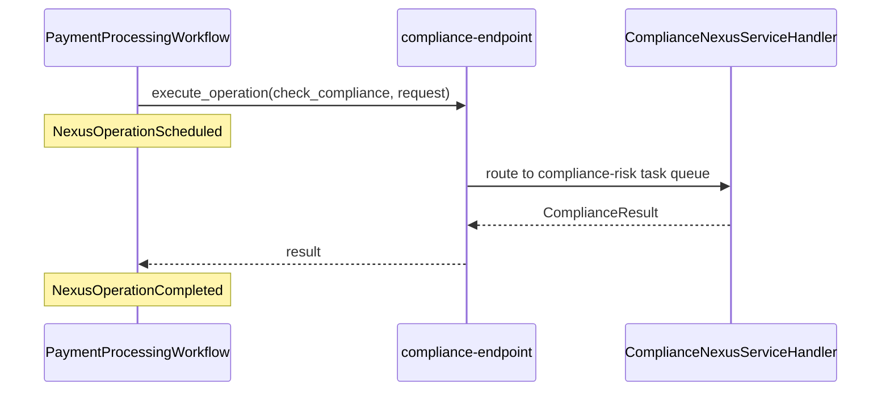

---
layout: default
---

# What Changes From the Caller's Perspective?

<v-clicks>

- **Before:** `await workflow.execute_activity(check_compliance, ...)` calls a function the Payments Worker imports and runs.
- **After:** `await nexus_client.execute_operation(...)` calls a function the **Compliance Worker** runs in another namespace.
- Same `await`. Same return value. **Different ownership.**

</v-clicks>

<br>

<v-click>

The Payments engineer six months from now reads this line and the only thing they need to know is that `compliance-endpoint` exists. **They never read Compliance code again.**

</v-click>

<!--
- **Build 1** Before: await workflow.execute_activity(check_compliance, ...) calls a function the Payments Worker imports and runs.
  - The "before" picture. Activity is a function the local Worker has imported.
- **Build 2** After: await nexus_client.execute_operation(...) calls a function the Compliance Worker runs in another namespace.
  - The "after" picture. The function lives somewhere else. The caller doesn't import it.
- **Build 3** Same await. Same return value. Different ownership.
  - The shape of the call site is identical. Workflows that already use Activities can swap to Nexus with minimal code change.
  - What changes is who owns the implementation. That's the architectural shift.
- **Build 4** The Payments engineer six months from now reads this line and the only thing they need to know is that compliance-endpoint exists.
  - Future-Mason, future-anybody, never has to read Compliance code.
  - The Endpoint name is the public surface. Everything else is implementation.

## Teaching notes

- **Anecdotal framing (verbal-only).** Real production teams articulate the same point as: "Callers shouldn't know workflow IDs or task queues." Use that wording if the room is engineer-skeptical and wants the production-engineering-team voice rather than the workshop's "future Payments engineer" framing. Same point, different register.
-->

---
layout: default
---

# The Caller Side

```python {all|1-4|6-10|all}
nexus_client = workflow.create_nexus_client(
    service=ComplianceNexusService,
    endpoint="compliance-endpoint",
)

compliance: ComplianceResult = await nexus_client.execute_operation(
    ComplianceNexusService.check_compliance,
    comp_req,
    schedule_to_close_timeout=timedelta(minutes=10),
)
```

<style>
.slidev-layout pre.shiki,
.slidev-layout pre code { font-size: 1.0rem; line-height: 1.3; }
</style>

<!--
- This is the entire caller side. Two calls. It's small.
- **Build 1 (whole code)** The full caller block.
- **Build 2 (lines 1-4, create_nexus_client)** `workflow.create_nexus_client(service=..., endpoint=...)`
  - The caller-side stub. Two arguments: the Service contract class and the Endpoint name.
  - That's it. No namespace, no task queue, no handler import.
- **Build 3 (lines 6-10, execute_operation)** `await nexus_client.execute_operation(...)`
  - Looks like an Activity call. Same `await`, same return value, same retry/timeout story.
  - First positional arg is the Operation reference (not a string). Type-checked.
  - Second positional arg is the input dataclass.
- **Build 4 (whole code)**
- The Caller-Side Explained slide carries the synthesis bullets.
-->

---
layout: default
---

# The Caller Side Explained

<v-clicks>

- `create_nexus_client` is the caller-side stub. Service contract plus Endpoint name.
- `execute_operation` looks like an Activity call. Same `await`, same return value.

</v-clicks>

<br>

<v-click>

Notice what the caller does **not** have: the Namespace, the Task Queue, the handler implementation, or the type of the handler (sync or async).

</v-click>

<br>

<v-click>

The caller knows the **contract** and the **Endpoint name**. That's the property that makes a same-contract Java handler invisible to a Python caller.

</v-click>

<!--
- **Build 1** `create_nexus_client` is the caller-side stub. Service contract plus endpoint name.
  - The caller's view of the integration: contract + name. Nothing else.
- **Build 2** `execute_operation` looks like an Activity call. Same `await`, same return value.
  - If you can call an Activity, you can call a Nexus Operation. The mental model is the same.
- **Build 3** Notice what the caller does NOT have.
  - The caller only knows the contract and the Endpoint name.
  - This is the property that makes a same-contract Java handler invisible to a Python caller.
- **Build 4** The contract + Endpoint name pair is the caller's whole world.
  - The Polyglot demo at the end of the workshop pays this off: a Java handler hits the same contract; the Python caller doesn't change.
-->

---
layout: default
---

# Dropping the Activity

Before:

```python {all|4|all}
worker = Worker(
    client,
    workflows=[PaymentProcessingWorkflow],
    activities=[validate_payment, execute_payment, check_compliance],
)
```

After:

```python {all|4|all}
worker = Worker(
    client,
    workflows=[PaymentProcessingWorkflow],
    activities=[validate_payment, execute_payment],
)
```

<v-click>

The Payments Worker no longer **knows about** compliance. The dependency flips from "Payments imports Compliance" to "Payments depends on a contract; Compliance implements it."

</v-click>

<style>
.slidev-layout pre.shiki,
.slidev-layout pre code { font-size: 1.0rem; line-height: 1.3; }
</style>

<!--
- **Build 1 (Before block, whole)** The original Worker registration.
- **Build 2 (Before, line 4 highlight)** `activities=[validate_payment, execute_payment, check_compliance]`
  - Three activities. `check_compliance` is the cross-team one.
  - This Worker can run all three because all three live in this codebase.
- **Build 3 (Before block, whole)**
- **Build 4 (After block, whole)** The new Worker registration.
- **Build 5 (After, line 4 highlight)** `activities=[validate_payment, execute_payment]`
  - One activity removed. The diff is one word.
  - `check_compliance` is no longer importable from this Worker. The import is gone too (do this in the exercise).
- **Build 6 (After block, whole)**
- **Build 7** The Payments Worker no longer **knows about** compliance. That's the win.
  - The Worker can't run a compliance check even if it wanted to.
  - The only path is through Nexus, which means the only path is through the Compliance team's Worker.
  - Cross-team blast radius dropped to zero on this one call.
- **Build 8** The dependency graph between teams flips, from "Payments imports Compliance" to "Payments depends on a Service contract; Compliance happens to implement it."
  - The diff is one word, but the architectural shift is enormous.
  - You can change Compliance's implementation, scale it, deploy it, monitor it independently. The Payments team will never know.
-->

---
layout: default
---

# Two Events, One Sync Call

In the caller's Event History, a sync Nexus Operation produces:

<v-clicks>

- `NexusOperationScheduled`: caller emitted "run this Operation." Analogue of `ActivityTaskScheduled`.
- `NexusOperationCompleted`: handler returned a result. Payload lives on this event.

</v-clicks>

<v-click>

Two events. Same shape as a single Activity call. No Workflow in `compliance-namespace` for a sync Operation.

</v-click>

<br>

<v-click>

**Your first Nexus diagnostic surface.** No Scheduled = call never registered. Scheduled, no Completed = handler stuck. Both = round trip worked.

</v-click>

<!--
- After the exercise they'll do this for real in the Web UI.
- In the caller's Event History, a sync Nexus Operation produces two events.
- **Build 1** `NexusOperationScheduled`: the Nexus call was started
  - This is the analogue of `ActivityTaskScheduled`. The caller workflow has emitted "I want this Operation to run."
- **Build 2** `NexusOperationCompleted`: the handler returned
  - The handler ran, returned a result, and the caller's Event History records the completion.
  - The result payload is on this event. You can inspect it in the Web UI.
- **Build 3** That's it. Two events. Same shape as a single Activity call.
  - Activity: Scheduled + Completed. Sync Nexus: Scheduled + Completed. Symmetric.
- **Build 4** You will **not** see a Workflow in `compliance-namespace` for a sync Operation.
  - A sync handler is a function call, not a workflow.
  - There's no compliance-side workflow to look at. Yet.
- **Build 5** This is your first Nexus diagnostic surface.
  - No Scheduled, the call never registered. The Nexus call never made it off the caller side.
  - Scheduled but no Completed, the handler is stuck. Worker not running, deadline blown, exception on the way back.
  - Both, the round trip worked. The rest of debugging layers on top of these two events.
-->

---
layout: default
---

# What the Caller Sees vs What Compliance Sees



<!--
- Three actors, one round trip.
  - Caller (PaymentProcessingWorkflow) calls `execute_operation` on the Endpoint.
  - First note appears: `NexusOperationScheduled` is recorded on the caller's Event History.
  - Endpoint routes to the handler on the `compliance-risk` task queue.
  - Handler returns the `ComplianceResult`.
  - Endpoint returns to the caller.
  - Second note appears: `NexusOperationCompleted` is recorded on the caller's Event History.
- The Endpoint isn't a separate process you run. It's a routing entry; conceptually it's the platform doing the routing.
- Sync only on this slide.

## Teaching notes

- Three actors, one round trip. Walk the arrows in order: caller schedules, the note for `NexusOperationScheduled` lands, Endpoint routes, handler returns, Endpoint relays, the note for `NexusOperationCompleted` lands.
- **Bidirectional linking (verbal-only).** In the Web UI, clicking through from the caller's `NexusOperationCompleted` event takes you to the handler workflow execution (and vice versa). No log correlation needed. Pre-Nexus, cross-service debugging took minutes of manual ID stitching across logs; with bidirectional linking, it's seconds. Production diagnostic surface worth pointing out during the exercise debrief.
-->

---
layout: exercise
minutes: 17
heading: Exercise 4
---

**Swap the caller to Nexus.**

You will replace the Payments Workflow's local `check_compliance` activity
call with a Nexus Operation, drop the now-unused Compliance code from the
Payments Worker, and witness the two-event sync pattern in Event History.

Full instructions are in the Instruqt tab.

<!--
- "Swap the activity for a Nexus call. Drop compliance from the caller."
- "Find me a NexusOperationScheduled. Find me a NexusOperationCompleted. Two events. No more."
- "You just took a single-namespace monolith and turned it into a two-namespace, Nexus-connected app. Your Compliance team can ship at their pace, scale at their pace, and Payments will never know."

## Teaching notes

- TODO 4: In `payments/workflows.py`, replace the `check_compliance` activity call with a Nexus call. Find the existing `await workflow.execute_activity(check_compliance, ...)` and replace with `nexus_client = workflow.create_nexus_client(...)` plus `await nexus_client.execute_operation(...)`. Same input dataclass, same output type, different transport.
- TODO 5: In `payments/worker.py`, remove `check_compliance` from `activities=`. One-line change. Drop the import too while you're there.
- After the swap, the room runs TXN-A, TXN-B, TXN-C and inspects the caller's Event History in the Web UI. Confirm there are no workflows in compliance-namespace yet.
-->

---
layout: default
---

# Review

<v-clicks>

- A Nexus Service contract is a typed Python class that both teams import
- A synchronous Nexus handler runs inline on the handler Worker. **No handler workflow exists.**
- A Nexus Endpoint is a routing entry created with the Temporal CLI. The caller names the **Endpoint**, never the Namespace.
- A caller Workflow uses `workflow.create_nexus_client` and `execute_operation` in place of an Activity call
- A successful synchronous Nexus call produces **two events** on the caller's Event History: `NexusOperationScheduled` and `NexusOperationCompleted`
- The Compliance team's Worker now owns its task queue, and the Payments Worker no longer imports Compliance code

</v-clicks>

<!--
- **Build 1** A Nexus Service contract is a typed Python class that both teams import
- **Build 2** A synchronous Nexus handler runs inline on the handler Worker. No handler workflow exists.
- **Build 3** A Nexus Endpoint is a routing entry created with the Temporal CLI. The caller names the Endpoint, never the Namespace.
- **Build 4** A caller Workflow uses `workflow.create_nexus_client` and `execute_operation` in place of an Activity call
- **Build 5** A successful synchronous Nexus call produces two events on the caller's Event History: `NexusOperationScheduled` and `NexusOperationCompleted`
- **Build 6** The Compliance team's Worker now owns its task queue, and the Payments Worker no longer imports Compliance code
-->

<!--
- Ch 4 closes here. Halftime + Break lands at the end of Ch 5 (the next chapter ends with the leaderboard moment), not here. Block 2 runs Ch 3 + Ch 4 + Ch 5 back-to-back without a break in between.
-->
