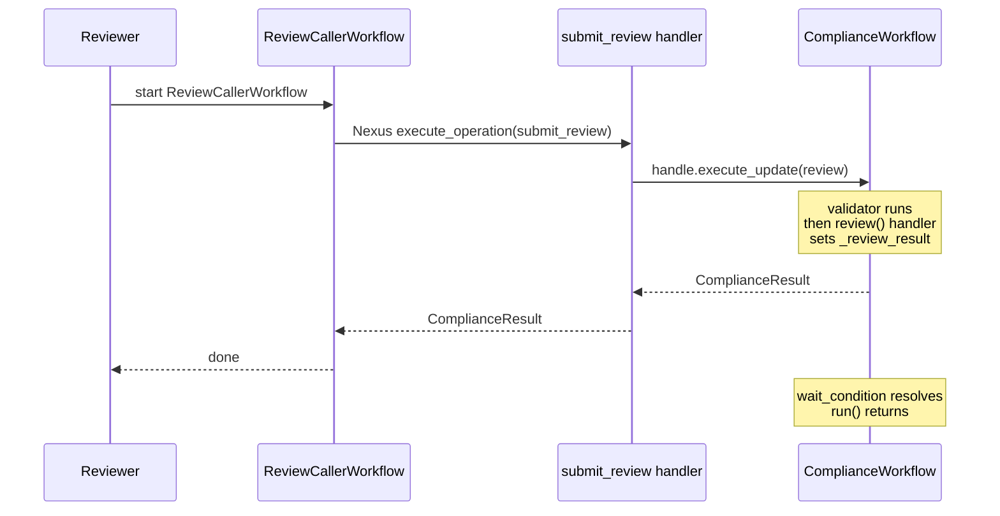

---
layout: section
---

# 06 / Updates Through Nexus

---
layout: default
---

# The Human-in-the-Loop Problem

<br>

A LOW-risk transaction auto-approves. A HIGH-risk one auto-declines.

<br>

<v-click>

A **MEDIUM-risk** one needs a human to look at it.

</v-click>

<v-click>

The handler workflow is already running. We need to **wake it up** with a decision.

</v-click>

<br>

<v-click>

That's a **Workflow Update**, sent through a Nexus Operation.

</v-click>

<!--
- Framing of the highest-friction chapter. Slow down. Set the scene.
- A LOW-risk transaction auto-approves. A HIGH-risk one auto-declines.
  - Quick recap from Chapter 5. The ComplianceWorkflow already handles these two cases automatically.
  - These don't need humans. The rule engine returns a verdict, the workflow returns.
- **Build 1** A **MEDIUM-risk** one needs a human to look at it.
  - The new case. The reason this chapter exists.
  - Real-world examples: refunds over $X, transactions to flagged jurisdictions, KYC borderline calls.
- **Build 2** The handler workflow is already running. We need to **wake it up** with a decision.
  - Important framing: the workflow exists, it's paused, we don't start a new one.
  - The decision arrives **from the outside** (a human reviewer) and goes **into a running workflow**.
- **Build 3** That's a **Workflow Update**, sent through a Nexus Operation.
  - Two concepts merge here: Workflow Updates (Temporal core) and Nexus Operations (this workshop).
  - The Update is the way to inject a decision into a running workflow.
  - The Nexus Operation is the way to do it across namespace boundaries.
- This chapter has the most moving parts of any chapter. Five things connect.
  - Validator. Update handler. wait_condition pause. Nexus sync handler that sends the Update. Caller workflow that triggers the Nexus call.
- Plan to walk the room during the exercise. Expect to take control of one or two attendee sandboxes.
-->

---
layout: default
---

# Workflow Updates in 60 Seconds

<br>

A **synchronous request-response into a running workflow.** Unlike a Signal, an Update has a return value.

<v-clicks>

- Two stages: a **validator** runs first; if it passes, the **handler** runs and returns.
- The validator runs synchronously in the workflow context and **must not mutate state.**
- If the validator raises, the Update is rejected and **no event is written to History at all.**
- Exactly the right primitive for "human submits a decision, workflow uses it to continue."

</v-clicks>

<br>

<v-click>

GA at Replay 2024. The combination "Updates + Nexus" is what this chapter is about.

</v-click>

<!--
- Primer slide. Even if the room used Updates briefly, this grounds the chapter.
- A synchronous request-response into a running workflow.
  - Sync = caller waits for a return value.
  - Distinguishes from Signal (fire-and-forget, no return) and Query (read-only, no mutation).
- **Build 1** Two stages: validator runs first; if it passes, handler runs and returns.
  - The two-stage pattern is what makes Updates safe.
  - Validator is the precondition layer. Handler is the effect.
- **Build 2** The validator runs synchronously in the workflow context and must not mutate state.
  - Must-not-mutate is the surface rule. The deeper reason comes on the validator slide: replay determinism.
- **Build 3** If the validator raises, the Update is rejected and no event is written to History at all.
  - This is the nuance most rooms don't know.
  - No `WorkflowExecutionUpdateAccepted`. No Rejected. No Completed. The workflow's history is unchanged.
  - That is what "validate before accept" buys you.
- **Build 4** Exactly the right primitive for "human submits a decision, workflow uses it to continue."
  - This is the chapter's use case in one line.
- **Build 5** GA at Replay 2024. The combination "Updates + Nexus" is what this chapter is about.
  - Updates went GA at the same Replay where Nexus went Public Preview. They were designed alongside each other.
- This is a 60-90 second slide. Don't burn time. Use it as the launch pad for the rest of the chapter.
-->

---
layout: default
---

# The Update Handler

```python {all|1|2|3-7|all}
@workflow.update
async def review(self, approved: bool, explanation: str) -> ComplianceResult:
    self._review_result = ComplianceResult(
        transaction_id=self._request.transaction_id,
        approved=approved, risk_level="MEDIUM", explanation=explanation,
    )
    return self._review_result
```

<v-click>

The handler runs **inside the workflow**, mutating its state durably.

</v-click>

<!--
- The Update handler. Half of a two-stage pattern. Validator next.
- **Build 1 (whole code)** Show the full Update handler.
- **Build 2 (line 1, decorator)** `@workflow.update`
  - This decorator marks `review` as a Workflow Update handler.
  - Updates are write-with-return-value: they mutate state and return a result.
- **Build 3 (line 2, signature)** `async def review(self, approved: bool, explanation: str) -> ComplianceResult`
  - Two arguments and a typed return. The return value flows back to the caller.
- **Build 4 (lines 3-7, body)** `self._review_result = ComplianceResult(...); return self._review_result`
  - The durable mutation. `_review_result` is what `run()` is waiting for in `wait_condition`.
  - Setting this is what unblocks the workflow.
- **Build 5** The handler runs **inside the workflow**, mutating its state durably.
  - "Inside the workflow" means: same event loop, same state, same history.
  - Mutations made here are durable. If the worker crashes mid-handler, the workflow replays and lands in the same state.
- This handler runs only AFTER the validator passes.
-->

---
layout: default
---

# The Validator

The validator is your **precondition layer**: read state, raise if the Update should be rejected, **never write.**

```python {all|1|2|3-6|all}
@review.validator
def validate_review(self, approved: bool, explanation: str) -> None:
    if self._auto_result is None or self._auto_result.risk_level != "MEDIUM":
        raise ValueError("Workflow is not awaiting review")
    if self._review_result is not None:
        raise ValueError("Review already submitted")
```

<v-click>

The validator runs **before** the Update is accepted. Idempotency happens here.

</v-click>

<br>

<v-click>

If the validator raises, the Update is rejected silently from History's perspective. **No `UpdateAccepted`. No `UpdateRejected`. No `UpdateCompleted`.** That is what "validate before accept" buys you.

</v-click>

<br>

<v-click>

The deeper "no writes" reason: the validator runs during a workflow task that may be **replayed.** Any non-determinism here corrupts replay.

</v-click>

<!--
- The validator. Side-effect-free guard that runs before the handler.
- **Build 1 (whole code)** Show the full validator.
- **Build 2 (line 1, decorator)** `@review.validator`
  - Bound to the `review` Update handler from the previous slide.
  - Slidev/Temporal calls this first; only if it returns without raising does the handler run.
- **Build 3 (line 2, signature)** `def validate_review(self, approved: bool, explanation: str) -> None`
  - Same arguments as the handler. Returns None. Raises to reject.
  - **Not async.** Validators are synchronous and side-effect-free.
- **Build 4 (lines 3-6, guards)** Two guards.
  - "Is the workflow ready for review?" (only MEDIUM risk waits)
  - "Has a review already happened?" (idempotency)
  - If either raises, the caller sees `WorkflowExecutionUpdateRejected`.
- **Build 5** The validator runs **before** the Update is accepted. Idempotency happens here.
  - A double-click on the approve button doesn't double-approve.
  - First call passes the validator, sets `_review_result`. Second call fails the validator.
- Plant the validator-vs-handler difference clearly.
  - Validator: read state, raise if invalid. No writes.
  - Handler: write state, return result. Side effects live here.
-->

---
layout: section
---

# Quiz Time

ahaslides.com/O8RSE

<!--
- **Switch to AhaSlides slide 26** (categorise, graded, ~45 seconds).
- This is the **highest-confusion concept of the workshop**. Run it now, while the validator vs handler distinction is fresh.
- **Lead-in**: "Before I show you the rest of this chapter, let's make sure the validator-vs-handler distinction is locked in. It's the easiest thing to get wrong."
- **AhaSlides slide 26 (categorise, graded)**: "Validator vs Handler: where does each action belong?"
  - Validator side: "raise if workflow not awaiting review," "raise if review already submitted," "check that input is non-empty," "no state mutation."
  - Handler side: "set self._review_result," "log to workflow.logger," "return ComplianceResult," "mutate workflow state."
  - The trap: people often put state checks in the handler. Validators do checks; handlers do work.
- After the timer, walk through any miscategorisations. The room will likely split on at least one item.
- **Lead-out**: "Locked in? Good. Let me show you how the workflow actually pauses while the validator runs."
- After this transition, advance to "The Workflow Pauses on wait_condition."
-->

---
layout: default
---

# The Workflow Pauses on `wait_condition`

<br>

```python {all|3-7|9-12|14-15|all}
@workflow.run
async def run(self, request: ComplianceRequest) -> ComplianceResult:
    self._auto_result = await workflow.execute_activity(
        check_compliance, request,
        start_to_close_timeout=timedelta(seconds=30),
    )

    if self._auto_result.risk_level != "MEDIUM":
        return self._auto_result

    await workflow.wait_condition(lambda: self._review_result is not None)
    return self._review_result
```

<br>

<v-clicks>

- LOW or HIGH returns immediately.
- MEDIUM blocks on `wait_condition` until the `review` Update fires.

</v-clicks>

<!--
- The workflow's `run()` method needs to know when to wait. That's `wait_condition`.
- **Build 1 (whole code)** Show the full `run()` method.
- **Build 2 (lines 3-7, the activity call)** `await workflow.execute_activity(check_compliance, ...)`
  - Standard Activity call. Runs the rule-based check. Stores the result on `self._auto_result`.
  - This is what we built in Chapter 5.
- **Build 3 (lines 9-12, the LOW/HIGH branch)** `if self._auto_result.risk_level != "MEDIUM": return self._auto_result`
  - LOW or HIGH = automatic verdict. Return immediately. No human needed.
- **Build 4 (lines 14-15, the MEDIUM pause)** `await workflow.wait_condition(lambda: self._review_result is not None)`
  - The durable pause. The workflow sleeps here until the predicate flips true.
  - When the `review` Update fires and sets `_review_result`, the predicate evaluates true and `run()` resumes.
  - The worker can crash, restart, and the workflow lands here again. That's durability.
- **Build 5 (whole code)** Pull back out for closing bullets.
- **Build 6** LOW or HIGH returns immediately.
  - Two-thirds of transactions never need a human. Fast path.
- **Build 7** MEDIUM blocks on `wait_condition` until the `review` Update fires.
  - This can take seconds, minutes, hours, days. The workflow doesn't care.
  - For TXN-B in the exercise, it'll be however long it takes you to run `python -m payments.review_starter`.
- This is the durability story Temporal is famous for, applied to human input.
  - "Kill the worker mid-pause. Restart it. The workflow picks up exactly where it left off."
  - That demo is worth doing live if there's time.
- One thing the slide deliberately omits: the Solution tab uses `@workflow.init` so `_request` is bound at construction (and typed `ComplianceRequest`, not `ComplianceRequest | None`). The slide skips `__init__` to keep the focus on `wait_condition`. If someone asks why their Solution tab has a decorator on `__init__`, that's it.
-->

---
layout: default
---

# Why `submit_review` Is Sync, Not Async

<br>

<v-clicks>

- Sending an Update is a **forwarding operation**, not a unit of work. The handler resolves a workflow by id, sends the Update, awaits the result, returns.
- Sub-second in practice. Well under the 10s sync deadline.
- The ComplianceWorkflow runs as long as it needs to. The sync handler is just a forwarder.

</v-clicks>

<br>

<v-click>

If you only learn one Nexus design pattern today, **it is this one.** Cross-team "tell-a-running-workflow-X" always looks like this.

</v-click>

<!--
- The reusable design pattern slide. Promote from speaker note to deck content.
- **Build 1** Sending an Update is a forwarding operation, not a unit of work.
  - The handler isn't doing the compliance review. The compliance workflow is.
  - The handler is the bridge: caller workflow -> Nexus -> handler workflow.
- **Build 2** Sub-second in practice. Well under the 10s sync deadline.
  - The validator runs, the handler runs, the result returns. All inside one Update execution.
  - Updates have their own time bound (20 second default, separate from sync Nexus's 10s) but in practice the whole thing is fast.
- **Build 3** The ComplianceWorkflow runs as long as it needs to. The sync handler is just a forwarder.
  - The architectural separation. Sync handler = forwarder. Async handler workflow = the actual work.
  - The 10s sync deadline never binds because we're not asking the sync handler to do compliance work.
- **Build 4** If you only learn one Nexus design pattern today, it is this one.
  - This is the workshop's most reusable pattern.
  - Cross-team "tell-a-running-workflow-X" calls always follow this shape: sync Nexus handler -> Update on a running workflow.
- This slide answers the question senior attendees will ask: "why is submit_review sync when check_compliance is async?"
-->

---
layout: default
---

# Resolving the Running Workflow

```python {all|1|2-6|7-10|all}
@nexusrpc.handler.sync_operation
async def submit_review(
    self,
    ctx: nexusrpc.handler.StartOperationContext,
    input: ReviewRequest,
) -> ComplianceResult:
    client = nexus.client()
    handle = client.get_workflow_handle_for(
        ComplianceWorkflow.run,
        workflow_id=f"compliance-ch06-{input.transaction_id}",
    )
```

<v-click>

The Nexus handler resolves the **running** ComplianceWorkflow by id.

</v-click>

<!--
- The trickiest piece in the chapter. Two slides for clarity.
- The `submit_review` handler is **sync**, not async.
  - Sending an Update is fast: validator runs, handler runs, return. ≤10s comfortably.
  - Updates are not work, they are messages with return values.
- **Build 1 (whole code)** Show the full handler signature + handle resolution.
- **Build 2 (line 1, decorator)** `@nexusrpc.handler.sync_operation`
  - Same decorator we used in Chapter 3 for `check_compliance` (before we converted it to async).
  - Sync is the right choice here.
- **Build 3 (lines 2-6, signature)** `async def submit_review(self, ctx, input: ReviewRequest) -> ComplianceResult`
  - `ReviewRequest` carries `transaction_id`, `approved`, `explanation`.
  - Returns `ComplianceResult` directly (not a `WorkflowHandle`). Sync.
- **Build 4 (lines 7-10, handle resolution)** `client = nexus.client(); handle = client.get_workflow_handle_for(...)`
  - `nexus.client()` is the per-process Temporal Client the handler can use to talk to the local namespace.
  - `get_workflow_handle_for(ComplianceWorkflow.run, workflow_id="compliance-ch06-{txn_id}")` resolves the running ComplianceWorkflow by its deterministic id.
  - Same id we set in Chapter 5's start_workflow call. That's why determinism matters.
- **Build 5** The Nexus handler resolves the **running** ComplianceWorkflow by id.
  - Key word: **running**. The workflow already exists from Chapter 5. We're not starting a new one.
- Next slide: now that we have the handle, we send the Update.
-->

---
layout: default
---

# Sending the Update

```python {all|1|2|3|all}
    return await handle.execute_update(
        ComplianceWorkflow.review,
        args=[input.approved, input.explanation],
    )
```

<v-click>

It sends the Update and awaits the result, all within the 10s sync deadline.

</v-click>

<br>

<v-click>

`handle.execute_update(...)` is shorthand for `start_update(..., wait_for_stage=COMPLETED)`. If you only need a receipt that the validator passed, use `start_update(..., wait_for_stage=ACCEPTED)`. Faster. Less coupling.

</v-click>

<!--
- The second half of `submit_review`. Sends the Update with `execute_update`.
- **Build 1 (whole code)** Show the execute_update call.
- **Build 2 (line 1, execute_update + return)** `return await handle.execute_update(...)`
  - Sends the Update and awaits the result.
  - The validator runs first on the workflow side; if it raises, this raises too.
  - If the validator passes, the handler runs and returns a `ComplianceResult`.
- **Build 3 (line 2, target)** `ComplianceWorkflow.review`
  - Reference to the Update handler, not a string. Type-checked.
- **Build 4 (line 3, args)** `args=[input.approved, input.explanation]`
  - Positional args passed to the Update handler.
  - Note `args=` is required as a keyword. Easy to forget.
- **Build 5** It sends the Update and awaits the result, all within the 10s sync deadline.
  - Sync deadline is plenty. Validator + handler + return is sub-second in practice.
- This pattern (sync Nexus handler that sends an Update) is the workshop's most reusable design.
  - Any cross-team "tell a running workflow X" call follows this shape.
-->

---
layout: default
---

# Why `ReviewCallerWorkflow` Exists

<br>

<v-clicks>

- The reviewer should not need a Temporal Client. They should call a workflow that fits the same shape they already know.
- `ReviewCallerWorkflow` is the **reviewer-facing entry point.** One Nexus call, then it ends.
- Symmetric with how transactions are kicked off via `PaymentProcessingWorkflow`. Same UX. Same observability surface.
- Short-lived: lifetime of the Nexus call. The reviewer's history shows the workflow start, the Nexus operation events, and the workflow completion.

</v-clicks>

<br>

<v-click>

The reviewer never reaches across into `compliance-namespace`. **The Nexus contract is the only path.**

</v-click>

<!--
- Why a workflow at all? Because the reviewer's UX should match every other workflow start in the system.
- **Build 1** The reviewer should not need a Temporal Client.
  - If the reviewer were calling Update directly, they'd need their own Temporal Client.
  - That couples them to the namespace, the workflow type, and the workflow id format.
  - All things they shouldn't need to know.
- **Build 2** ReviewCallerWorkflow is the reviewer-facing entry point.
  - One Nexus call, return, done.
  - The workflow exists for two seconds. That's fine.
- **Build 3** Symmetric with how transactions are kicked off via PaymentProcessingWorkflow.
  - The mental model the reviewer already has: "I start a workflow, it does stuff, it returns."
  - Reviewers don't need a different mental model than transaction-starters.
- **Build 4** Short-lived: lifetime of the Nexus call.
  - The history of ReviewCallerWorkflow has: WorkflowExecutionStarted, NexusOperationScheduled, NexusOperationCompleted, WorkflowExecutionCompleted.
  - Four events. Easy to read.
- **Build 5** The reviewer never reaches across into compliance-namespace. The Nexus contract is the only path.
  - This is the structural reason. Same boundary discipline as Chapter 4.
  - Reviewer is on the Payments side. Their workflow runs in payments-namespace. The Nexus call crosses the boundary.
- The pre-supplied review_starter.py kicks off this workflow. Don't waste time on the starter; it's mechanical glue.
-->

---
layout: default
---

# The Caller-Side Trigger

<br>

```python {all|2-5|6-10|all}
@workflow.defn
class ReviewCallerWorkflow:
    @workflow.run
    async def submit_review(self, request: ReviewRequest) -> ComplianceResult:
        nexus_client = workflow.create_nexus_client(
            service=ComplianceNexusService,
            endpoint="compliance-endpoint",
        )
        return await nexus_client.execute_operation(
            ComplianceNexusService.submit_review,
            request,
            schedule_to_close_timeout=timedelta(seconds=10),
        )
```

<br>

<v-click>

A short-lived caller workflow. Routes human input through Nexus, respects team boundaries.

</v-click>

<!--
- The Payments-side wrapper. A short-lived caller workflow that triggers the Nexus call.
- **Build 1 (whole code)** Show the full ReviewCallerWorkflow.
- **Build 2 (lines 2-5, class + entry point)** `class ReviewCallerWorkflow` with `submit_review` as the entry point.
  - Standard `@workflow.defn` + `@workflow.run`. Nothing exotic on this side.
  - Takes a `ReviewRequest`, returns a `ComplianceResult`.
- **Build 3 (lines 6-10, the Nexus call)** `nexus_client = workflow.create_nexus_client(...); return await nexus_client.execute_operation(...)`
  - One Nexus call. Same `create_nexus_client` + `execute_operation` pattern from Chapter 4.
  - Calls `submit_review`, not `check_compliance`. Same Service contract, different Operation.
  - 10-second timeout matches the sync handler's deadline.
- **Build 4 (whole code)** Pull back out for the closing line.
- **Build 5** A short-lived caller workflow. Routes human input through Nexus, respects team boundaries.
  - "Short-lived" = lifetime of one Nexus call. Starts, calls, returns.
  - "Routes human input through Nexus" = the reviewer's decision flows in via Payments-side, out via Nexus, into Compliance.
  - "Respects team boundaries" = the reviewer never reaches across into compliance-namespace. The Nexus contract is the only path.
- `review_starter.py` (the script that starts this workflow) is supplied complete in the exercise.
  - It's mechanical glue: connect to Temporal, start ReviewCallerWorkflow with a ReviewRequest, wait for result.
  - We don't waste time on it; the workshop's lessons live in the contract + handler + caller workflow.
-->

---
layout: default
---

# End-to-End

Five components: validator, Update handler, `wait_condition` pause, sync Nexus handler that sends the Update, caller workflow that triggers the Nexus call. **All five are needed.** The exercise wires them together.



<!--
- End-to-end sequence diagram. Walk it once, slowly, top to bottom.
- Four actors: Reviewer, ReviewCallerWorkflow, submit_review handler, ComplianceWorkflow.
- Walk:
  - Reviewer (or `review_starter.py`) kicks off ReviewCallerWorkflow with a decision.
  - ReviewCallerWorkflow makes a Nexus call: `execute_operation(submit_review, ...)`.
  - The Nexus call routes to the `submit_review` handler in compliance-namespace.
  - The handler resolves the running `ComplianceWorkflow` by id and calls `execute_update(review, ...)`.
  - On ComplianceWorkflow: the validator runs, then the `review()` Update handler runs, sets `_review_result`.
  - Result returns to the handler, then back through Nexus to ReviewCallerWorkflow, then to the reviewer.
  - Meanwhile, ComplianceWorkflow's `wait_condition` resolves and `run()` returns.
- What's in each Event History after the dust settles:
  - **Caller workflow (ReviewCallerWorkflow)**: `NexusOperationScheduled`, `NexusOperationCompleted`. Two events for the sync Nexus call.
  - **Handler workflow (ComplianceWorkflow)**: `WorkflowExecutionUpdateAccepted`, `WorkflowExecutionUpdateCompleted` for the Update. Plus the eventual `WorkflowExecutionCompleted`.
- This diagram pulls together everything in the chapter. If they're confused after this, walk the diagram again.
-->

---
layout: exercise
minutes: 17
heading: Exercise 6
---

**Add a human-review path through Nexus.**

You will add a Workflow Update with a validator to `ComplianceWorkflow`,
turn `submit_review` into a real Update sender, and route reviewer decisions
across the Nexus boundary into the running handler workflow.

Full instructions are in the Instruqt tab.

<!--
- 17 minute exercise. Highest-friction exercise of the workshop.
- "Add the review path. Wire it through Nexus."
  - Three TODOs, two of them concepts most attendees haven't used in production.
- TODO 10: Add `@workflow.update review` and `@review.validator` to `ComplianceWorkflow`
  - The validator + handler from slide 2 of this chapter.
  - Common error: forgetting that the validator must NOT mutate state. If they put `self._foo = ...` inside the validator, replay-determinism explodes later.
- TODO 11: Implement `submit_review` handler with `execute_update`
  - The sync Nexus handler that resolves the running workflow and sends the Update.
  - Common error: forgetting `args=[...]` on `execute_update`. The keyword `args=` is required.
- TODO 12: Add `ReviewCallerWorkflow` to `payments/workflows.py` and register it on the Worker
  - Both the workflow class AND the Worker registration. They'll forget the Worker registration.
  - Add `ReviewCallerWorkflow` to the `workflows=[...]` list in `payments/worker.py`.
- `payments/review_starter.py` is supplied complete. Run it after the starter blocks on TXN-B.
  - The exercise flow:
    1. Run `python -m payments.starter`. It will block on TXN-B (MEDIUM, waiting for review).
    2. In a second terminal, run `python -m payments.review_starter --approve` (or similar).
    3. The starter unblocks, TXN-B completes, then TXN-C runs and is declined.
- Plan to walk the room. Expect to take control of one or two attendee sandboxes.
  - The biggest sources of friction:
    - Decorator ordering (`@workflow.update` THEN `async def review`)
    - Validator mutating state (it shouldn't)
    - Forgetting to register `ReviewCallerWorkflow` on the Payments Worker
    - Wrong workflow id in `get_workflow_handle_for` (it must match the id from Chapter 5's `start_workflow`)
- After they finish, advance to the **Quiz Time** transition for AhaSlides slides 27-28 (events match + human-in-the-loop word cloud). Slide 26 already ran mid-chapter.
-->

---
layout: section
---

# Quiz Time

ahaslides.com/O8RSE

<!--
- **Switch to AhaSlides slides 27-28** (one graded, one word cloud, ~1 minute).
- This block runs **after** the exercise. They've just seen WorkflowExecutionUpdateAccepted and Completed in the Web UI; this reinforces.
- **Lead-in**: "OK, you just made an Update fly through Nexus. Let's confirm what you saw, then I want to hear about your real systems."
- **AhaSlides slide 27 (pick answer, graded)**: "Which two events confirm an Update succeeded?"
  - Correct: **WorkflowExecutionUpdateAccepted + WorkflowExecutionUpdateCompleted**.
  - These are the events on the **handler workflow's** history (compliance-ch06-TXN-B), not the caller's.
  - The caller's history shows NexusOperationScheduled / Completed; the Update events live on the handler side.
- **AhaSlides slide 28 (word cloud)**: "Name a human-in-the-loop scenario in your domain."
  - Read 5-7 responses out loud. This is the goldmine for booth conversations later.
  - Common responses: refunds, KYC, fraud review, content moderation, escalations, manual order approval, expense approval.
  - Affirm them: "All of those are textbook fits for the pattern you just built."
- **Lead-out**: "OK, you've now built one of Temporal's most-asked patterns. Last big chapter: lifecycle control. Errors, cancellation, the circuit breaker. One quick recap and we're there."
- After this transition, advance to the Review slide, then on to Chapter 7.
-->

---
layout: default
---

# Review

<v-clicks>

- A Workflow Update has two stages: a **validator** that reads state and raises, then a **handler** that writes state and returns
- A rejected Update writes nothing to Event History. The validator is the precondition layer.
- A synchronous Nexus handler that resolves a running workflow and forwards an Update is the canonical cross-team **"tell-a-running-workflow-X"** pattern
- A short-lived caller workflow lets reviewers route human input through the same Service contract every other caller uses
- The handler workflow's Event History records `WorkflowExecutionUpdateAccepted` and `WorkflowExecutionUpdateCompleted` for a successful Update

</v-clicks>

<!--
- Five builds back. The chapter has the most moving parts, so the Review earns its keep here.
- **Build 1** A Workflow Update has two stages: a validator that reads state and raises, then a handler that writes state and returns
- **Build 2** A rejected Update writes nothing to Event History. The validator is the precondition layer.
- **Build 3** A synchronous Nexus handler that resolves a running workflow and forwards an Update is the canonical cross-team "tell-a-running-workflow-X" pattern
- **Build 4** A short-lived caller workflow lets reviewers route human input through the same Service contract every other caller uses
- **Build 5** The handler workflow's Event History records `WorkflowExecutionUpdateAccepted` and `WorkflowExecutionUpdateCompleted` for a successful Update
- After the last build, advance to Chapter 7.
-->
