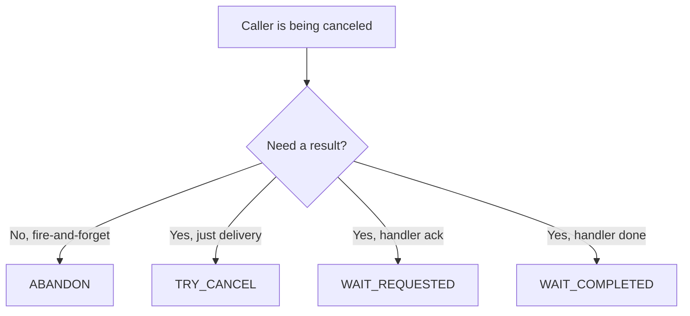

---
layout: section
---

# 07 / Cancellation, Errors, Circuit Breaker

---
layout: default
---

# What This Chapter Teaches You to Recognize

<br>

A successful Operation flows `Scheduled -> Started -> Completed`.

<v-clicks>

A Nexus Operation can also leave the happy path **four** ways:

- **Non-retryable failure** (`OperationError`)
- **Retryable failure** (`HandlerError`, with backoff)
- **Cancellation** (propagating from the caller through the Endpoint to the handler workflow)
- **Circuit breaker** (5 retryable errors in a row, breaker opens for 60s)

</v-clicks>

<br>

<v-click>

Each leaves a distinct trace in the caller's Event History or `temporal workflow describe`. **The chapter teaches you to recognize each one in production.**

</v-click>

<!--
- Frames the chapter as four lifecycle modes, not four unrelated topics.
- A successful Operation flows Scheduled to Started to Completed.
  - The happy path. Recap from Ch 5.
- **Build 1** A Nexus Operation can also leave the happy path four ways.
  - Read the four out loud. Don't dwell on each yet.
  - Set up the rest of the chapter as "we'll see each one."
- **Build 2** Each leaves a distinct trace.
  - Production reflex: when something is wrong, you should know which of the four modes you're looking at.
  - The exercise is mostly observation: see each mode in the UI and CLI.
- The chapter is dense but the framing is simple: four modes, four traces, four production reflexes.
-->

---
layout: default
---

# Cancellation Crosses the Boundary

<br>

When a caller Workflow is canceled, the in-flight Nexus Operation cancels too.

<br>

<v-clicks>

- The platform sends cancellation through the Endpoint.
- The handler workflow receives `CancelledError` at its next `await`.
- Both sides end in the **Canceled** state.

</v-clicks>

<br>

<v-click>

You don't write any plumbing for this. You **choose how long to wait**.

</v-click>

<!--
- When a caller Workflow is canceled, the in-flight Nexus Operation cancels too.
  - Cancellation crosses the namespace boundary automatically.
  - This is one of the things Nexus gives you that ad-hoc HTTP integration doesn't.
- **Build 1** The platform sends cancellation through the Endpoint.
  - Same path as the original call, in reverse direction. The Endpoint is the only routing surface.
- **Build 2** The handler workflow receives `CancelledError` at its next `await`.
  - Standard Workflow cancellation. The handler workflow can catch it, do cleanup, then re-raise.
  - Same model attendees already know from regular Workflow cancellation.
- **Build 3** Both sides end in the **Canceled** state.
  - Caller: Canceled. Handler workflow: Canceled. Symmetric.
  - In the exercise: caller workflow `payment-ch07-TXN-CANCEL-1` and handler workflow `compliance-ch07-TXN-CANCEL-1` both Canceled.
- **Build 4** You don't write any plumbing for this. You **choose how long to wait**.
  - The platform handles the wire-level propagation.
  - What you control is the **cancellation type**: do we wait for acknowledgement? Or move on?
-->

---
layout: default
---

# Pick Your Cancel

<br>

| Type                | Caller waits until...                        | Use when                                  |
| :------------------ | :------------------------------------------- | :---------------------------------------- |
| `ABANDON`           | nothing, returns immediately                 | The caller is being torn down anyway      |
| `TRY_CANCEL`        | the cancel is **delivered**                  | You want guaranteed delivery, not result  |
| `WAIT_REQUESTED`    | the handler **acknowledges** the cancel      | Mid-strict: you need a receipt            |
| `WAIT_COMPLETED`    | the handler **finishes** (canceled or done)  | Strictest: shutdown order matters         |

<br>

<v-click>

Default is `WAIT_COMPLETED`. The strictest, the slowest, the safest.

</v-click>

<br>

<v-click>



</v-click>

<br>

<v-click>

**Sync Nexus Operations cannot be cancelled.** They hold no operation token. Only async, workflow-backed handlers support cancellation. This is one of the reasons Chapter 5's switch to async matters.

</v-click>

<br>

<v-click>

Wire-format aside: at the proto layer, `WAIT_REQUESTED` is named `WAIT_CANCELLATION_REQUESTED`. Replay output and raw event payloads use the longer form.

</v-click>

<!--
- Four levels of strictness. ABANDON is least strict; WAIT_COMPLETED is most strict.
- Walk the table top to bottom.
  - `ABANDON`: caller waits for **nothing**. Returns immediately. Use when the caller is being torn down anyway.
    - "Fire-and-forget cancel."
    - The handler may run to completion; the caller doesn't care.
  - `TRY_CANCEL`: caller waits until the cancel is **delivered**.
    - "I know the platform got my message."
    - You have a receipt that the cancel was sent. You don't have a receipt that the handler heard it.
  - `WAIT_REQUESTED`: caller waits until the handler **acknowledges** the cancel.
    - "I know the handler got my message."
    - The handler has registered the cancellation request. Cleanup may still be running.
  - `WAIT_COMPLETED`: caller waits until the handler **finishes** (canceled or done).
    - "I know the handler is actually done."
    - Strictest, slowest, safest. Use when shutdown order matters (e.g., before retrying).
- **Build 1** Default is `WAIT_COMPLETED`. The strictest, the slowest, the safest.
  - Default exists because most callers want correctness over speed.
  - Override the default explicitly when you know the trade-off.
- Practical examples:
  - For a caller workflow that's terminating, ABANDON: don't make the shutdown wait.
  - For a payment that needs to know the compliance check truly stopped before retrying, WAIT_COMPLETED.
  - For a UI that shows a "canceling..." state, TRY_CANCEL or WAIT_REQUESTED gives a faster confirmation.
- This table is the cheat sheet for matching scenarios to cancellation types.
-->

---
layout: default
---

# Two Error Types, Two Behaviors

<br>

```python {all|1-3|5-7|all}
# Permanent failure. No retry. Fails the Operation.
raise nexusrpc.OperationError("transaction blocked by sanctions list")

# Transient failure. Retries with backoff.
raise nexusrpc.HandlerError("downstream KYC API timed out")
```

<br>

<v-clicks>

- **OperationError**: caller sees `NexusOperationFailed` immediately. Workflow ends in `Failed`.
- **HandlerError**: caller sees `Pending Nexus Operations` with growing attempt count, `BackingOff` state.

</v-clicks>

<br>

<v-click>

**Activity-error analogy.** `OperationError` is `ApplicationError(non_retryable=True)`. `HandlerError` is the regular Activity exception that retries by default.

</v-click>

<br>

<v-click>

`HandlerError` carries a **type**. Retryability follows the type:

| Non-retryable | Retryable |
| :--- | :--- |
| `BAD_REQUEST` | `RESOURCE_EXHAUSTED` |
| `UNAUTHENTICATED` | `INTERNAL` |
| `UNAUTHORIZED` | `UNAVAILABLE` |
| `NOT_FOUND` | `UPSTREAM_TIMEOUT` |
| `NOT_IMPLEMENTED` | |

</v-click>

<br>

<v-click>

Picking the right type is API design. **Raise `INTERNAL` for what is actually `BAD_REQUEST` and callers retry forever** on something that will never succeed.

</v-click>

<!--
- The error model maps to the Activity error model. Non-retryable + retryable.
- **Build 1 (whole code)** Show both error types side by side.
- **Build 2 (lines 1-3, OperationError)** `raise nexusrpc.OperationError("transaction blocked by sanctions list")`
  - **Permanent** failure. No retry. Fails the Operation immediately.
  - Use for business-reason failures. "This payment is blocked by sanctions and will never succeed."
  - Analogue of Activity's `ApplicationError(non_retryable=True)`.
- **Build 3 (lines 5-7, HandlerError)** `raise nexusrpc.HandlerError("downstream KYC API timed out")`
  - **Transient** failure. Retries with exponential backoff.
  - Use for infrastructure problems. "The downstream API is timing out, but it usually works."
  - Analogue of Activity's regular exceptions, which retry by default.
- **Build 4 (whole code)** Pull back out for closing bullets.
- **Build 5** **OperationError**: caller sees `NexusOperationFailed` immediately. Workflow ends in `Failed`.
  - Single event in the caller's history: `NexusOperationFailed`. No retry attempts.
  - The caller workflow `Failed` state shows up in the Web UI.
- **Build 6** **HandlerError**: caller sees `Pending Nexus Operations` with growing attempt count, `BackingOff` state.
  - The Operation goes into `BackingOff` between retries.
  - `temporal workflow describe -w <caller-id>` shows attempt count climbing: 1, 2, 3, ...
  - Same exponential backoff pattern as Activity retries.
- Note: if the handler is a workflow, failures can also come from the **handler workflow itself failing** (workflow-level), separate from `HandlerError` raised inside the Nexus handler. Both surface in the caller's history.
-->

---
layout: default
---

# The Circuit Breaker

<br>

The breaker prevents one misbehaving handler endpoint from saturating the platform with retries from every caller in the same namespace. Without it, a thundering herd of retries piles up.

<br>

<v-clicks>

- After **5 consecutive retryable errors** on the same caller-namespace and Endpoint pair, the breaker opens.
- **Scope:** per `(caller-Namespace, Endpoint)` pair. Not per workflow, not per Operation.
- New Operations on that pair go straight to `State: Blocked`.
- Open for **60 seconds**, then half-open with a single probe. Success closes it. Failure re-opens for another 60.

</v-clicks>

<br>

<v-click>

Look for `BlockedReason: The circuit breaker is open.` on `temporal workflow describe`.

</v-click>

<br>

<v-click>

**Most circuit breaker trips in the wild are not buggy handlers. They are handler workers that are not running.** Five timed-out requests in a row and the breaker opens.

</v-click>

<!--
- After **5 consecutive retryable errors** on the same caller-namespace and Endpoint pair, Temporal opens a circuit breaker.
  - Platform-level protection. You don't configure it.
  - Scope: per (caller-namespace, Endpoint) pair. Not per workflow, not per Operation.
- **Build 1** New Operations on that pair go straight to `State: Blocked`.
  - The Operation never even attempts. Saves Worker capacity on the handler side.
  - Caller sees the Operation stuck in Pending with `State: Blocked`.
- **Build 2** The breaker stays open for **60 seconds**, then transitions to half-open.
  - Half-open = "let one through to test the water."
  - 60 seconds is the platform default; not user-tunable today.
- **Build 3** On the next success, it closes. On another failure, it re-opens.
  - Standard circuit breaker semantics. Closed = normal. Open = blocking. Half-open = probing.
- **Build 4** Look for `BlockedReason: The circuit breaker is open.` on `temporal workflow describe`.
  - That exact string. Memorize it.
  - This is one of those features you discover during an incident. Recognizing the message saves debugging time.
- The circuit breaker is the platform's protection against thundering-herd failures.
  - If the Compliance Worker is down, you don't want every Payments workflow piling up retries.
  - Five errors and the platform stops trying for a minute. Lets the dependency recover.
-->

---
layout: exercise
minutes: 12
heading: Exercise 7
---

**Inject failures. Watch the lifecycle.**

You will inject non-retryable, retryable, cancellation, and circuit-breaker
scenarios into the Compliance handler, then run a lifecycle starter and
observe each one in the Web UI and `temporal workflow describe`.

Full instructions are in the Instruqt tab.

<!--
- 12 minute exercise. Smaller on purpose. The novelty is in the observation, not the coding.
- "Inject failures. Watch the lifecycle."
  - One TODO. They're mostly here to **see** what each lifecycle scenario looks like in the UI and CLI.
- TODO 13: In the handler, branch on `transaction_id` to raise `OperationError`, `HandlerError`, or trigger cancellation.
  - The exercise scaffold has the branching skeleton. Their job is to fill in the raises.
  - For example: `if input.transaction_id.startswith("TXN-FAIL-OP"): raise nexusrpc.OperationError(...)`.
- Run `python -m payments.lifecycle_starter` to drive each scenario.
  - The lifecycle starter runs CANCEL, FAIL-OP, FAIL-HANDLER, and CIRCUIT scenarios back-to-back.
  - Each scenario starts a workflow with a transaction_id that triggers the corresponding handler branch.
- Observe in the Web UI, then in `temporal workflow describe`.
  - **Cancel**: caller workflow `payment-ch07-TXN-CANCEL-1` and handler workflow `compliance-ch07-TXN-CANCEL-1` both end in `Canceled` state.
  - **OperationError**: caller's history shows `NexusOperationFailed` event immediately, workflow ends `Failed`.
  - **HandlerError**: caller's `Pending Nexus Operations` shows attempt count growing, `State: BackingOff`.
  - **Circuit breaker**: after ~5 of these, new Operations on that endpoint show `State: Blocked` and `BlockedReason: The circuit breaker is open.`
- Don't expect attendees to finish the entire scenario set. Most will get through the cancel + OperationError; the rest are gravy.
- After they finish, advance to the **Quiz Time** transition for AhaSlides slides 29-32. That's the last graded block of the workshop.
-->

---
layout: section
---

# Quiz Time

ahaslides.com/O8RSE

<!--
- **Switch to AhaSlides slides 29-32** (four graded slides, ~2 minutes). **Last graded block.**
- They've just observed all four scenarios in the Web UI. Reinforce while it's fresh.
- **Lead-in**: "Last graded block of the workshop. Four questions. Lock in those production reflexes."
- **AhaSlides slide 29 (match pairs, graded)**: "Pick your Cancel: ABANDON, TRY_CANCEL, WAIT_REQUESTED, WAIT_COMPLETED."
  - Allow extra time (45-60s). Each cancellation type matches a scenario.
  - ABANDON → caller is being torn down anyway.
  - TRY_CANCEL → you want guaranteed delivery, not result.
  - WAIT_REQUESTED → mid-strict, you need a receipt.
  - WAIT_COMPLETED → strictest, shutdown order matters.
- **AhaSlides slide 30 (pick answer, graded)**: "OperationError vs HandlerError: which one triggers automatic retry?"
  - Correct: **HandlerError**.
  - OperationError is permanent (business reason). HandlerError is transient (infra problem). Same model as Activity errors.
- **AhaSlides slide 31 (pick answer, graded)**: "You see 'State: Blocked / BlockedReason: The circuit breaker is open' in `temporal workflow describe`. What's happening?"
  - Correct: **The platform has stopped routing new Operations on this caller-namespace + Endpoint pair after 5 consecutive retryable errors.**
  - This is the recognition-of-prod-output question. Aim for >80% correct.
- **AhaSlides slide 32 (pick answer, graded)**: "After how many consecutive errors does the circuit breaker open?"
  - Correct: **5**.
  - Memorize the number. It comes up in real incidents.
- **Lead-out**: "Last graded block done. Final scoring is locked in. One quick recap, then the fun bit, let's break the language assumption with the polyglot demo. Watch this."
- After this transition, advance to the Review slide, then on to the Polyglot section.
-->

---
layout: default
---

# Review

<v-clicks>

- Cancellation crosses the Nexus boundary automatically. The choice you make is **how long to wait**.
- The four cancellation types are `ABANDON`, `TRY_CANCEL`, `WAIT_REQUESTED`, and `WAIT_COMPLETED`. The default is `WAIT_COMPLETED`.
- Synchronous Nexus Operations cannot be cancelled. Only async, workflow-backed handlers support cancellation.
- `nexusrpc.OperationError` is **permanent** and never retries. `nexusrpc.HandlerError` is **transient** and retries with backoff.
- The circuit breaker opens after **5 consecutive retryable errors** on the same caller-Namespace and Endpoint pair, stays open for 60 seconds, then half-opens.

</v-clicks>

<!--
- Closes the production-reflexes chapter. Build each one back.
- **Build 1** Cancellation crosses the Nexus boundary automatically. The choice you make is how long to wait.
- **Build 2** The four cancellation types are `ABANDON`, `TRY_CANCEL`, `WAIT_REQUESTED`, and `WAIT_COMPLETED`. The default is `WAIT_COMPLETED`.
- **Build 3** Synchronous Nexus Operations cannot be cancelled. Only async, workflow-backed handlers support cancellation.
- **Build 4** `nexusrpc.OperationError` is permanent and never retries. `nexusrpc.HandlerError` is transient and retries with backoff.
- **Build 5** The circuit breaker opens after 5 consecutive retryable errors on the same caller-Namespace and Endpoint pair, stays open for 60 seconds, then half-opens.
- After the last build, advance to the Polyglot section.
-->
